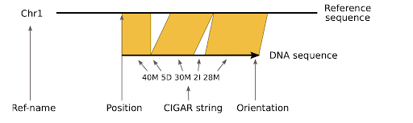

# BAM

---

## Overview

---

The **BAM (Binary Alignment/Map)** format is the binary, compressed version of the SAM (Sequence Alignment/Map) format. It is widely used in genomics to store read alignments against a reference genome, especially in NGS workflows.

BAM files are preferred over SAM due to their smaller size, random access capability (with index), and compatibility with downstream tools.

## Structure

---

> A BAM file cannot be viewed directly due to its binary nature, **BGZF (Blocked GZip Format)**. The following examples show SAM line (human-readable).

A BAM file consists of:

1. **Header Section**: The header provides metadata about the alignment, including reference sequences and processing history. It begins with lines starting with `@`, such as:

| Tag   | Description                                     |
| ----- | ----------------------------------------------- |
| `@HD` | Header line format version and sorting order    |
| `@SQ` | Reference sequence names and lengths            |
| `@RG` | Read group information (e.g., sample, platform) |
| `@PG` | Program used for alignment or processing        |
| `@CO` | Custom comments                                 |

Example:

```text
@HD VN:1.6 SO:coordinate
@SQ SN:chr1 LN:248956422
@RG ID:flowcell1 SM:sample1 PL:ILLUMINA
@PG ID:bwa PN:bwa VN:0.7.17
```

2. **Alignment Section**: Each record represents a mapped or unmapped read and its alignment to the reference genome.

- Example:

  ```text
  SRR1234567.1 0 chr1 10050 60 101M * 0 0 AGCTTAGCTAGCTACCTAT... FFFFFFFFFFFFFFFFFFFF...
  ```

  | Field | Description                             | Example Value           |
  | ----- | --------------------------------------- | ----------------------- |
  | QNAME | Query name (read ID)                    | SRR1234567.1            |
  | FLAG  | Bitwise flag (e.g., mapped, paired)     | 0                       |
  | RNAME | Reference sequence name                 | chr1                    |
  | POS   | Position (1-based)                      | 10050                   |
  | MAPQ  | Mapping quality                         | 60                      |
  | CIGAR | Alignment representation                | 101M                    |
  | RNEXT | Mate reference name (`*` if single-end) | \*                      |
  | PNEXT | Mate alignment position (0 if N/A)      | 0                       |
  | TLEN  | Template length (0 if single-end)       | 0                       |
  | SEQ   | Read sequence                           | AGCTTAGCTAGCTACCTAT...  |
  | QUAL  | Quality string (ASCII-encoded Phred)    | FFFFFFFFFFFFFFFFFFFF... |

- The **CIGAR** string can get more complex (e.g., 76M2I23M1D), representing matches, insertions, deletions, clipping, etc.   

  
  Reference: [futurelearn](https://www.futurelearn.com/info/courses/bioinformatics-for-biologists-analysing-and-interpreting-genomics-datasets/0/steps/388425)

- The **FLAG** field is important for filtering reads. 0 = simple case.
  - Reference: [Decoding SAM flags](https://broadinstitute.github.io/picard/explain-flags.html)
  - Reference: [BAM format](https://weitinglin.com/2016/01/27/sambam-and-cram/)
  - Reference: [BAM format](https://yourgene.pixnet.net/blog/post/95204728)

## Common tools

---

| Tool         | Purpose                             |
| ------------ | ----------------------------------- |
| [**Samtools**](../tools/samtools.md) | View, sort, index, filter BAM files |
| **Picard**   | Mark duplicates, collect metrics    |
| **Bedtools** | Intersect BAM with BED regions      |
| **IGV**      | Visualize BAM alignments            |
