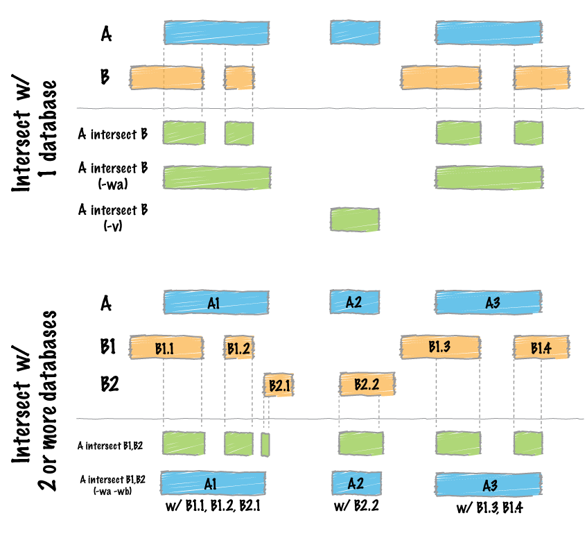

# BED

## Format

- BED format is **zero-based (0-based)** 

- The start position is inclusive, and the end position is exclusive. `[start, end)`

```text
chr1    1   2         # position 2
chr1    1   1000      # position 2-1000
```

## Merge overlapping regions

```bash
sort -k1,1 -k2,2n bam_file > bam_file.sorted

# merged file has 3 columns (chromosome, start, end)
bedtools merge -i bam_file.sorted > bam_file.sorted.merged

# merged file has 4th column merged with comma (chromosome, start, end, 4th_column_info)
# e.g. chr1 1 100 EGFR,EGFR
bedtools merge -i bam_file.sorted -c 4 -o collapse > bam_file.sorted.merged
```

### Convert sambamba output position to bed file

- sambamba usage: [sambamba](bam.md#method-2)

- Position: `chr7:150652580-150652581`
- Bed file content: `chr7   150652579   150652581`
- sambamba command
    - use **position**: `sambamba depth base -L chr7:150652580-150652581 -c 0 -q20 bam_file`
    - use **bed file**: `sambamba depth base -L bed_file -c 0 -q20 bam_file`

```less
REF     POS          COV     A   C   G   T   DEL REFSKIP SAMPLE
chr7    150652579    21      0   0   0   21  0   0       bam_file
chr7    150652580    22      0   0   22  0   0   0       bam_file
```


## Intersect

```bash
bedtools intersect -a bedfile1 -b bedfile2 > outputfile
```

- `-a`: BAM/BED/GFF/VCF file “A”. Each feature in A is compared to B in search of overlaps.

- `-b`: One or more BAM/BED/GFF/VCF file(s) “B”.

- `-wa`: Write the original entry in A for each overlap.

- For detail information, please referred to the following website: [bedtools](https://bedtools.readthedocs.io/en/latest/content/tools/intersect.html)

