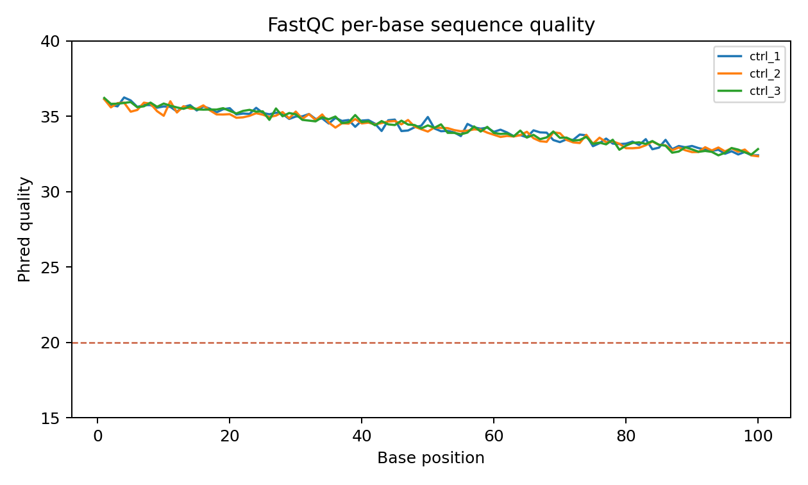
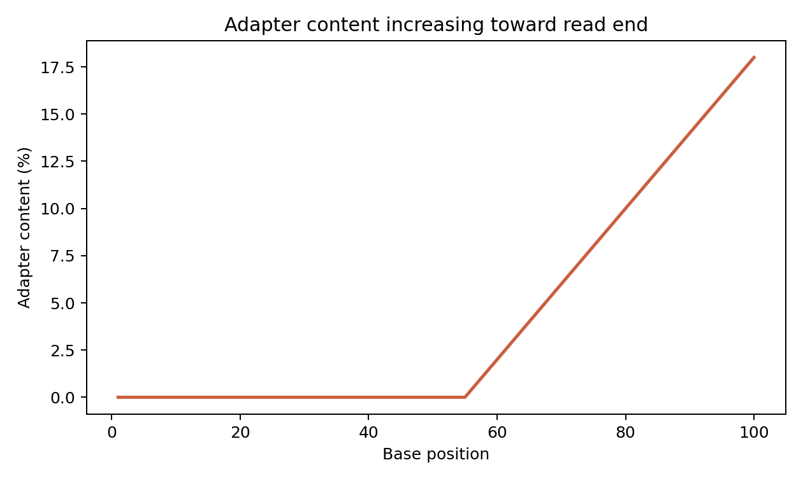

# FASTQ, Quality Control, and Trimming

本章目的：從壓縮 FASTQ 開始，檢查 reads 是否完整、paired-end 是否成對、base quality 是否合理，以及是否需要 adapter trimming 或 quality trimming。

## FASTQ Format

FASTQ 每筆 read 由四行組成：

```text
@read_identifier
ACGTNACGTN...
+
IIIIHGFEDC...
```

| Line | Meaning |
| --- | --- |
| `@read_identifier` | read id、instrument、flowcell、lane、tile、座標與 pair 資訊 |
| sequence | nucleotide sequence，可能含 `N` |
| `+` | separator，可重複 identifier 或留空 |
| quality | Phred quality score，每個字元對應一個 base |

Phred quality 的概念是：

$$
Q = -10 \log_{10}(P_\text{error})
$$

Phred+33 表示 quality character 的 ASCII code 減 33 得到 Q score。`Q20` 約 1% error，`Q30` 約 0.1% error。

## Raw Data Checks

輸入資料：

- `*.fastq.gz`
- sequencing facility 提供的 `md5` 或 checksum
- sample sheet 或 metadata

輸出資料：

- read 前幾行檢查
- 每個 FASTQ 的 read 數
- checksum
- paired-end read id 對應檢查

```bash
# 看第一筆 read。zcat 適合 .fastq.gz。
zcat data/raw/sample_R1.fastq.gz | head -n 8

# FASTQ 行數應為 4 的倍數；read 數 = 行數 / 4。
zcat data/raw/sample_R1.fastq.gz | wc -l

# seqkit 可以更快整理每個 FASTQ 的 read count、length 與 GC。
seqkit stats data/raw/*.fastq.gz

# 完整性檢查：和資料來源提供的 md5 比對。
md5sum data/raw/*.fastq.gz > results/md5sum.txt

# paired-end 是否成對：R1/R2 read id 的主要部分應一致。
paste \
  <(zcat data/raw/sample_R1.fastq.gz | sed -n '1~4p' | sed 's/[ /].*//') \
  <(zcat data/raw/sample_R2.fastq.gz | sed -n '1~4p' | sed 's/[ /].*//') |
awk '$1 != $2 {print; exit 1}'
```

Warning: FASTQ 檔案不完整常見症狀是 gzip EOF error、行數不是 4 的倍數、R1/R2 read 數不同，或 paired read id 不匹配。

## FastQC and MultiQC

分析目的：FastQC 對單一 FASTQ 產生 quality report；MultiQC 把多個 FastQC、fastp、samtools、STAR、featureCounts 等報告彙整成一份總覽。

完整 script：

```bash
bash scripts/fastq_qc.sh data/raw results/01_fastq_qc
```

`scripts/fastq_qc.sh` 會建立：

- `results/01_fastq_qc/fastqc/*_fastqc.html`
- `results/01_fastq_qc/fastqc/*_fastqc.zip`
- `results/01_fastq_qc/multiqc/multiqc_report.html`
- `results/01_fastq_qc/checksums/md5sum.txt`



圖 1. Per-base sequence quality 示意圖。RNA-seq read 末端品質下降很常見；若大量 base 低於 Q20，才需要考慮 quality trimming 或重新評估上機品質。

### FastQC Modules and Interpretation

| Module | 看什麼 | RNA-seq 常見情境 | 何時需要處理 |
| --- | --- | --- | --- |
| Per base sequence quality | 每個 read position 的 Q score | read 末端下降常見 | 長尾嚴重低品質、整體偏低 |
| Per sequence quality scores | 每條 read 平均品質 | 通常應集中在高分 | 大量低品質 reads |
| Per base sequence content | A/C/G/T 是否在前幾個 cycles 偏移 | random priming 或 biased library 可能警告 | 全長嚴重偏移需查 library |
| GC content | GC 分布 | 物種與 transcriptome composition 會影響 | 多峰、與預期物種差很多 |
| Sequence duplication | duplicate level | 高表現基因會造成 RNA-seq duplication 偏高 | 極端 duplication 需查 PCR 或低複雜度 |
| Adapter content | adapter 是否出現 | 短 insert library 常見 | 明顯上升時 trimming |
| Overrepresented sequences | 高頻序列 | rRNA、adapter、poly-A 或高表現 transcript | adapter/rRNA 污染需處理 |
| Sequence length distribution | read 長度分布 | trimming 後會變寬 | 未預期長度混合需追查 |
| N content | `N` 比例 | 通常很低 | 高 `N` 表示 base calling 問題 |



圖 2. Adapter content 在 read 末端上升的示意圖。短 insert 或 read-through adapter 會讓 adapter content 隨 position 增加。

Key point: FastQC 的 warning 不是自動失敗。RNA-seq 高 duplication、前端 sequence content bias 或 GC 分布偏移有時是 library 或 transcriptome 的正常特性；adapter、嚴重低品質、過多 `N` 與檔案不完整才通常需要明確處理。

## Adapter and Quality Trimming

分析目的：移除 adapter、低品質 tail、poly-G/poly-X artifacts，並保持 paired-end reads 同步。

| Tool | Strength | Notes |
| --- | --- | --- |
| fastp | 一支工具完成 adapter detection、quality trimming、poly-G trimming、HTML/JSON report | 適合教學與一般 PE RNA-seq |
| Cutadapt | adapter 指定彈性高，適合特殊 adapter 或小 RNA | 常搭配其他 QC 工具 |
| Trim Galore | Cutadapt + FastQC wrapper，參數簡潔 | 常見於 Illumina adapter trimming |

完整 fastp 範例：

```bash
bash scripts/fastp_trim.sh data/sample_metadata.csv . results/02_fastp_trim
```

重要參數：

| Parameter | Meaning |
| --- | --- |
| `--detect_adapter_for_pe` | 自動偵測 paired-end adapter |
| `--cut_front --cut_tail` | 從 read 前後端依品質修剪 |
| `--cut_mean_quality 20` | sliding window 平均品質門檻 |
| `--length_required 30` | trimming 後 read 最短長度 |
| `--trim_poly_g --trim_poly_x` | 移除 NextSeq/NovaSeq 常見 poly-G 與 poly-X tail |

程式碼逐段說明：

- 以 metadata 逐列讀取 sample、R1、R2。
- 每個 sample 產生同步的 trimmed R1/R2。
- HTML/JSON report 放在 `reports/`，最後用 MultiQC 彙整。

Warning: trimming 不是越多越好。過度 trimming 會讓 reads 變短、mapping ambiguity 上升，也可能造成 gene body coverage 或 isoform quantification 偏差。若 adapter content 很低且品質良好，可以只做 QC 不 trimming。

## Common Problems

| Problem | Symptom | Action |
| --- | --- | --- |
| FASTQ corrupted | `gzip: unexpected end of file` | 重新下載或要求資料來源重傳 |
| R1/R2 not synchronized | aligner 報 paired reads 不一致 | 用原始 read id 檢查，必要時重新整理 pairs |
| Adapter remains | FastQC adapter content 高 | fastp/Cutadapt/Trim Galore |
| Too aggressive trimming | read length distribution 過短 | 放寬品質門檻或最低長度 |
| Low complexity | overrepresented sequences 多 | 查 adapter、rRNA、PCR duplication |

