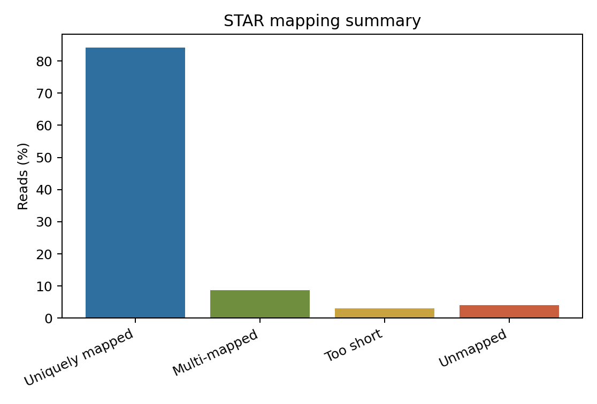

# Reference Genome, Alignment, BAM, and Alignment QC

本章目的：理解 reference genome/annotation 的版本一致性，使用 STAR 或 HISAT2 做 splice-aware alignment，處理 SAM/BAM/CRAM，並判讀 alignment QC。

## Reference Genome and Annotation

輸入資料：

- Genome FASTA：染色體或 scaffold sequence。
- Transcriptome FASTA：transcript sequence，常用於 Salmon/kallisto。
- GTF/GFF3：gene、transcript、exon、CDS、UTR 等 genomic feature。

| Concept | Practical implication |
| --- | --- |
| Genome assembly version | `GRCh38`、`GRCm39`、`TAIR10` 等版本不可混用 |
| Annotation source | Ensembl、GENCODE、NCBI RefSeq 的 gene model 與 ID 系統不同 |
| Chromosome naming | `chr1` 與 `1` 不一致會讓 reads 或 features 無法匹配 |
| Gene ID / transcript ID | count matrix 與 downstream annotation 的主鍵 |
| GTF vs GFF3 | GTF 常用於 RNA-seq quantification；GFF3 attribute 結構較泛用 |

GTF 中 gene、transcript、exon、CDS 的層級可以想成：

```text
gene
  transcript 1
    exon 1
    exon 2
    CDS
  transcript 2
    exon 1
    exon 3
```

Warning: FASTA 與 GTF 版本不一致會造成 STAR index junction 錯誤、featureCounts assignment 低、tx2gene mapping 不完整，或 `chr` 命名不相容。

## Splice-aware Alignment

RNA-seq reads 可能跨越 exon-exon junction，因此 aligner 必須允許 read 分段對到基因組不同 exon。**Splice-aware alignment** 會辨識 intron gap、canonical splice site（常見 GT-AG、GC-AG、AT-AC）、exon-exon junction 與 soft clipping。

| Term | Meaning |
| --- | --- |
| Unique mapping | read 最佳位置唯一，對 gene-level counting 較穩 |
| Multi-mapping | read 可對到多個相似位置，例如 paralog、repeat、rRNA |
| Soft clipping | read 端點未對上但保留在 BAM sequence 中，CIGAR 以 `S` 表示 |
| Mismatch | read 與 reference base 不一致，可能是錯誤、SNP 或 RNA editing |
| Alignment score | aligner 對 match/mismatch/gap 的總分 |
| MAPQ | mapping quality，反映 mapping 位置信心；不同 aligner 定義不完全相同 |

## STAR

STAR 使用 seed search 加上 stitching，速度快、junction detection 強，常用於 mammalian RNA-seq。它記憶體需求高，human genome index 通常需要數十 GB RAM。

### Build Index

```bash
READ_LENGTH=101 THREADS=16 \
bash scripts/star_alignment.sh reference/genome.fa reference/genes.gtf data/trimmed_fastq results/03_star
```

核心參數：

| Parameter | Meaning |
| --- | --- |
| `--runMode genomeGenerate` | 建立 genome index |
| `--sjdbGTFfile` | 將已知 exon junction 納入 index，提高 junction mapping |
| `--sjdbOverhang` | 通常設為 read length - 1 |
| `--outSAMtype BAM SortedByCoordinate` | 直接輸出 coordinate-sorted BAM |
| `--quantMode GeneCounts` | 產生 STAR GeneCounts，適合快速檢查但 featureCounts 更彈性 |
| `--twopassMode Basic` | first pass 找 junction，second pass 使用 novel junction 改善 mapping |

### Single-end Example

```bash
STAR --runThreadN 8 \
  --genomeDir results/03_star/index \
  --readFilesIn sample_R1.fastq.gz \
  --readFilesCommand zcat \
  --outFileNamePrefix results/03_star/bam/sample. \
  --outSAMtype BAM SortedByCoordinate \
  --quantMode GeneCounts
```

### Paired-end Example

```bash
STAR --runThreadN 8 \
  --genomeDir results/03_star/index \
  --readFilesIn sample_R1.fastq.gz sample_R2.fastq.gz \
  --readFilesCommand zcat \
  --outFileNamePrefix results/03_star/bam/sample. \
  --outSAMtype BAM SortedByCoordinate \
  --quantMode GeneCounts \
  --twopassMode Basic
```

STAR 本身不需要 featureCounts-style strand parameter 來對齊，但 `--quantMode GeneCounts` 輸出會包含 unstranded、forward stranded、reverse stranded 三種 gene count 欄位。正式 counting 仍應依 library strandness 設定 featureCounts `-s`。

### Log.final.out



圖 1. STAR mapping summary 示意圖。重點不是單看 total mapped，而是 uniquely mapped、multi-mapped、too short、unmapped 與 chimeric/fusion-related 指標是否符合資料型態。

常看的欄位：

- `Number of input reads`
- `Uniquely mapped reads %`
- `% of reads mapped to multiple loci`
- `% of reads unmapped: too short`
- `Mismatch rate per base`
- `Deletion/Insertion rate per base`

適用情境：需要 BAM、junction-level information、fusion detection、variant calling 或 genome browser inspection。限制：index 大、RAM 高、不同版本與參數會影響 junction 結果。

## HISAT2

HISAT2 使用 hierarchical graph FM index，記憶體需求通常低於 STAR。搭配 splice site 與 exon information 可改善已知 junction mapping，常與 StringTie 做 transcript assembly。

完整 script：

```bash
THREADS=12 \
bash scripts/hisat2_alignment.sh reference/genome.fa reference/genes.gtf data/trimmed_fastq results/03_hisat2
```

重要參數：

| Parameter | Meaning |
| --- | --- |
| `hisat2_extract_splice_sites.py` | 從 GTF 產生 splice site hints |
| `hisat2_extract_exons.py` | 從 GTF 產生 exon hints |
| `hisat2-build --ss --exon` | 建立含 annotation hints 的 index |
| `--dta` | downstream transcriptome assembly mode，保留較長 alignment 給 StringTie |

單端：

```bash
hisat2 -p 8 --dta -x results/03_hisat2/index/genome \
  -U sample_R1.fastq.gz \
  2> results/03_hisat2/logs/sample.summary.txt |
  samtools sort -o results/03_hisat2/bam/sample.sorted.bam -
```

雙端：

```bash
hisat2 -p 8 --dta -x results/03_hisat2/index/genome \
  -1 sample_R1.fastq.gz -2 sample_R2.fastq.gz \
  2> results/03_hisat2/logs/sample.summary.txt |
  samtools view -bS - |
  samtools sort -o results/03_hisat2/bam/sample.sorted.bam -
```

HISAT2 summary 會列出 overall alignment rate、concordantly aligned pairs、discordantly aligned pairs、multi-mapping reads。若 paired-end concordance 很低，需檢查 insert size、R1/R2 是否交換、library orientation 或樣本污染。

## STAR, HISAT2, Salmon, and kallisto Comparison

| Feature | STAR | HISAT2 | Salmon | kallisto |
| --- | --- | --- | --- | --- |
| Principle | splice-aware genomic alignment | graph/FM-index genomic alignment | lightweight mapping / selective alignment | pseudoalignment |
| Speed | fast but index heavy | fast, lower memory | very fast | very fast |
| Memory | high for large genomes | moderate | low to moderate | low |
| Output level | BAM, junction, optional gene counts | BAM | transcript abundance | transcript abundance |
| Produces BAM | yes | yes | no in common quant mode | no |
| Gene-level counting | via featureCounts/HTSeq or STAR GeneCounts | via featureCounts/HTSeq | via tximport | via tximport |
| Transcript quantification | possible but not primary | with StringTie/RSEM workflows | primary | primary |
| Alternative splicing | junction/BAM available | StringTie-friendly | transcript abundance, not novel junction discovery | transcript abundance |
| Fusion detection | STAR-Fusion/STAR chimeric mode | limited | no | no |
| Variant calling | possible with careful RNA-seq caveats | possible with caveats | no | no |
| Novel transcript discovery | possible with StringTie/Scallop | strong StringTie pairing | no | no |
| DE analysis | gene counts into edgeR/DESeq2/limma | gene counts into edgeR/DESeq2/limma | tximport into edgeR/DESeq2/limma | tximport into edgeR/DESeq2/limma |
| Main limitation | RAM and storage | sometimes lower junction sensitivity than STAR | depends on transcriptome annotation | less flexible bias modeling than Salmon |

Key point: alignment 與 pseudoalignment 不一定能互相取代。若後續要看 BAM、junction、fusion、variant 或 novel transcript，選 STAR/HISAT2；若主要是 known transcript/gene abundance 與 DE，Salmon/kallisto 通常更快。

## BAM Processing

SAM 是文字格式，BAM 是壓縮二進位格式，CRAM 是 reference-based 壓縮格式。大多數 downstream tools 使用 coordinate-sorted BAM 加上 BAM index。

```bash
# SAM to BAM
samtools view -@ 4 -bS sample.sam > sample.bam

# Coordinate sorting: genome browser、variant calling、featureCounts 常用
samtools sort -@ 4 -o sample.sorted.bam sample.bam
samtools index sample.sorted.bam

# Name sorting: 某些 paired-end 操作或 transcript assembly 前處理可能需要
samtools sort -n -@ 4 -o sample.name_sorted.bam sample.bam

# QC
samtools flagstat sample.sorted.bam
samtools stats sample.sorted.bam > sample.stats.txt
samtools idxstats sample.sorted.bam > sample.idxstats.txt
samtools view -H sample.sorted.bam | head
```

SAM flag 會描述 paired-end 狀態、proper pair、unmapped mate、reverse strand、first/second in pair、secondary alignment、supplementary alignment 等。Primary alignment 是主要對齊；secondary 常見於 multi-mapping；supplementary 常見於 split alignment、fusion 或 structural variation。

## Alignment QC

完整 script：

```bash
bash scripts/bam_qc.sh results/03_star/bam results/05_bam_qc
```

RNA-seq alignment QC 常看：

| Metric | Meaning | Interpretation |
| --- | --- | --- |
| Total reads | 輸入 reads/fragments 數 | 與 FASTQ read count 對齊 |
| Mapped reads | 至少對到 reference 的 reads | 過低需查污染、reference、品質 |
| Uniquely mapped | 唯一位置 reads | gene-level quantification 通常偏好 |
| Multi-mapped | 多位置 reads | repeat、paralog、rRNA 會增加 |
| Properly paired | paired-end orientation/距離合理 | 過低查 insert size 或 read pairing |
| Insert size | fragment length distribution | library prep 與 aligner summary 對照 |
| Duplication | PCR/optical/high-expression duplication | RNA-seq 沒有固定門檻 |
| Strandness | sense/antisense read distribution | 錯誤會讓 counting 幾乎失敗 |
| rRNA contamination | reads mapping to rRNA | 過高表示 depletion/polyA selection 問題 |
| Gene body coverage | 5'/3' coverage uniformity | degradation 或 protocol bias |
| Junction saturation | novel junction discovery 是否趨於飽和 | splicing analysis 重要 |
| Read distribution | exonic/intronic/intergenic | pre-mRNA、nuclear RNA 或 DNA contamination 會影響 |

可用工具：samtools、RSeQC、Picard、Qualimap、MultiQC。沒有單一 QC 門檻適用所有 RNA-seq；要根據物種、library preparation、read length、sample type 與研究目的綜合判斷。

