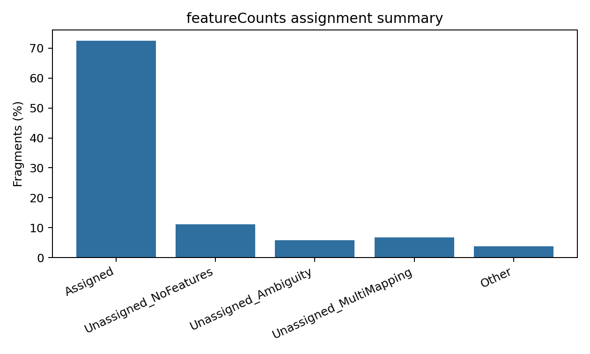

# Pseudoalignment, Read Counting, and tximport

本章目的：比較 Salmon/kallisto 的 transcript-level quantification，說明 gene-level read counting，以及如何用 tximport 將 transcript abundance 彙整到 gene-level differential expression 所需資料。

## Lightweight Mapping Concepts

**Pseudoalignment** 不計算完整 base-by-base genomic alignment，而是判斷 read 與哪些 transcript 相容。**Quasi-mapping** 或 selective alignment 則在 transcriptome space 中加入更精細的 mapping validation。這些方法通常比 genome alignment 快，輸出 transcript-level abundance。

| Concept | Meaning |
| --- | --- |
| Transcript-level quantification | 估計每個 transcript 的 abundance |
| Effective transcript length | 校正 fragment length 與可被觀測位置後的有效長度 |
| Equivalence class | 一組 read 對應到相同 transcript set |
| Bias correction | sequence-specific、GC、positional bias 的模型校正 |
| Bootstrap / inferential replicate | 估計 abundance uncertainty |

## Salmon

Salmon 支援 quasi-mapping、selective alignment、bias correction 與 automatic library type detection。常見輸出是每個 sample 目錄下的 `quant.sf`。

### Build Index

```bash
salmon index \
  -t reference/transcripts.fa \
  -i results/04_salmon/index \
  -k 31
```

Decoy-aware transcriptome 會把 genome decoy sequence 加入 index，減少 reads 錯誤吸附到 transcriptome。真實專案中建議用 Salmon 官方建議流程建立 gentrome/decoy index，尤其是 vertebrate genome。

### Paired-end Quantification

```bash
salmon quant \
  -i results/04_salmon/index \
  -l A \
  -1 sample_R1.fastq.gz \
  -2 sample_R2.fastq.gz \
  --validateMappings \
  --seqBias \
  --gcBias \
  -p 8 \
  -o results/04_salmon/quant/sample
```

### Single-end Quantification

```bash
salmon quant \
  -i results/04_salmon/index \
  -l A \
  -r sample_R1.fastq.gz \
  --validateMappings \
  --seqBias \
  --gcBias \
  -p 8 \
  -o results/04_salmon/quant/sample
```

重要參數：

| Parameter | Meaning |
| --- | --- |
| `-l A` | 自動推測 library type |
| `--validateMappings` | selective alignment validation，提高 mapping 精確度 |
| `--seqBias` | 校正 sequence-specific bias |
| `--gcBias` | 校正 GC bias |

`quant.sf` 欄位：

| Column | Meaning |
| --- | --- |
| `Name` | transcript ID |
| `Length` | transcript length |
| `EffectiveLength` | 有效長度 |
| `TPM` | transcript abundance |
| `NumReads` | estimated read/fragment count |

## kallisto

kallisto 以 pseudoalignment 與 EM algorithm 估計 transcript abundance。速度快、參數少，bootstrap 可估 uncertainty。

```bash
kallisto index \
  -i results/04_kallisto/index/transcripts.idx \
  reference/transcripts.fa

kallisto quant \
  -i results/04_kallisto/index/transcripts.idx \
  -b 100 \
  -t 8 \
  -o results/04_kallisto/quant/sample \
  sample_R1.fastq.gz sample_R2.fastq.gz
```

單端資料必須指定 fragment length mean 與 standard deviation：

```bash
kallisto quant \
  -i results/04_kallisto/index/transcripts.idx \
  --single \
  -l 200 \
  -s 30 \
  -b 100 \
  -t 8 \
  -o results/04_kallisto/quant/sample \
  sample_R1.fastq.gz
```

Warning: 單端 fragment length 設錯會影響 effective length 與 abundance，尤其是 transcript-level interpretation。

## Gene-level Read Counting

若使用 STAR/HISAT2 產生 BAM，常用 featureCounts 或 HTSeq-count 產生 gene-level count matrix。

featureCounts 的核心概念是：把 exon feature 依 `gene_id` 聚合，計算 fragments/read 是否落在 gene 的 exon 上。

```bash
STRAND=0 THREADS=8 \
bash scripts/featurecounts_gene_counting.sh reference/genes.gtf results/03_star/bam results/06_featurecounts
```

重要參數：

| Parameter | Meaning |
| --- | --- |
| `-a` | annotation GTF/GFF |
| `-o` | output count matrix |
| `-t exon` | 使用 exon feature |
| `-g gene_id` | 以 gene_id 聚合 exon |
| `-p` | paired-end input |
| `--countReadPairs` | count fragments rather than individual reads |
| `-s 0/1/2` | unstranded / stranded / reversely stranded |
| `-M` | count multi-mapping reads |
| `-O` | 允許 overlapping features 都被計數 |
| `-T` | threads |



圖 1. featureCounts assignment summary 示意圖。若 Assigned 很低，優先檢查 strandness、GTF/FASTA 版本、chromosome naming、BAM 是否 coordinate sorted，以及 reads 是否主要落在 exonic region。

常見策略：

- bulk gene-level DE 通常只 count primary alignment。
- multi-mapping reads 預設不算較保守；若研究 repetitive genes 或 gene families，可明確討論 `-M`。
- overlapping features 預設不重複計數；使用 `-O` 會改變解讀。
- duplicate reads 是否移除取決於 library、UMI 與實驗目的；一般 bulk RNA-seq 不一定移除 PCR duplicates。

HTSeq-count 也可用於 gene counting，模式清楚但速度常較慢；featureCounts 在大型資料上通常更快。

## tximport

Salmon/kallisto 產生 transcript-level 結果後，常用 `tximport` 匯入 R，並依 `tx2gene` 彙整到 gene-level。

完整 R script：

```r
suppressPackageStartupMessages({
  library(readr)
  library(tximport)
})

metadata <- read_csv("data/sample_metadata.csv", show_col_types = FALSE)
tx2gene <- read_tsv("reference/tx2gene.tsv",
                    col_names = c("TXNAME", "GENEID"),
                    show_col_types = FALSE)

files <- file.path("results/04_salmon/quant", metadata$sample_id, "quant.sf")
names(files) <- metadata$sample_id
stopifnot(all(file.exists(files)))

txi <- tximport(
  files,
  type = "salmon",
  tx2gene = tx2gene,
  countsFromAbundance = "lengthScaledTPM"
)
```

`countsFromAbundance` 的選擇：

| Value | Meaning | Use case |
| --- | --- | --- |
| `no` | 使用 estimated counts，不從 abundance 重算 | 保留原始 estimated counts 概念 |
| `scaledTPM` | TPM 乘回 library size | 減少 abundance/count scale 差異 |
| `lengthScaledTPM` | 同時考慮 gene-level effective length | 常用於 gene-level DE import |

輸出矩陣：

- `txi$counts`：可進入 edgeR/DESeq2/limma-voom 的 estimated counts。
- `txi$abundance`：TPM，適合表達量展示與樣本內描述。
- `txi$length`：effective length，可作為 offset 或匯入模型所需資訊。

`tximeta` 是 tximport 的延伸，會追蹤 reference transcriptome checksum 與 annotation metadata，對 reproducibility 很有幫助。

