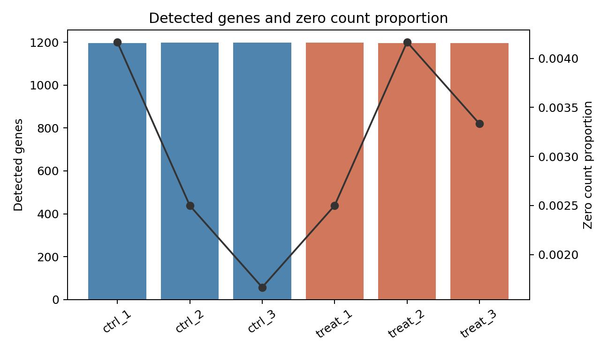
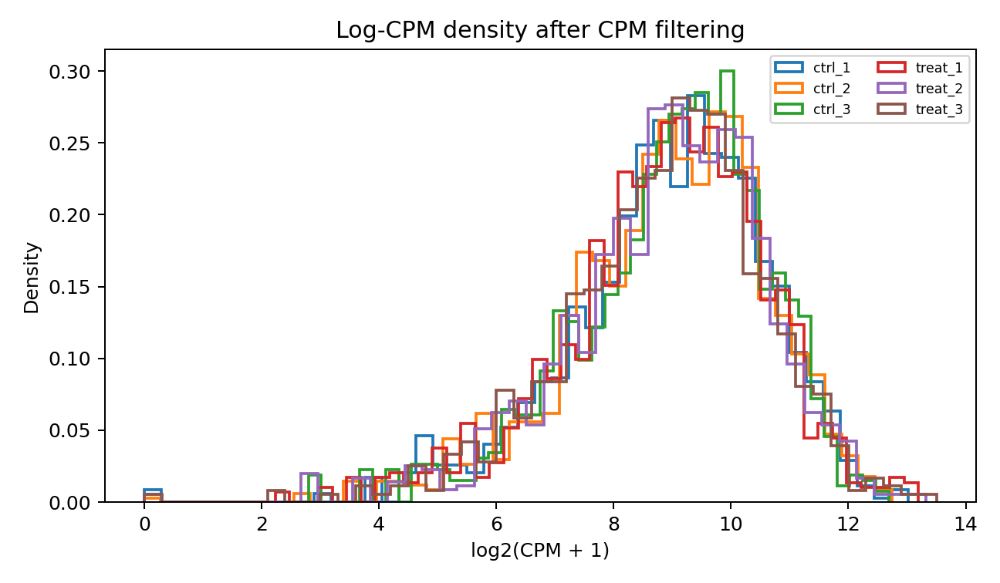
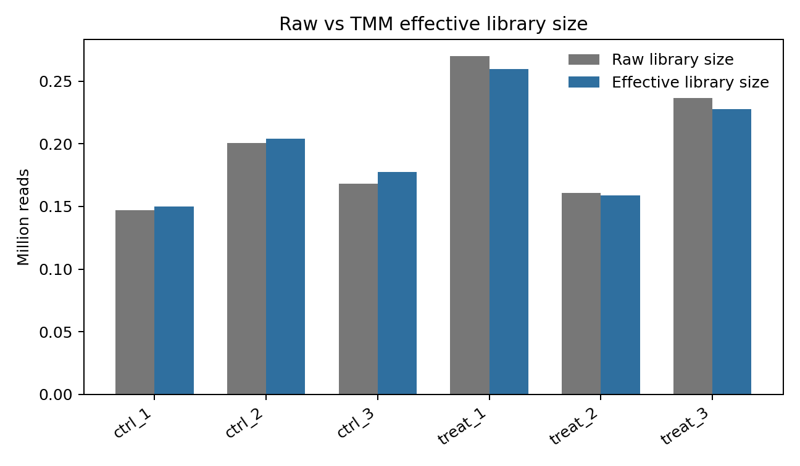
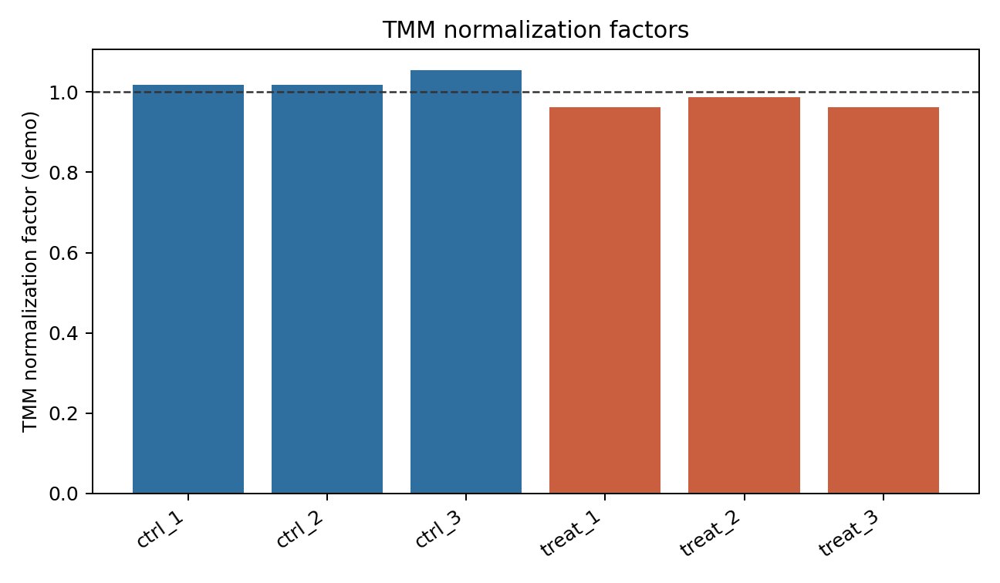
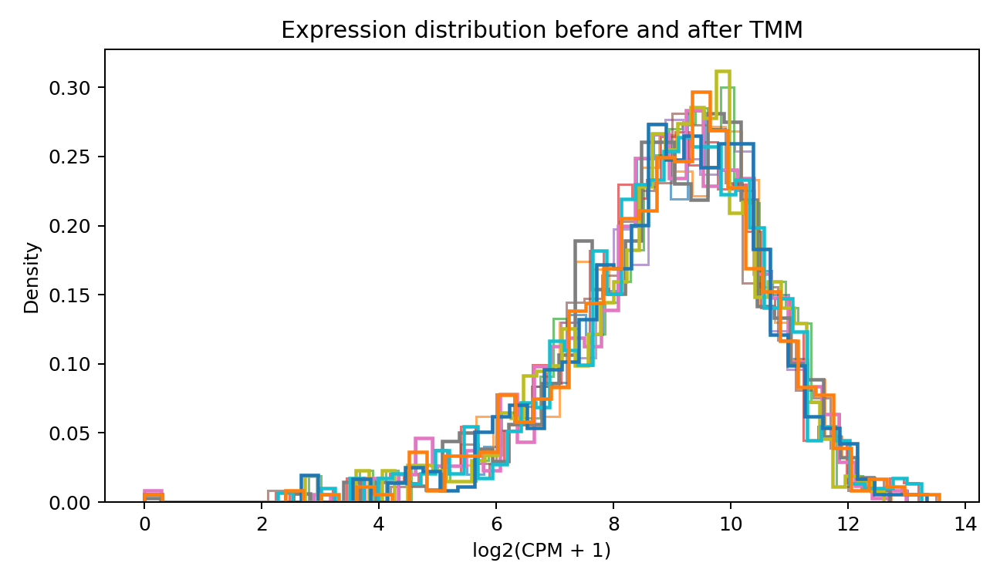

# Count Matrix, Filtering, Normalization, and TMM

本章目的：檢查 count matrix 與 sample metadata 是否對齊，過濾低表現基因，並清楚區分 RNA-seq 中不同 normalization 方法的用途。TMM 是本章核心範例。

本節使用模擬資料示範分析流程，結果不代表真實生物學研究發現。

## Count Matrix and Metadata Checks

輸入資料：

- `data/simulated_gene_counts.csv`
- `data/sample_metadata.csv`

基本檢查：

```r
library(readr)

counts_tbl <- read_csv("data/simulated_gene_counts.csv", show_col_types = FALSE)
metadata <- read_csv("data/sample_metadata.csv", show_col_types = FALSE)

sample_cols <- setdiff(names(counts_tbl), c("gene_symbol", "length"))
count_mat <- as.matrix(counts_tbl[, sample_cols])
rownames(count_mat) <- counts_tbl[[1]]

stopifnot(!anyDuplicated(metadata$sample_id))
stopifnot(setequal(colnames(count_mat), metadata$sample_id))
metadata <- metadata[match(colnames(count_mat), metadata$sample_id), ]
stopifnot(identical(colnames(count_mat), metadata$sample_id))
stopifnot(!anyNA(metadata))

table(metadata$group)
design <- model.matrix(~ group + batch + sex + age, data = metadata)
qr(design)$rank == ncol(design)
```

完整 script：

```bash
Rscript scripts/metadata_design_checks.R data/simulated_gene_counts.csv data/sample_metadata.csv
```

Warning: metadata 順序錯誤是 RNA-seq 中最危險的錯誤之一，因為程式可能不報錯，但 differential expression 的 group label 已經套到錯的 sample。

## Low-expression Filtering

分析目的：移除幾乎沒有資訊的低表現基因，降低 multiple testing burden，改善 mean-variance modeling。

低表現基因常造成：

- 大量 zero counts。
- fold change 極不穩定。
- dispersion 估計不穩。
- p-value 大多無資訊但仍增加 FDR 校正負擔。

固定 CPM threshold 範例：

```r
library(edgeR)

y <- DGEList(counts = count_mat)
cpm_mat <- cpm(y)
keep_fixed <- rowSums(cpm_mat >= 1) >= 3
```

Design-aware filtering：

```r
group <- factor(metadata$group)
design <- model.matrix(~ group)
keep <- filterByExpr(y, design)
y <- y[keep, , keep.lib.sizes = FALSE]
```

`filterByExpr()` 會根據 library size、group replicate 結構與 design 決定合理門檻，比單純固定 CPM 更貼近實驗設計。



圖 1. 每個樣本偵測到的 gene 數與 zero count proportion。若某一樣本偵測基因數明顯偏低，需回到 RNA quality、library size、mapping rate 或 duplication 檢查。



圖 2. CPM filtering 後的 log-CPM density。過濾後低表現尖峰會減少，但不應把具有實驗設計意義的小型 gene set 全部過濾掉。

## Normalization Concepts

RNA-seq normalization 不是單一問題：

| Concept | What it corrects | Example |
| --- | --- | --- |
| Sequencing depth / library size | 每個樣本 reads 數不同 | CPM、size factor |
| Composition bias | 少數高表現基因佔比改變造成其他基因相對下降 | TMM、median-of-ratios |
| Gene length | 同一樣本內長 gene 更容易累積 reads | RPKM/FPKM/TPM |
| Between-sample normalization | 樣本間比較同一 gene | TMM、DESeq2 size factors |
| Within-sample normalization | 同一樣本內比較不同 gene/transcript | TPM |
| Statistical model offset | 在 GLM 中校正 exposure/scale | edgeR effective library size、DESeq2 size factors |

Key point: TPM 很適合描述同一樣本內 transcript composition，但不是 edgeR/DESeq2 的 raw count input。TMM/DESeq2 size factor 是 differential expression 模型的 between-sample normalization，不是 gene length correction。

## Normalization Methods

| Method | Library size | Gene length | Within-sample comparison | Between-sample DE | Direct input to edgeR/DESeq2 | Common misuse |
| --- | --- | --- | --- | --- | --- | --- |
| Raw counts | no | no | no | no without model offset | yes | 直接畫樣本間 barplot 比大小 |
| CPM | yes | no | limited | descriptive only | no as transformed input | 用 CPM 跑 DESeq2 |
| RPKM | yes | yes | rough | poor for composition bias | no | 跨樣本 DE testing |
| FPKM | yes | yes | rough | poor for composition bias | no | 當作 count |
| TPM | yes, sum fixed | yes | yes | descriptive with caution | no | 直接 edgeR/DESeq2 |
| TMM | yes + composition | no | no | yes with count model | edgeR factor, not matrix replacement | 以為校正 gene length |
| TMMwsp | TMM variant for many zeros | no | no | yes in edgeR | edgeR factor | 不理解 zero-heavy context |
| DESeq2 median-of-ratios | yes + composition | no | no | yes with DESeq2 | DESeq2 size factor | 對全零/多零資料不檢查 |
| Upper-quartile | robust library scaling | no | no | sometimes | model-specific | 忽略 composition extremes |
| Quantile normalization | forces distributions equal | no | sometimes microarray | usually not count-model default | no | 破壞 count mean-variance |

## TMM Normalization

TMM 是 **Trimmed Mean of M-values**。它處理的核心問題是 composition bias：如果少數基因在某個樣本中極高表現，總 library size 變大，其他大多數基因即使 absolute expression 沒變，單純 CPM 也會看起來下降。

### Core Terms

| Term | Meaning |
| --- | --- |
| Reference sample | TMM 計算 log-ratio 時的比較基準 |
| M value | log expression ratio，常寫成 log2 fold change-like quantity |
| A value | average log expression，代表 absolute expression level |
| Trimming | 去掉極端 M 與 A，避免 DE genes 或低 count genes 主導 normalization |
| Weighted mean | 對保留下的 genes 計算加權平均 log-ratio |
| Scaling factor | 由 trimmed weighted mean 轉換出的 sample factor |
| Normalization factor | edgeR 儲存在 `y$samples$norm.factors` 的 factor |
| Effective library size | `library size * normalization factor` |
| Offset | GLM 中用來校正 exposure 的 log effective library size |

簡化公式：

$$
M_g = \log_2 \left(\frac{Y_{gk}/N_k}{Y_{gr}/N_r}\right),
\quad
A_g = \frac{1}{2}\log_2 \left(\frac{Y_{gk}}{N_k}\frac{Y_{gr}}{N_r}\right)
$$

其中 \(Y_{gk}\) 是 gene \(g\) 在 sample \(k\) 的 count，\(N_k\) 是 library size，\(r\) 是 reference sample。TMM 對極端 \(M\) 與 \(A\) 做 trimming 後，計算加權平均並轉成 normalization factor。

### R Example

```r
library(edgeR)
library(readr)

counts_tbl <- read_csv("data/simulated_gene_counts.csv", show_col_types = FALSE)
metadata <- read_csv("data/sample_metadata.csv", show_col_types = FALSE)
counts <- as.matrix(counts_tbl[, metadata$sample_id])
rownames(counts) <- counts_tbl[[1]]

group <- factor(metadata$group)
design <- model.matrix(~ group)

y <- DGEList(counts = counts, group = group)
keep <- filterByExpr(y, design)
y <- y[keep, , keep.lib.sizes = FALSE]
y <- calcNormFactors(y, method = "TMM")

y$samples[, c("lib.size", "norm.factors")]
y$samples$effective_lib_size <- y$samples$lib.size * y$samples$norm.factors

log_cpm <- cpm(y, log = TRUE, prior.count = 2)
```

`normLibSizes()` 是 edgeR 新版本中用來 normalize library sizes 的介面；`calcNormFactors()` 仍常見於既有教學與 workflow。TMMwsp 是 TMM 的 variant，對 sparse matrix 或 zero-heavy data 更穩定，會用 singleton positive counts 提供更多資訊。



圖 3. 原始 library size 與 TMM effective library size。TMM 不只是把每個樣本除以總 reads，而是調整 composition bias 後的有效 exposure。



圖 4. TMM normalization factor。factor 大於 1 表示該樣本 effective library size 被放大，factor 小於 1 表示被縮小。



圖 5. TMM normalization 前後的 log-CPM density。normalization 後分布應更適合樣本間比較，但不要求所有樣本完全相同，因為真實 biological signal 也可能改變分布。

TMM 與其他方法比較：

- TMM vs CPM：CPM 只除 library size；TMM 另校正 composition bias。
- TMM vs TPM：TPM 校正 transcript length 並讓樣本內 TPM sum 相同；TMM 不校正 gene length，主要給 count model 做樣本間 normalization。
- TMM vs RPKM/FPKM：RPKM/FPKM 以 gene length 與 library size 描述 abundance，但不適合作為 count-based DE input。
- TMM vs DESeq2 median-of-ratios：兩者都處理 composition bias；TMM 使用 trimmed log-ratio weighted mean，DESeq2 用 pseudo-reference geometric mean 與 median ratio。

TMM 適合大多數 bulk RNA-seq gene-level count DE。若全局性表達改變、spike-in 設計、極端 cell composition shift 或大量 genes 真實同向改變，需額外評估 normalization 假設。

