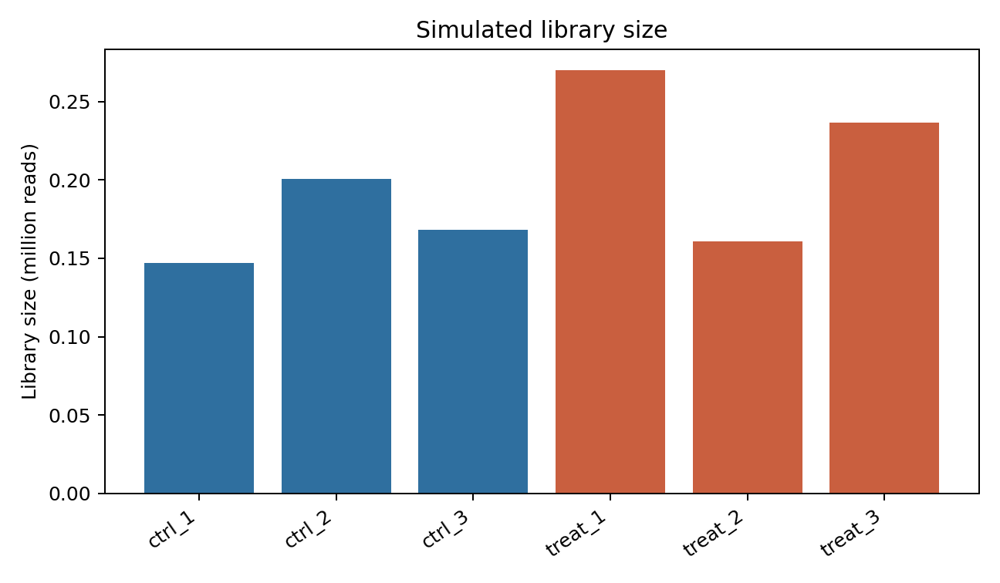
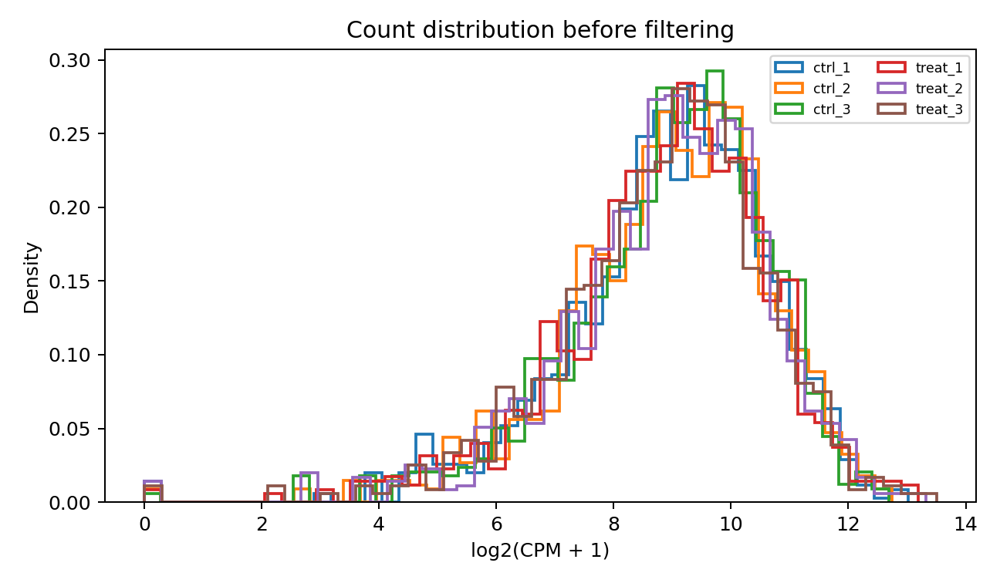
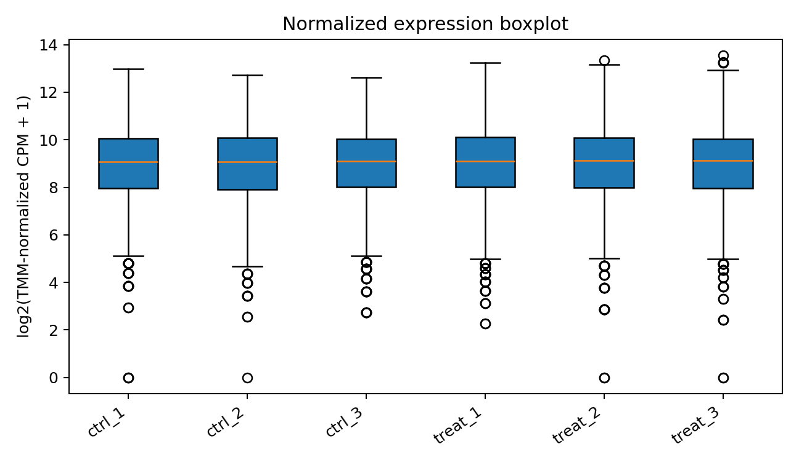
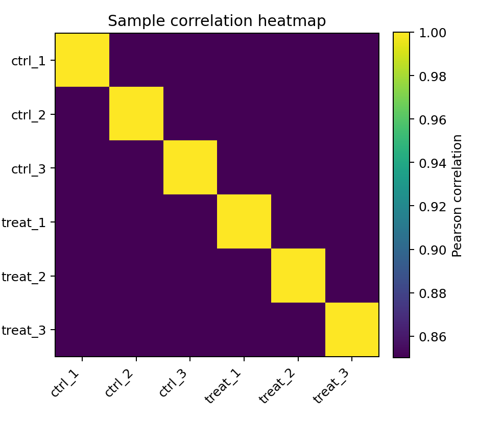
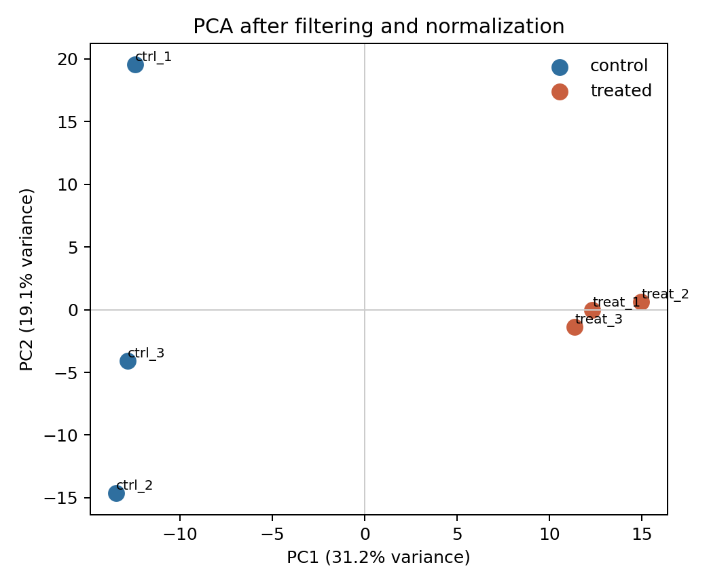
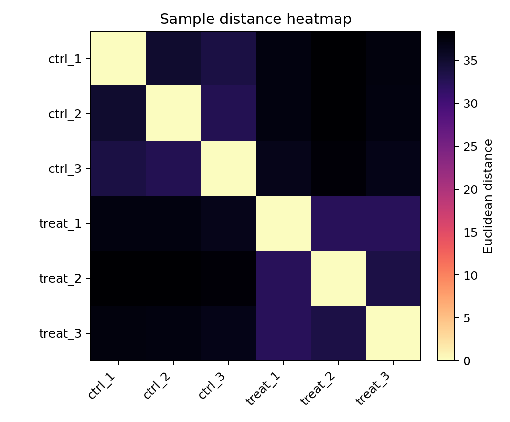
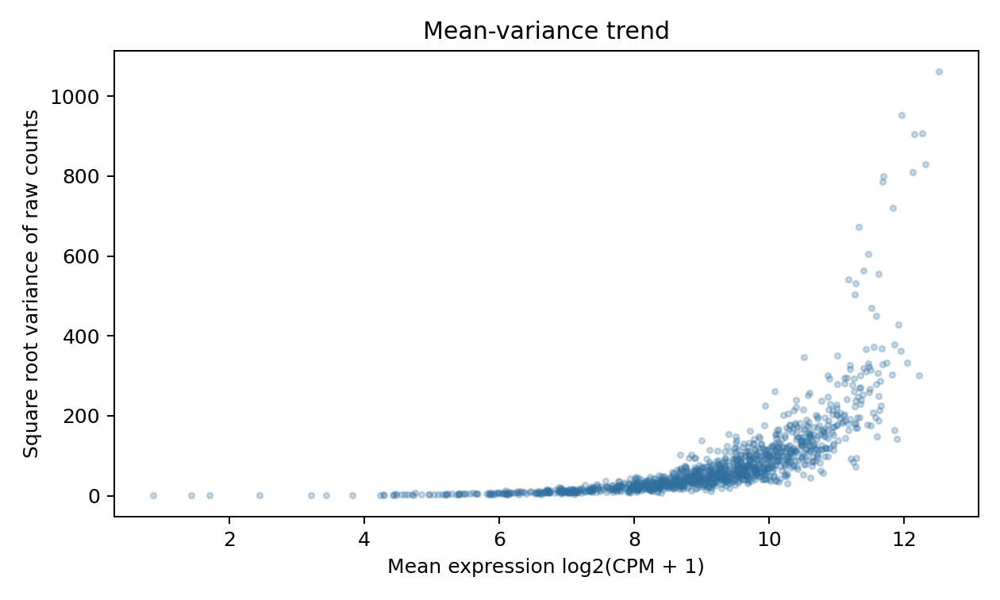

# Exploratory Analysis, Experimental Design, and Count Models

本章目的：用樣本層級圖表檢查資料結構，建立正確 design matrix，並理解 RNA-seq count data 為什麼通常需要 negative binomial model，而不是只用 Poisson model。

本節使用模擬資料示範分析流程，結果不代表真實生物學研究發現。

## Exploratory Data Analysis

EDA 的目標不是直接決定顯著基因，而是檢查：

- library size 是否極端不均。
- detected gene count 與 zero proportion 是否有 outlier。
- normalization 後 sample distribution 是否合理。
- replicate 是否聚集。
- batch、sex、age 或其他 covariate 是否主導主要變異。
- mean-variance trend 是否符合 count data 特性。

### Library Size, Detected Genes, and Zero Proportion

```r
library(edgeR)
library(readr)

counts_tbl <- read_csv("data/simulated_gene_counts.csv", show_col_types = FALSE)
metadata <- read_csv("data/sample_metadata.csv", show_col_types = FALSE)
counts <- as.matrix(counts_tbl[, metadata$sample_id])
rownames(counts) <- counts_tbl[[1]]

library_size <- colSums(counts)
detected <- colSums(counts > 0)
zero_prop <- colMeans(counts == 0)
data.frame(sample = metadata$sample_id, library_size, detected, zero_prop)
```



圖 1. Library size bar plot。若某一樣本 library size 遠低於其他樣本，DE 前應檢查 sequencing depth、mapping rate 與 sample quality。


圖 2. Detected gene count 與 zero count proportion。這兩個指標常一起看，因為 library size 低、RNA degradation 或 mapping failure 都可能讓 detected genes 下降。

### Distribution, Boxplot, Correlation, PCA, and Distance

```r
group <- factor(metadata$group)
design <- model.matrix(~ group)
y <- DGEList(counts = counts, group = group)
y <- y[filterByExpr(y, design), , keep.lib.sizes = FALSE]
y <- calcNormFactors(y)
log_cpm <- cpm(y, log = TRUE, prior.count = 2)

plotMDS(y, col = as.integer(group))
cor_mat <- cor(log_cpm)
sample_dist <- dist(t(log_cpm))
pca <- prcomp(t(log_cpm), scale. = FALSE)
```



圖 3. 過濾前的 log-CPM density。低表現基因通常形成靠近 0 的堆積，過多低 count 會影響多重檢定與模型穩定度。



圖 4. Normalized expression boxplot。箱型圖能快速看出樣本整體分布是否偏移，但不能單獨判斷 batch effect 或 outlier 來源。



圖 5. Sample correlation heatmap。replicate 通常應高相關；若不同 group 內相關性反而低，需檢查 metadata、batch 或 sample swap。



圖 6. PCA plot。軸標籤應標出 variance explained。若 PC1/PC2 依 group 分離，表示主要變異與實驗條件一致；若依 batch 分離，DE design 應納入 batch 或重新檢視 confounding。



圖 7. Sample distance heatmap。distance heatmap 比 correlation heatmap 更受 scale 與 transformation 影響，應搭配 PCA/MDS 一起看。



圖 8. Mean-variance trend。RNA-seq count 的 variance 通常隨 mean 增加，這是需要 count-aware model 的主要原因。

Tip: outlier 不能只靠一張 PCA 排除。應同時檢查 FASTQ QC、mapping QC、gene body coverage、library size、metadata、sample handling record 與是否有合理生物原因。

## Experimental Design

設計矩陣描述每個樣本的 group、batch、covariate 與 pairing。模型只能估計 design 中可以由資料分辨的效應。

| Concept | Meaning |
| --- | --- |
| Biological replicate | 獨立生物樣本，是 DE 的變異基礎 |
| Technical replicate | 同一 biological sample 的技術重複，通常先合併或用特定模型 |
| Independent sample | 彼此獨立的觀測單位 |
| Paired design | 同一個 subject 前後處理或左右配對 |
| Repeated measures | 同一 subject 多時間點，需 blocking/correlation model |
| Factor | 離散變項，如 group、batch、sex |
| Covariate | 連續或調整變項，如 age、RIN |
| Confounding | group 與 batch 完全重疊，無法分辨 |
| Interaction | treatment effect 是否依 time/genotype 改變 |
| Blocking factor | subject、patient 或 batch 造成相關性 |
| Nested design | 例如 sample nested within patient 或 lane nested within flowcell |

### model.matrix Examples

```r
metadata$group <- factor(metadata$group, levels = c("control", "treated"))

# 有截距：treated coefficient 是 treated - control。
model.matrix(~ group, metadata)

# 無截距：每組各一欄，contrast 另行定義。
model.matrix(~ 0 + group, metadata)

# 加入 batch、age、sex。
model.matrix(~ batch + sex + age + group, metadata)

# paired design：subject 作為 blocking factor。
model.matrix(~ subject + treatment, paired_metadata)

# treatment by time interaction。
model.matrix(~ treatment * time, timecourse_metadata)
```

錯誤案例：group 與 batch 完全 confounded。

```r
bad <- data.frame(
  sample = paste0("s", 1:4),
  group = c("control", "control", "treated", "treated"),
  batch = c("A", "A", "B", "B")
)
design_bad <- model.matrix(~ group + batch, bad)
qr(design_bad)$rank < ncol(design_bad)
```

這種情況下，group effect 與 batch effect 沒有辦法由資料分開。把 batch 放進 model 不會 magically 修正 confounding。

## Count Models

RNA-seq gene counts 是非負整數，且 variance 通常大於 mean。Poisson distribution 假設：

$$
Y_g \sim \text{Poisson}(\mu_g), \quad Var(Y_g)=\mu_g
$$

但 biological replicate 的 RNA-seq 常有 overdispersion：

$$
Y_g \sim \text{NB}(\mu_g, \phi_g), \quad Var(Y_g)=\mu_g + \phi_g \mu_g^2
$$

其中 \(\phi_g\) 是 dispersion。若只用 Poisson，會低估 biological variation，使 p-value 過小、false positives 增加。

| Term | Meaning |
| --- | --- |
| Mean-variance relationship | count mean 越高，variance 通常越高 |
| Overdispersion | variance 超過 Poisson 預期 |
| Negative binomial | edgeR/DESeq2 常用 count model |
| Biological coefficient of variation | edgeR 中 dispersion 的直觀尺度 |
| Common dispersion | 所有 genes 共用的 dispersion trend |
| Trended dispersion | dispersion 隨 abundance 改變 |
| Tagwise dispersion | gene-specific dispersion |
| Shrinkage / empirical Bayes | 用全基因資訊穩定 individual gene estimates |
| Quasi-likelihood | edgeR QL framework，對 gene-level uncertainty 更保守 |

Key point: replicate 數少時，單一 gene 的 dispersion 很難穩定估計，因此 edgeR、DESeq2、limma-voom 都會借用全基因資訊做 shrinkage 或 empirical Bayes。

