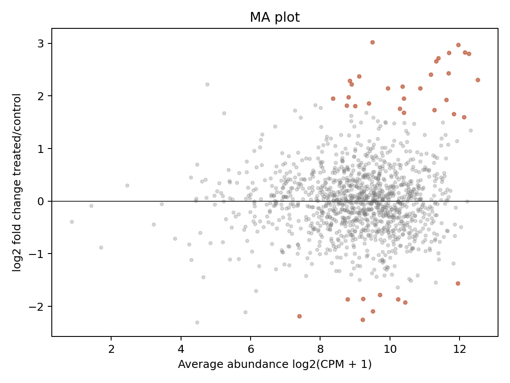
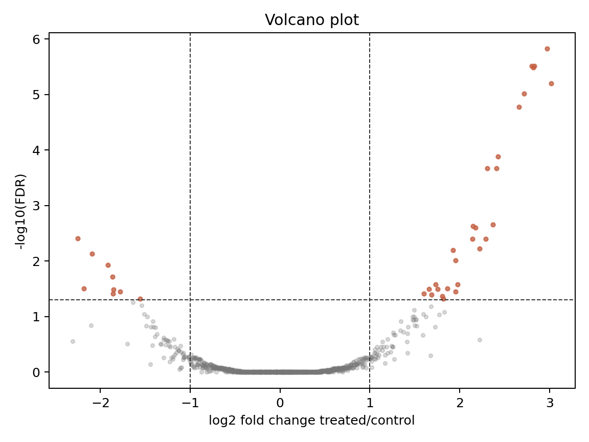
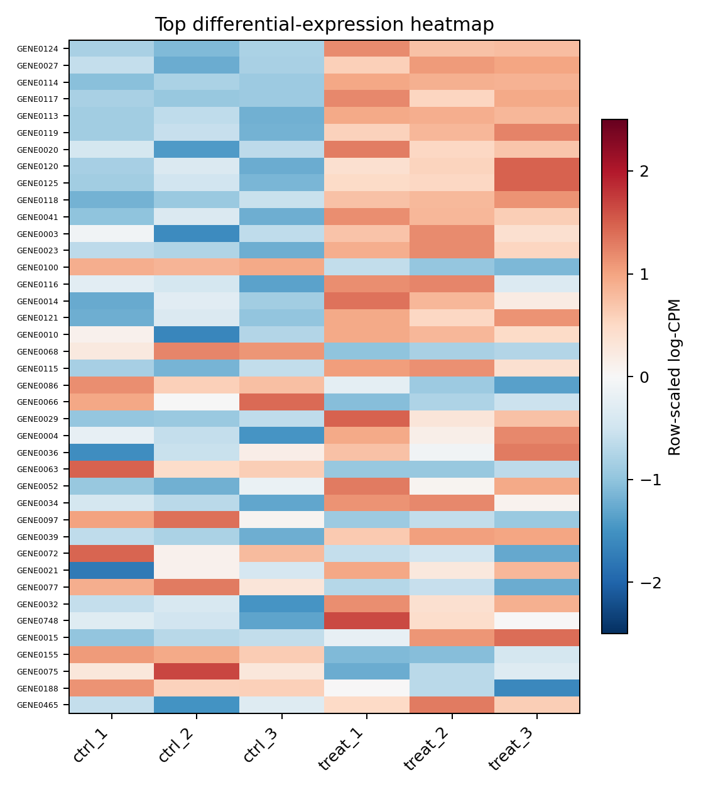
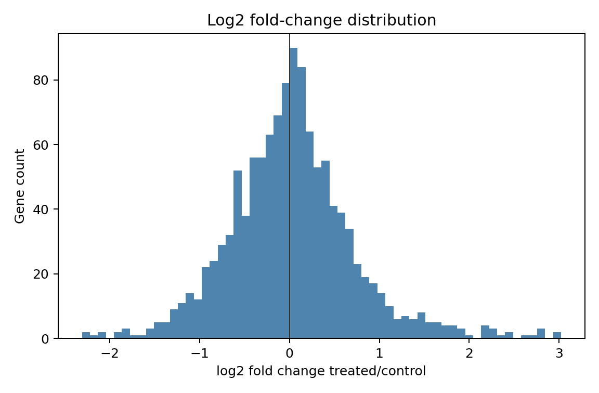
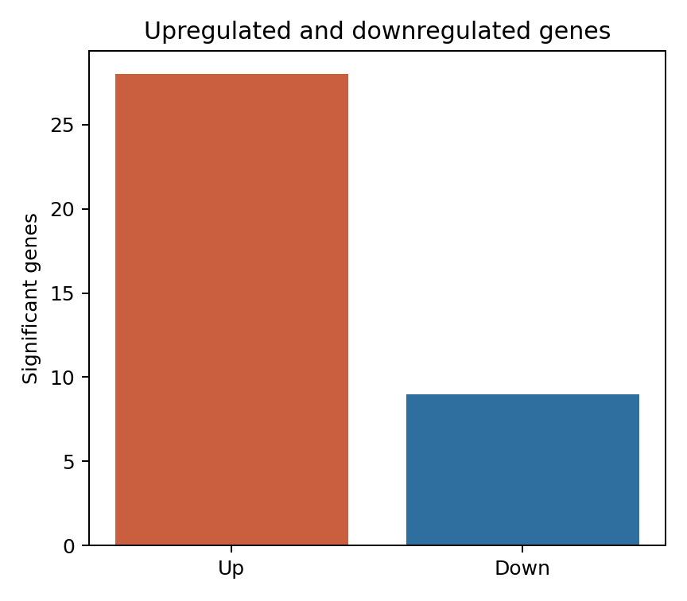
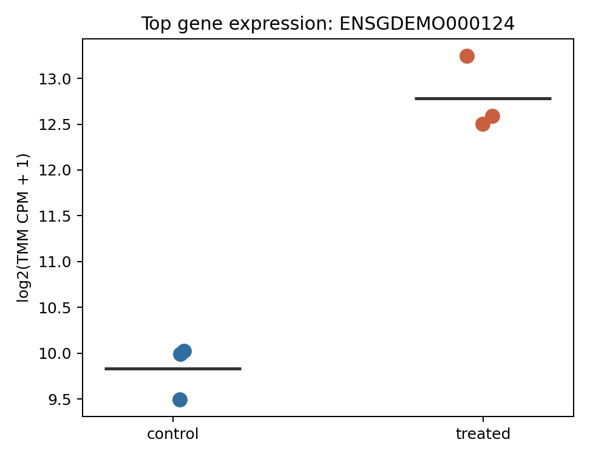

# Contrasts, Multiple Testing, and DE Visualization

本章目的：正確設定 comparison/contrast，理解 p-value 與 FDR，並用 MA plot、volcano plot、heatmap 與 gene-level expression plot 解讀 differential expression 結果。

本節使用模擬資料示範分析流程，結果不代表真實生物學研究發現。

## Coefficients and Contrasts

Coefficient 是 model matrix 中某一欄的模型參數；contrast 是 coefficient 的線性組合。contrast 方向會直接決定 log2 fold change 正負號。

### Reference-level Design

```r
metadata$group <- factor(metadata$group, levels = c("control", "treated"))
design <- model.matrix(~ group, metadata)
colnames(design)
# "(Intercept)" "grouptreated"
```

這裡 `grouptreated` 代表 treated - control。

DESeq2：

```r
results(dds, contrast = c("group", "treated", "control"))
```

edgeR：

```r
glmQLFTest(fit, coef = "grouptreated")
```

### No-intercept Design

```r
design <- model.matrix(~ 0 + group, metadata)
colnames(design) <- c("control", "treated")
makeContrasts(treated - control, levels = design)
```

錯誤方向範例：

```r
# 這是 control - treated，不是 treated - control。
makeContrasts(control - treated, levels = design)
```

如果 contrast 方向反了，顯著性通常相同，但 logFC 正負號與 up/down interpretation 會顛倒。

## Interaction and Difference-in-differences

Treatment by time interaction：

```r
design <- model.matrix(~ treatment * time, metadata)
```

若 time 有 `pre` 與 `post`，treatment 有 `control` 與 `drug`，interaction coefficient 可解讀為：

```text
(drug_post - drug_pre) - (control_post - control_pre)
```

這不是單純 post 時間點的 drug vs control，而是 drug 是否改變了 pre-to-post 的變化量。

## Multiple Testing

RNA-seq 同時檢定上萬個 genes，不能只看未校正 p-value。

| Term | Meaning |
| --- | --- |
| P value | 若 null hypothesis 為真，觀察到至少同等極端結果的機率 |
| Multiple testing | 同時做大量假設檢定造成 false positives 上升 |
| Family-wise error rate | 至少一個 false positive 的機率 |
| False discovery rate | 被宣稱顯著者中預期 false positives 比例 |
| Benjamini-Hochberg | 常用 FDR adjustment 方法 |
| Adjusted P value | 在多重檢定下控制 FDR 的 p-value |

常見顯著標準：

```r
sig <- subset(res, FDR < 0.05 & abs(logFC) >= 1)
```

Warning: `PValue < 0.05` 在上萬個基因中會產生大量 false positives。應以 FDR/padj 為主，並把 log2 fold change threshold 視為 biological effect size filter，而不是統計校正替代品。

## Visualization

### MA Plot

```r
plot(res$logCPM, res$logFC,
     pch = 16, cex = 0.4,
     xlab = "Average abundance",
     ylab = "log2 fold change")
abline(h = 0, col = "gray40")
```



圖 1. MA plot。x 軸是平均表達量，y 軸是 log2 fold change。低 abundance 區域的 fold change 常較不穩，需搭配 FDR 與 shrinkage 解讀。

### Volcano Plot

```r
plot(res$logFC, -log10(res$FDR),
     pch = 16, cex = 0.4,
     xlab = "log2 fold change",
     ylab = "-log10(FDR)")
abline(v = c(-1, 1), lty = 2)
abline(h = -log10(0.05), lty = 2)
```



圖 2. Volcano plot。它適合快速呈現 effect size 與 significance，但不應取代完整結果表、model diagnostics、sample QC 與 gene-level 檢查。

### Heatmap

```r
top <- rownames(res)[order(res$FDR)][1:50]
mat <- log_cpm[top, ]
mat_scaled <- t(scale(t(mat)))
pheatmap::pheatmap(mat_scaled, annotation_col = metadata["group"])
```



圖 3. Top DE genes heatmap。row scaling 讓每個 gene 呈現相對高低，不代表絕對表達量。top genes 的選擇應明確，例如 FDR 排名前 50 或 FDR < 0.05 且 abs(logFC) >= 1。

### Other Summary Plots



圖 4. Log2 fold change distribution。若分布整體偏移，可能是真實全局變化，也可能是 normalization 假設不符。



圖 5. Upregulated 與 downregulated gene count。這是 summary，不應單獨用來判斷 biology。



圖 6. Top gene expression plot。單一 gene 圖能檢查 replicate 是否一致；若顯著性由單一 outlier 驅動，應回到 QC 與模型診斷。

Gene symbol 標示注意事項：

- symbol 可能 outdated 或 duplicated。
- Ensembl ID version suffix 可能造成 mapping 失敗。
- 圖上標太多 label 會降低可讀性；通常只標 top genes 或已知 marker。

