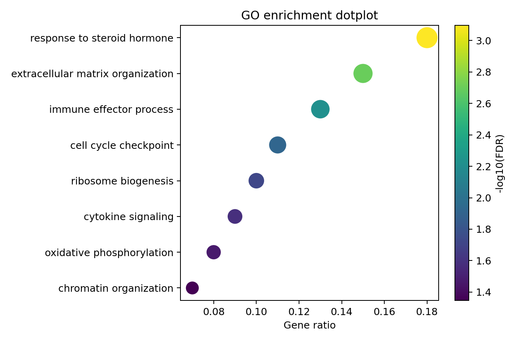
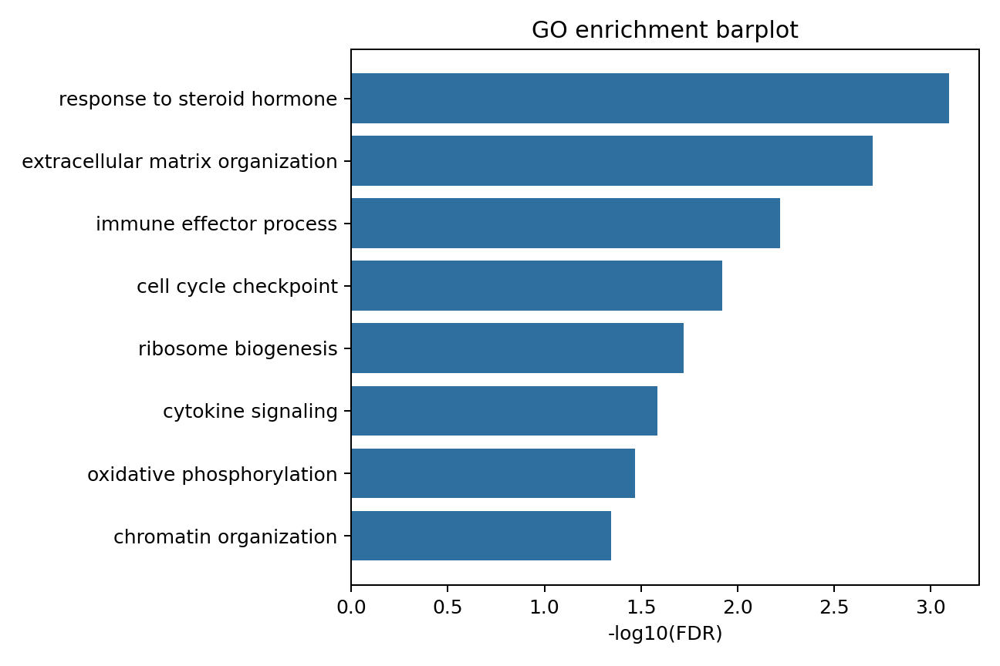

# Gene Annotation and Functional Enrichment

本章目的：將 gene ID 轉換為 gene symbol、Entrez ID 等可解讀 annotation，並使用 ORA/GSEA 解讀差異表現基因的 pathway 與 biological process。

本節使用模擬資料示範分析流程，結果不代表真實生物學研究發現。

## Gene Annotation

RNA-seq 結果常以 Ensembl gene ID 為 row names，但報告與 enrichment 常需要 gene symbol 或 Entrez ID。

| Identifier | Example | Notes |
| --- | --- | --- |
| Ensembl gene ID | `ENSG00000141510` | 版本 suffix 如 `.17` 需小心 |
| Ensembl transcript ID | `ENST00000269305` | transcript-level quantification 主鍵 |
| Entrez ID | `7157` | KEGG/clusterProfiler 常用 |
| Gene symbol | `TP53` | 易讀但可能 duplicate/deprecated |

常見問題：

- Version suffix：`ENSG00000141510.17` 與 annotation DB 的 `ENSG00000141510` 不匹配。
- One-to-many mapping：一個 ID 可能對到多個 symbol 或 Entrez。
- Deprecated symbol：舊 symbol 可能無法映射。
- Duplicate symbol：不同 Ensembl genes 可能共享 symbol，heatmap row label 會混淆。
- Annotation database version：不同版本會造成結果差異。

### AnnotationDbi Example

```r
library(AnnotationDbi)
library(org.Hs.eg.db)

gene_ids <- sub("\\..*$", "", rownames(count_mat))
symbols <- mapIds(
  org.Hs.eg.db,
  keys = gene_ids,
  keytype = "ENSEMBL",
  column = "SYMBOL",
  multiVals = "first"
)

annotation <- data.frame(
  gene_id = rownames(count_mat),
  ensembl_id_no_version = gene_ids,
  gene_symbol = unname(symbols)
)
```

### biomaRt Example

```r
library(biomaRt)

mart <- useEnsembl("genes", dataset = "hsapiens_gene_ensembl")
annot <- getBM(
  attributes = c("ensembl_gene_id", "hgnc_symbol", "entrezgene_id"),
  filters = "ensembl_gene_id",
  values = unique(gene_ids),
  mart = mart
)
```

Tip: 對 downstream DE table，保留 unmapped genes 比直接丟掉更安全。可新增 `gene_symbol` 欄位，但主鍵仍用 stable gene ID。

## Functional Enrichment

Functional enrichment 把 gene-level 結果轉成 biological process、pathway 或 gene set 層級。

| Method | Input | Question |
| --- | --- | --- |
| ORA | 顯著基因清單 + background universe | 顯著基因是否在某些 gene set 過度出現？ |
| GSEA | 全部 genes 的排序分數 | 某 gene set 是否集中在排序頂端或底端？ |

常見資料庫：

- GO：BP biological process、CC cellular component、MF molecular function。
- KEGG：pathway maps。
- Reactome：curated biological pathways。

重要概念：

| Concept | Why it matters |
| --- | --- |
| Gene universe | ORA 背景應是實際進入差異分析的 genes |
| Ranking metric | GSEA 可用 signed statistic、logFC 或 signed -log10 p |
| Gene set size | 太小不穩，太大不具體 |
| Multiple testing | pathway 也需要 FDR correction |
| Redundant pathways | GO term 彼此重疊，需要 simplify/emapplot 輔助 |
| Directionality | ORA 對上調/下調需分開做；GSEA 可保留方向 |

Warning: ORA 的背景集合不應任意使用全基因組。正確背景通常是「通過 filtering 且實際進入 DE model 的 genes」，否則會因可偵測性偏差而產生錯誤富集。

## clusterProfiler ORA

```r
library(clusterProfiler)
library(org.Hs.eg.db)
library(enrichplot)

sig_symbols <- de$gene_symbol[de$FDR < 0.05 & abs(de$logFC) >= 1]
universe_symbols <- tested_genes$gene_symbol

sig_entrez <- bitr(sig_symbols, fromType = "SYMBOL", toType = "ENTREZID", OrgDb = org.Hs.eg.db)
universe_entrez <- bitr(universe_symbols, fromType = "SYMBOL", toType = "ENTREZID", OrgDb = org.Hs.eg.db)

ego <- enrichGO(
  gene = unique(sig_entrez$ENTREZID),
  universe = unique(universe_entrez$ENTREZID),
  OrgDb = org.Hs.eg.db,
  ont = "BP",
  keyType = "ENTREZID",
  pAdjustMethod = "BH",
  pvalueCutoff = 0.05,
  qvalueCutoff = 0.2,
  minGSSize = 10,
  maxGSSize = 500,
  readable = TRUE
)

dotplot(ego, showCategory = 15)
barplot(ego, showCategory = 15)
cnetplot(ego, showCategory = 5)
emapplot(pairwise_termsim(ego))
```

KEGG：

```r
ekegg <- enrichKEGG(
  gene = unique(sig_entrez$ENTREZID),
  universe = unique(universe_entrez$ENTREZID),
  organism = "hsa",
  pAdjustMethod = "BH"
)
```

## GSEA

```r
ranked <- de[!is.na(de$logFC) & !is.na(de$gene_symbol), ]
ranked <- ranked[!duplicated(ranked$gene_symbol), ]
map <- bitr(ranked$gene_symbol, fromType = "SYMBOL", toType = "ENTREZID", OrgDb = org.Hs.eg.db)
ranked <- merge(ranked, map, by.x = "gene_symbol", by.y = "SYMBOL")

gene_list <- ranked$logFC
names(gene_list) <- ranked$ENTREZID
gene_list <- sort(gene_list, decreasing = TRUE)

ggo <- gseGO(
  geneList = gene_list,
  OrgDb = org.Hs.eg.db,
  ont = "BP",
  pAdjustMethod = "BH",
  minGSSize = 10,
  maxGSSize = 500
)
```

GSEA 不需要先切顯著基因，但非常依賴 ranking metric。若使用 logFC，會強調 effect size；若使用 signed statistic，會同時考慮 uncertainty。



圖 1. GO enrichment dotplot。x 軸 gene ratio 代表 gene set 中命中的比例，點大小常代表 count，顏色代表 adjusted significance。



圖 2. GO enrichment barplot。barplot 容易讀，但較難呈現 gene set size 與 overlap，應搭配 dotplot、cnetplot 或 emapplot。

結果解讀：

- 不要把 enriched term 解讀成所有 genes 都同向改變，除非分析已分上/下調或使用 GSEA direction。
- redundant GO terms 需合併或挑選代表 term。
- pathway 結果是 hypothesis generation，不是機制證明。

