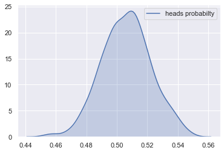

# Core Concepts & Bayes' Theorem

Bayesian statistics is built on a single, powerful idea: **probability is a measure of belief, and beliefs should be updated when new evidence arrives**. This section introduces the philosophical foundation and the mathematical engine behind it all.

Key point: Why is Bayesian statistics important: Frequent statistics can only answer "Assuming that the null hypothesis is true, how extreme is this data?" while Bayesian statistics can directly answer "After reading the data, what is my belief about the parameters?" This is a fundamental difference in epistemology.

## Two Views of Probability

Before deriving Bayes' theorem, it's essential to understand what "probability" even means. There are two fundamentally different interpretations:

| View            | Probability Represents          | Example Statement                                       |
| --------------- | ------------------------------- | ------------------------------------------------------- |
| **Frequentist** | Long-run frequency of an event  | "A fair coin lands heads 50% of the time in many flips" |
| **Bayesian**    | Degree of belief or uncertainty | "I am 70% confident this coin is fair"                  |

Tip: The Bayesian view allows us to assign probabilities to one-time events and to model parameters — things a frequentist treats as fixed unknown constants, not as random variables.

## Bayes' Theorem

Bayes' theorem follows directly from the definition of conditional probability.

### Derivation

\[ P(A \cap B) = P(A|B) \cdot P(B) = P(B|A) \cdot P(A) ]

Rearranging:

\[ \boxed{P(A|B) = \frac{P(B|A) \cdot P(A)}{P(B)\}} ]

### In Statistical Inference Context

Replace generic events with **parameter θ** and **data D**:

\[ \boxed{P(\theta | D) = \frac{P(D | \theta) \cdot P(\theta)}{P(D)\}} ]

| Term               | Name                   | Meaning                                            |
| ------------------ | ---------------------- | -------------------------------------------------- |
| $P(\theta \mid D)$ | posterior distribution | Belief about θ **after** seeing data               |
| $P(D \mid \theta)$ | likelihood             | How probable is this data given parameter θ?       |
| $P(\theta)$        | **Prior**              | Belief about θ **before** seeing data              |
| $P(D)$             | **Evidence**           | Normalizing constant — ensures posterior sums to 1 |

Tip: The practical shorthand is Posterior ∝ Likelihood × Prior. Because $P(D)$ is just a constant that does not depend on θ, we often work with the unnormalized form $P(\theta \mid D) \propto P(D \mid \theta) \cdot P(\theta)$.

## Intuition: The Update Cycle

Bayesian inference is fundamentally **iterative**. You start with a prior belief, observe data, and produce a posterior — which then becomes the prior for the next observation.

```
Prior Belief → [Observe Data] → Posterior Belief → [Observe More Data] → Updated Posterior → ...
```

This is how beliefs rationally evolve with accumulating evidence. Crucially:

* **Strong priors** require more data to overcome
* **Weak (vague) priors** let the data dominate quickly
* **More data** → Posterior concentrates around the true value regardless of prior choice

## Worked Example: Coin Flipping

Suppose we want to estimate θ = probability of heads for a coin we suspect might be biased.

**Setup:**

* Prior: We believe θ is probably near 0.5 (fair coin), but we're uncertain → Beta(2, 2)
* We flip 10 times and observe 7 heads

```python
import numpy as np
import matplotlib.pyplot as plt
from scipy.stats import beta

# Parameter space
theta = np.linspace(0, 1, 300)

# Prior: Beta(2, 2) — weak belief in fairness
prior_a, prior_b = 2, 2
prior = beta.pdf(theta, prior_a, prior_b)

# Data: 7 heads out of 10 flips
heads = 7
tails = 3

# Posterior: Beta(prior_a + heads, prior_b + tails)
# This is the Beta-Binomial conjugate result (expanded in the conjugate priors chapter)
post_a = prior_a + heads
post_b = prior_b + tails
posterior = beta.pdf(theta, post_a, post_b)

# Likelihood: proportional to theta^heads * (1-theta)^tails
likelihood = theta**heads * (1 - theta)**tails
likelihood /= likelihood.max()  # normalize for visualization only

# Plot
plt.figure(figsize=(9, 5))
plt.plot(theta, prior,      label=f'Prior: Beta({prior_a}, {prior_b})',  linestyle='--', color='gray')
plt.plot(theta, likelihood, label='Likelihood (scaled)',                  linestyle=':',  color='steelblue')
plt.plot(theta, posterior,  label=f'Posterior: Beta({post_a}, {post_b})', linewidth=2.5,  color='tomato')
plt.axvline(heads / (heads + tails), color='black', linestyle='--', alpha=0.4, label='MLE (7/10 = 0.7)')
plt.xlabel('θ (probability of heads)')
plt.ylabel('Density')
plt.title("Bayesian Update: Coin Flip Example")
plt.legend()
plt.tight_layout()
plt.show()
```

**Reading the plot:**

* The **prior** (gray dashed) reflects our initial belief — symmetric, centered at 0.5
* The **likelihood** (blue dotted) peaks at 0.7, driven purely by data
* The **posterior** (red solid) is a compromise — pulled toward 0.7 by data, but moderated by the prior

Tip: With only 10 flips, the prior still has visible influence. With 1000 flips at the same rate, the posterior would nearly coincide with the likelihood. Data dominates as n grows. The larger the amount of data, the smaller the influence of the prior, and the closer the posterior is to the maximum likelihood estimate (MLE). This also explains why frequentist statistics and Bayesian statistics tend to reach similar conclusions when using large samples.

## Reading Prior, Likelihood, and Posterior Together

One of the biggest learning jumps in Bayesian statistics is recognizing that these three objects play different roles:

| Object         | Question it answers                                      |
| -------------- | -------------------------------------------------------- |
| **Prior**      | What did I believe before seeing the data?               |
| **Likelihood** | Which parameter values make the observed data plausible? |
| **Posterior**  | What should I believe now after combining both?          |



In the source material, this type of plot is useful because it makes Bayesian updating tangible: the posterior is not just "a formula result", but a reshaped belief distribution. In practice, when you read a posterior density plot, look for:

1. Where the mass is concentrated.
2. How wide the distribution is.
3. Whether the distribution is symmetric or skewed.

Tip: A narrow posterior means the data plus prior together support a relatively precise claim. A wide posterior means substantial uncertainty remains, even after observing the data.

## A Sequential Update Example

Bayesian reasoning is especially natural when data arrives over time. Instead of refitting from scratch conceptually, the old posterior becomes the new prior.

```python
from scipy.stats import beta

# Start with a weakly informative prior
a, b = 2, 2

# Batch 1: 8 flips, 5 heads
a, b = a + 5, b + 3
print("After batch 1:", beta(a, b).mean())

# Batch 2: 12 more flips, 9 heads
a, b = a + 9, b + 3
print("After batch 2:", beta(a, b).mean())

# Batch 3: 20 more flips, 11 heads
a, b = a + 11, b + 9
print("After batch 3:", beta(a, b).mean())
```

This sequential view is part of what makes Bayesian methods attractive in experimentation, online learning, and monitoring problems where evidence accumulates gradually.

## The Evidence Term P(D)

The denominator $P(D)$ is the **marginal likelihood** — the probability of observing the data averaged over all possible parameter values:

\[ P(D) = \int P(D | \theta) \cdot P(\theta) , d\theta ]

Warning: This integral is often analytically intractable for complex models, which is why MCMC methods exist. In practice, we often work with Posterior ∝ Likelihood × Prior and let sampling methods handle the normalization constant implicitly.

## Key Takeaways

| Concept                            | Key Point                                                                       |
| ---------------------------------- | ------------------------------------------------------------------------------- |
| **Probability = degree of belief** | In Bayesian stats, parameters have distributions — they are not fixed constants |
| **Bayes' theorem**                 | Posterior ∝ Likelihood × Prior — the complete update formula                    |
| **The update cycle**               | Each posterior can become the prior for the next round of data                  |
| **Prior influence shrinks**        | As n → ∞, the posterior is dominated by the likelihood regardless of prior      |
| **P(D) is just a normalizer**      | Often skipped; sampling methods handle it without computing it directly         |
