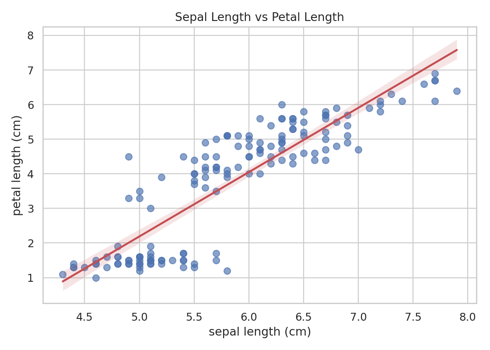
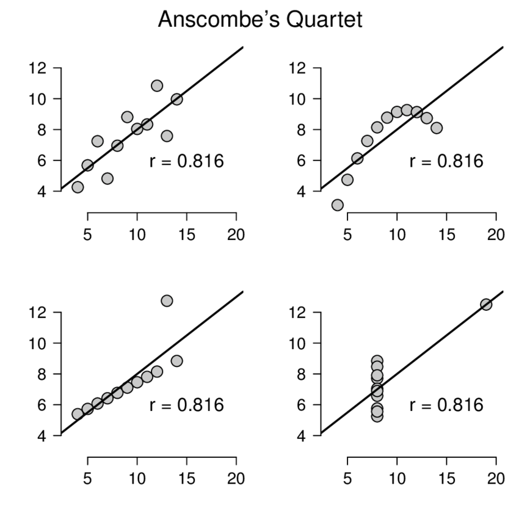
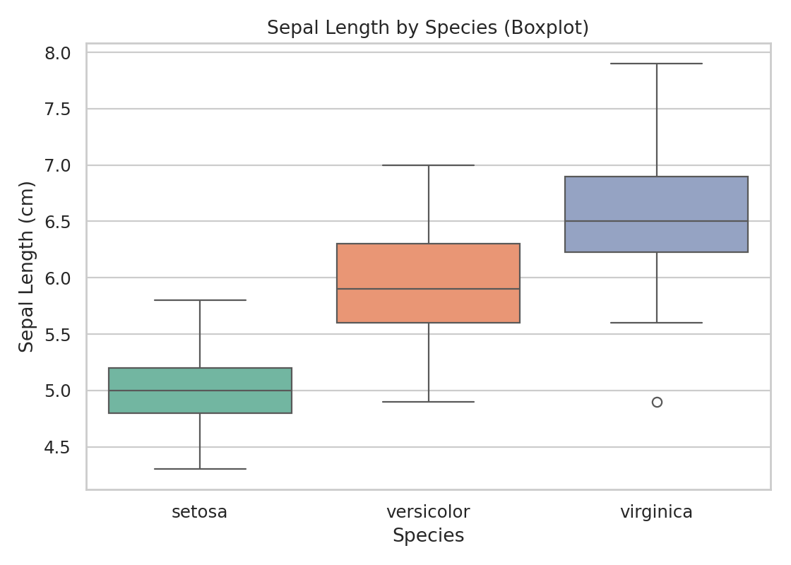
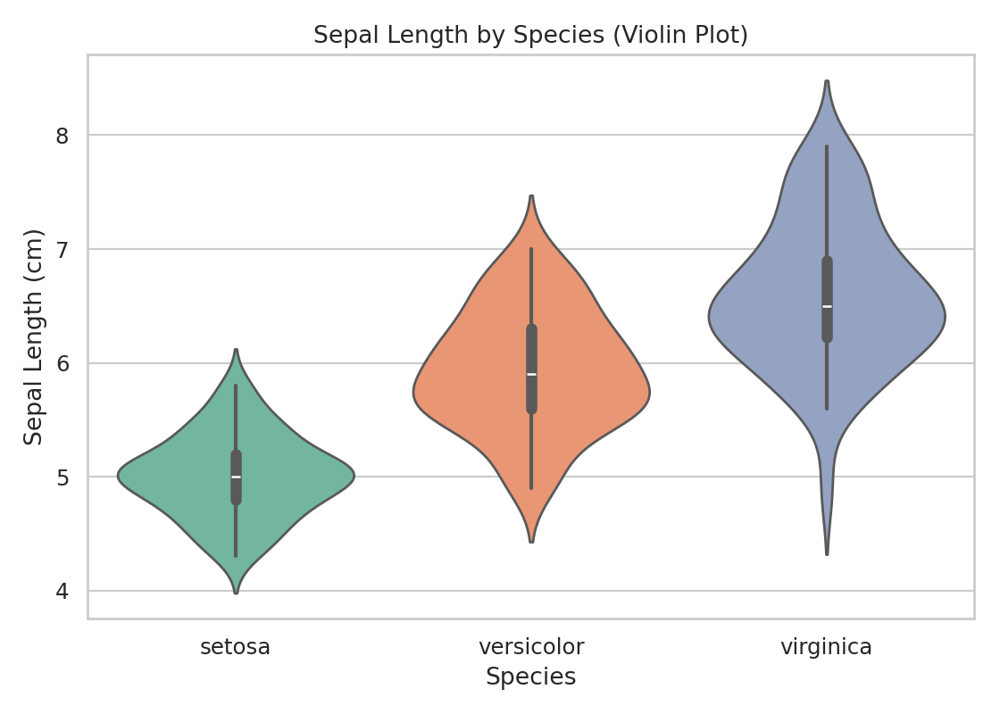
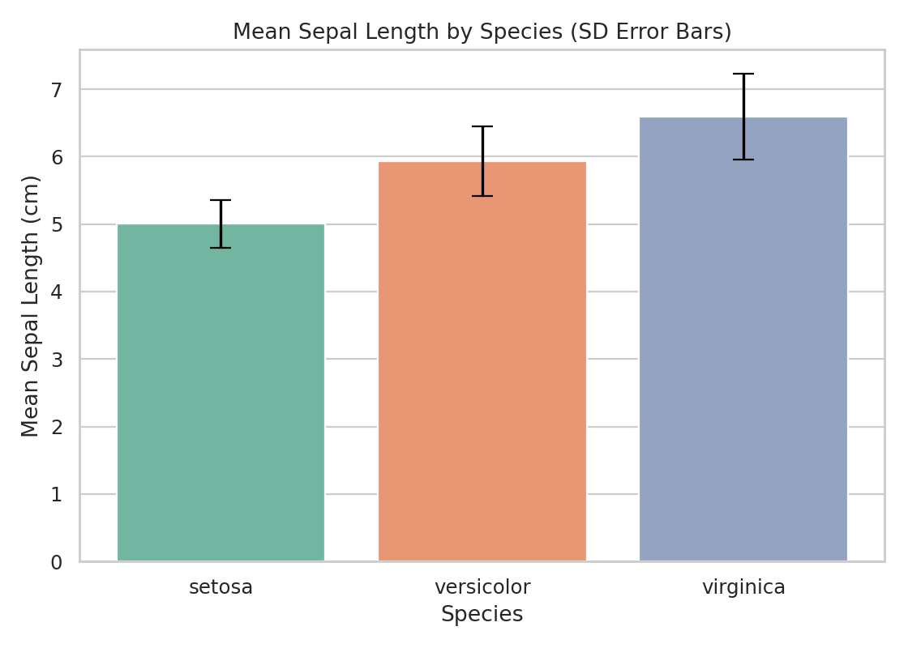
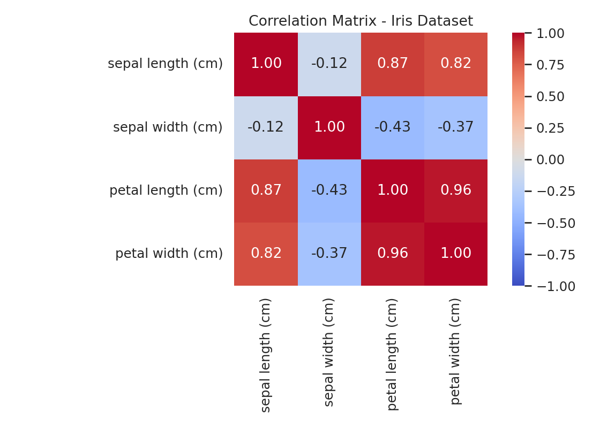
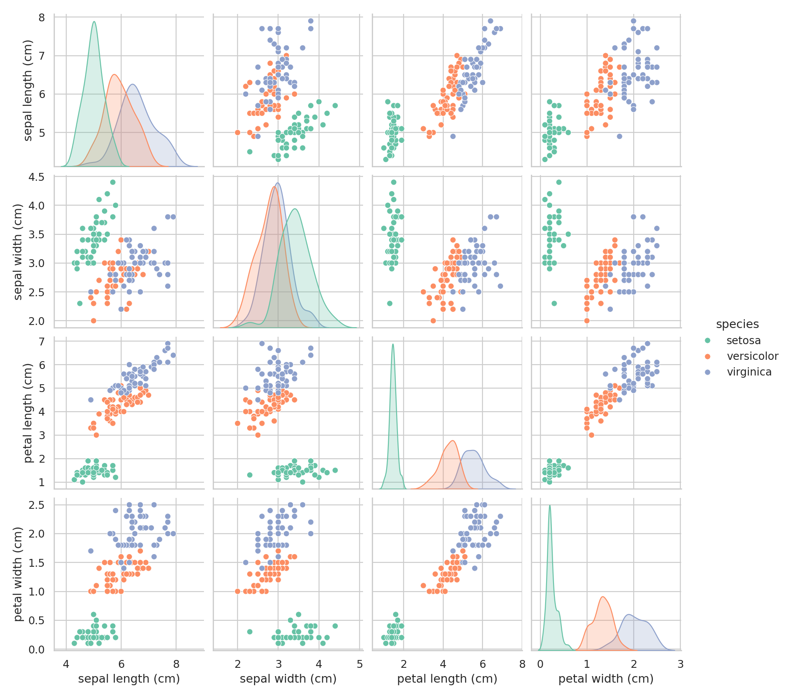

# Bivariate Analysis

**Bivariate analysis** examines the relationship between **two variables**. The appropriate method depends on the data types of both variables.

| Variable A         | Variable B         | Method                                   |
| ------------------ | ------------------ | ---------------------------------------- |
| Numerical          | Numerical          | Correlation (Pearson, Spearman, Kendall) |
| Categorical        | Categorical        | Cross-tabulation                         |
| Numerical          | Categorical        | Group comparison, boxplot by group       |
| Multiple Numerical | Multiple Numerical | Correlation matrix, heatmap              |

**Key point:**

- **Correlation ≠ Causation**. A strong correlation tells you two variables move together — it does not tell you that one causes the other.

## Categorical × Categorical: Cross-Tabulation

A cross-tabulation (contingency table) shows the joint frequency of **two categorical variables**.

Use it to answer questions like:

- How are outcomes distributed across groups?
- Does one category appear more often within a specific subgroup?
- Should you compare raw counts or within-group proportions?

```python
import pandas as pd

data = pd.DataFrame({
    'Gender':   ['Male', 'Female', 'Male', 'Female', 'Male', 'Female'],
    'Survived': ['No',   'Yes',    'Yes',  'Yes',    'No',   'No']
})

# Raw counts with row/column totals
ct = pd.crosstab(data['Gender'], data['Survived'], margins=True, margins_name='Total')
print(ct)
# Raw count output:
# Survived  No  Yes  Total
# Gender
# Female     1    2      3
# Male       2    1      3
# Total      3    3      6

# Row-normalized proportions (within each row)
ct_row = pd.crosstab(data['Gender'], data['Survived'], normalize='index').round(3)
print(ct_row)
# Row-normalized output:
# Survived     No    Yes
# Gender
# Female    0.333  0.667
# Male      0.667  0.333

# Column-normalized proportions (within each column)
ct_col = pd.crosstab(data['Gender'], data['Survived'], normalize='columns').round(3)
print(ct_col)
# Column-normalized output:
# Survived     No    Yes
# Gender
# Female    0.333  0.667
# Male      0.667  0.333

# Overall-normalized proportions (share of grand total)
ct_all = pd.crosstab(data['Gender'], data['Survived'], normalize='all').round(3)
print(ct_all)
# Overall-normalized output:
# Survived     No    Yes
# Gender
# Female    0.167  0.333
# Male      0.333  0.167
```

## Numerical × Numerical: Correlation

### Pearson Correlation Coefficient ($r$)

Measures the **strength and direction of the linear relationship** between two continuous variables.

$$
r =
\frac{\sum_{i=1}^{n}(x_i-\bar{x})(y_i-\bar{y})}
{\sqrt{\sum_{i=1}^{n}(x_i-\bar{x})^2
\sum_{i=1}^{n}(y_i-\bar{y})^2}},
\quad -1 \le r \le 1
$$

|      $r$ Value | Direction | Strength   | Interpretation                 |
| -------------: | --------- | ---------- | ------------------------------ |
| -1.00 to -0.50 | Negative  | Strong     | Strong negative relationship   |
| -0.49 to -0.30 | Negative  | Moderate   | Moderate negative relationship |
|    -0.29 to <0 | Negative  | Weak       | Weak negative relationship     |
|              0 | None      | Negligible | No linear relationship         |
|     >0 to 0.29 | Positive  | Weak       | Weak positive relationship     |
|   0.30 to 0.49 | Positive  | Moderate   | Moderate positive relationship |
|   0.50 to 1.00 | Positive  | Strong     | Strong positive relationship   |

**Note:**

- These thresholds are guidelines, not rules — context matters. A correlation of 0.3 might be weak in physics but very meaningful in social science research.

```python
import pandas as pd
from scipy import stats
from sklearn.datasets import load_iris

df = load_iris(as_frame=True).frame

# Method 1: scipy (also gives p-value)
r, p_value = stats.pearsonr(df['sepal length (cm)'], df['petal length (cm)'])
print(f"Pearson r = {r:.3f},  p-value = {p_value:.4f}")

# Method 2: pandas (quick, between two columns)
r_pandas = df['sepal length (cm)'].corr(df['petal length (cm)'])
print(f"Pearson r = {r_pandas:.3f}")
```

**Assumptions for Pearson r:**

| Assumption                                     | How to Check                                                                                                                   |
| ---------------------------------------------- | ------------------------------------------------------------------------------------------------------------------------------ |
| Both variables are continuous (Interval/Ratio) | [Check data types](./data-types.md)                                                                                            |
| Linear relationship                            | [Scatter plot](#visualization-scatter-plot)                                                                                    |
| Both variables approximately normal            | [Histogram](./univariate-numerical.md#histogram-with-kde), [Q–Q plot](./univariate-numerical.md#qq-plot-quantilequantile-plot) |
| No severe outliers                             | [Boxplot](./univariate-numerical.md#boxplot)                                                                                   |

**Warning:**

- If these assumptions are violated, use **Spearman ρ** instead.

### Spearman's ρ (Rank Correlation)

Based on **ranked data** — detects monotonic relationships (where one variable consistently increases/decreases as the other does, but not necessarily linearly).

**Use when:**

- Data is ordinal
- Distribution is heavily skewed
- The relationship is monotonic but not linear
- Severe outliers are present

```python
rho, p = stats.spearmanr(df['sepal length (cm)'], df['petal length (cm)'])
print(f"Spearman ρ = {rho:.3f},  p-value = {p:.4f}")
```

### Kendall's $τ$ (Tau)

Also rank-based — uses concordant and discordant pairs instead of ranks directly. More robust for small samples or data with many tied values.

```python
tau, p = stats.kendalltau(df['sepal length (cm)'], df['petal length (cm)'])
print(f"Kendall τ = {tau:.3f},  p-value = {p:.4f}")
```

### Choosing the Right Correlation Method

| Method         | Data Type          | Relationship Type | Outliers  | Best For                                       |
| -------------- | ------------------ | ----------------- | --------- | ---------------------------------------------- |
| **Pearson r**  | Continuous, normal | Linear only       | Sensitive | Standard correlation for clean numerical data  |
| **Spearman ρ** | Ordinal or skewed  | Monotonic         | Robust    | Non-normal data, ranked data, outliers present |
| **Kendall τ**  | Ordinal, small n   | Monotonic         | Robust    | Small samples, many ties                       |

**Tip:**

- When in doubt, use **Spearman ρ** — it makes fewer assumptions and is almost as efficient as Pearson when the data is normal.

### Visualization: Scatter Plot

Always visualize before computing correlation. A scatter plot reveals:

- Whether the relationship is actually linear
- The presence of outliers
- Clusters or subgroups in the data

```python
import matplotlib.pyplot as plt
import seaborn as sns

plt.figure(figsize=(7, 5))
sns.regplot(
    x='sepal length (cm)',
    y='petal length (cm)',
    data=df,
    scatter_kws={'alpha': 0.65, 's': 45},
    line_kws={'color': '#c44e52', 'linewidth': 2}
)
plt.title(f"Sepal Length vs Petal Length (r = {r:.3f})")
plt.tight_layout()
plt.show()
```



**Warning:**

- **Anscombe's Quartet**: Four datasets can have almost identical correlations but look completely different visually. Always plot first. Draw first, then calculate.



<p align="right">
  <a href="https://www.researchgate.net/figure/Anscombes-quartet-highlights-the-importance-of-plotting-data-to-confirm-the-validity-of_fig2_280302159">
    Image from Website
  </a>
</p>

## Numerical × Categorical: Group Comparison

When one variable is numerical and the other is categorical, compare the numerical variable's distribution **across groups**.

```python
import matplotlib.pyplot as plt
import seaborn as sns
from sklearn.datasets import load_iris

iris = load_iris(as_frame=True)
df = iris.frame
df['species'] = iris.target_names[iris.target]
sns.set_theme(style='whitegrid')

# Summary statistics by group
group_summary = df.groupby('species')['sepal length (cm)'].agg(
    Count='count',
    Mean='mean',
    Median='median',
    SD='std',
    IQR=lambda x: x.quantile(0.75) - x.quantile(0.25)
).round(3)
print(group_summary)
# Output:
#             Count   Mean  Median     SD    IQR
# species
# setosa         50  5.006     5.0  0.352  0.400
# versicolor     50  5.936     5.9  0.516  0.700
# virginica      50  6.588     6.5  0.636  0.675

# Boxplot by group — shows median, IQR, outliers
plt.figure(figsize=(7, 5))
sns.boxplot(x='species', y='sepal length (cm)', data=df, hue='species', palette='Set2', legend=False)
plt.title('Sepal Length by Species (Boxplot)')
plt.xlabel('Species')
plt.ylabel('Sepal Length (cm)')
plt.tight_layout()
plt.show()

# Violin plot — shows distribution shape within each group
plt.figure(figsize=(7, 5))
sns.violinplot(x='species', y='sepal length (cm)', data=df, hue='species', palette='Set2', legend=False)
plt.title('Sepal Length by Species (Violin Plot)')
plt.xlabel('Species')
plt.ylabel('Sepal Length (cm)')
plt.tight_layout()
plt.show()

# Bar chart with error bars — shows mean with variability
summary = df.groupby('species')['sepal length (cm)'].agg(['mean', 'std']).reset_index()
ax = sns.barplot(x='species', y='mean', data=summary, hue='species', palette='Set2', legend=False)
ax.errorbar(
    x=range(len(summary)),
    y=summary['mean'],
    yerr=summary['std'],
    fmt='none',
    ecolor='black',
    elinewidth=1.5,
    capsize=6
)
plt.title('Mean Sepal Length by Species (SD Error Bars)')
plt.xlabel('Species')
plt.ylabel('Mean Sepal Length (cm)')
plt.tight_layout()
plt.show()
```

**Boxplot by group**



**Violin plot**



**Bar chart with error bars**



| Chart                         | Best For                                                 |
| ----------------------------- | -------------------------------------------------------- |
| **Boxplot by group**          | Comparing median and spread; spotting outliers per group |
| **Violin plot**               | Seeing distribution shape within each group              |
| **Bar chart with error bars** | Comparing means with variability indication              |

## Multiple Numerical Variables: Correlation Matrix

When you have multiple numerical variables, a **correlation matrix** shows all pairwise correlations at once.

```python
import seaborn as sns
import matplotlib.pyplot as plt

# Select numerical columns
num_cols = ['sepal length (cm)', 'sepal width (cm)', 'petal length (cm)', 'petal width (cm)']
corr_matrix = df[num_cols].corr(method='pearson')

print(corr_matrix.round(3))
# Output:
#                    sepal length (cm)  sepal width (cm)  petal length (cm)  petal width (cm)
# sepal length (cm)              1.000            -0.118              0.872             0.818
# sepal width (cm)              -0.118             1.000             -0.428            -0.366
# petal length (cm)              0.872            -0.428              1.000             0.963
# petal width (cm)               0.818            -0.366              0.963             1.000
```

**Heatmap — the standard way to visualize a correlation matrix:**

```python
plt.figure(figsize=(7, 5))
sns.heatmap(
    corr_matrix,
    annot=True,       # show correlation values in cells
    fmt='.2f',        # 2 decimal places
    cmap='coolwarm',  # blue = negative, red = positive
    vmin=-1, vmax=1,  # fix scale to [-1, 1]
    center=0,
    square=True
)
plt.title('Correlation Matrix — Iris Dataset')
plt.tight_layout()
plt.show()
```



**Pairplot — scatter plots for all pairs with distributions on the diagonal:**

```python
sns.pairplot(df, hue='species', diag_kind='kde', palette='Set2')
plt.suptitle('Pairplot — Iris Dataset', y=1.02)
plt.show()
```



## Key Takeaways

| Concept                            | Key Point                                                                        |
| ---------------------------------- | -------------------------------------------------------------------------------- |
| **Match method to data types**     | Always check what types of variables you have before choosing a method           |
| **Visualize first**                | Scatter plots reveal patterns (or problems) that correlation coefficients miss   |
| **Pearson vs Spearman**            | Pearson for normal continuous data; Spearman when assumptions are violated       |
| **Correlation ≠ Causation**        | A high r does not mean X causes Y — always consider alternative explanations     |
| **Heatmap for multiple variables** | Correlation matrix + heatmap is the most efficient overview of relationships     |
| **Cross-tabulation**               | Use for relationships between two categorical variables                          |
| **Group comparison**               | Use boxplot or violin plot when comparing a numerical variable across categories |

## Three Questions Before Interpreting a Relationship

1. Is the pattern really linear?
2. Is the apparent association driven by outliers or subgroups?
3. Could a third variable explain what you see?

Tip: Bivariate analysis is a screening stage, not a causal conclusion stage.
