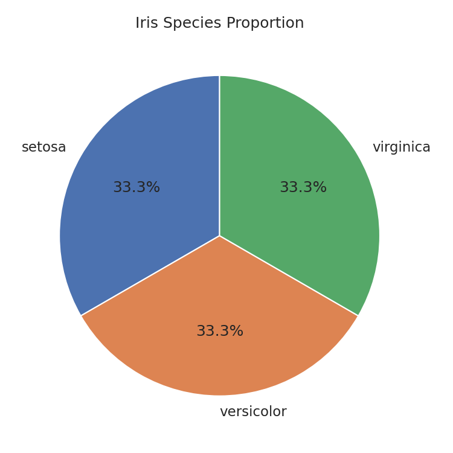

# Univariate Analysis (Categorical)

This section covers how to describe a **single categorical variable** (Nominal or Ordinal scale). Since you cannot compute a meaningful mean or standard deviation for categories, the focus is on **counts, proportions, and visual distributions**.

## Frequency Table

A frequency table is the foundation of categorical description. It shows how often each category appears.

| Metric                 | Description                                      |
| ---------------------- | ------------------------------------------------ |
| **Frequency (n)**      | Raw count of each category                       |
| **Relative Frequency** | Proportion = count ÷ total                       |
| **Percentage (%)**     | Relative frequency × 100                         |
| **Cumulative %**       | Running total — most useful for **ordinal** data |

```python
import pandas as pd
import seaborn as sns

df = sns.load_dataset("iris").copy()

# Build frequency table
freq = df['species'].value_counts()
rel_freq = df['species'].value_counts(normalize=True)

summary = pd.DataFrame({
    'Count': freq,
    'Proportion': rel_freq.round(3),
    'Percentage (%)': (rel_freq * 100).round(1)
})

print(summary)
#             Count  Proportion  Percentage (%)
# species
# setosa         50       0.333            33.3
# versicolor     50       0.333            33.3
# virginica      50       0.333            33.3
```

Including `dropna=False` is often useful for questionnaires because skipped items can be analytically meaningful.

```python
summary = pd.DataFrame({
    "Count": df["response"].value_counts(dropna=False),
    "Proportion": df["response"].value_counts(dropna=False, normalize=True),
})
```

**When to use relative frequency instead of raw count?**

When comparing two groups of different sizes, raw counts are misleading.

For example, 30 complaints out of 100 customers is very different from 30 out of 1,000.

In survey work, **relative frequency** is often the first summary to inspect because subgroup sizes are rarely perfectly balanced.

## Ordinal Data: Preserving Order Matters

For ordinal variables (e.g., satisfaction ratings), the category order is meaningful and must be preserved in both tables and charts.

```python
# Define ordered categories explicitly
ratings = pd.Categorical(
    ['Good', 'Bad', 'Excellent', 'Good', 'Bad', 'Excellent', 'Good'],
    categories=['Bad', 'Good', 'Excellent'],  # logical order
    ordered=True
)

freq_ordered = pd.Series(ratings).value_counts().sort_index()
print(freq_ordered)
# Bad          2
# Good         3
# Excellent    2
```

**Warning:**

- Without setting `ordered=True` and specifying categories, pandas will sort <u>alphabetically</u> (Bad → Excellent → Good), which breaks the logical order.

For Likert-style items, frequency tables are often more informative when they include both ordered counts and cumulative percentages.

```python
likert = pd.Series(pd.Categorical(
    df["satisfaction"],
    categories=["Strongly disagree", "Disagree", "Neutral", "Agree", "Strongly agree"],
    ordered=True,
))

freq = likert.value_counts().sort_index()
prop = likert.value_counts(normalize=True).sort_index()

likert_summary = pd.DataFrame({
    "Count": freq,
    "Proportion": prop,
    "Cumulative %": (prop.cumsum() * 100).round(1),
})
```

**Key point:**

- For <u>ordinal survey responses</u>, **cumulative percentages** are often easier to interpret than a mean score because they preserve rank without pretending the spacing between categories is equal.

## Visualization

### Vertical Bar Chart

- Use when the main goal is to compare category counts.
- Avoid it only when labels are too long or too numerous to fit comfortably.

```python
import matplotlib.pyplot as plt
import seaborn as sns

iris = sns.load_dataset("iris").copy()

sns.countplot(x="species", data=iris, hue="species", palette="Set2", legend=False)
plt.title('Species Distribution')
plt.xlabel('Species')
plt.ylabel('Count')
plt.show()
```


### Horizontal Bar Chart

- Use when category labels are long or when you have many categories.
- Prefer this over a vertical bar chart when readability becomes the main concern.

```python
species_counts = iris["species"].value_counts().sort_values()

species_counts.plot(kind="barh", color="steelblue")
plt.title("Species Distribution")
plt.xlabel("Count")
plt.ylabel("Species")
plt.show()
```


### Pie Chart

- Use when the message is part-of-whole and the number of categories is small.
- Avoid it when you need precise comparison across many categories.

```python
species_counts = iris["species"].value_counts()

species_counts.plot(
    kind="pie", autopct="%1.1f%%", startangle=90
)
plt.title("Species Proportion")
plt.ylabel("")
plt.show()
```



### Ordered Bar Chart

- Use for ordinal data, where category order carries meaning.
- Define the order explicitly before plotting, otherwise the chart may be misleading.

```python
tips = sns.load_dataset("tips").copy()
day_order = ["Thur", "Fri", "Sat", "Sun"]
tips["day"] = pd.Categorical(tips["day"], categories=day_order, ordered=True)

sns.countplot(x="day", data=tips, order=day_order, color="coral")
plt.title("Tips Dataset Day Distribution")
plt.xlabel("Day")
plt.ylabel("Count")
plt.show()
```


**Tip:**

- Default to bar charts.
- Use a **pie chart** only when the part-of-whole message is the main point and the number of categories is small.

## Key Takeaways

| Concept                | Key Point                                                               |
| ---------------------- | ----------------------------------------------------------------------- |
| **Frequency table**    | Always the starting point for categorical description                   |
| **Relative frequency** | Prefer over raw counts when comparing groups of different sizes         |
| **Ordinal data**       | Explicitly define category order — don't let pandas sort alphabetically |
| **Bar chart**          | Default visualization for categorical data                              |
| **Pie chart**          | Only when ≤ 5 categories and part-of-whole is the message               |

## Rare Categories and Grouping

Real-world categorical variables often contain many low-frequency levels. Before plotting or modeling, consider whether to keep them separate or group them into `Other`.
