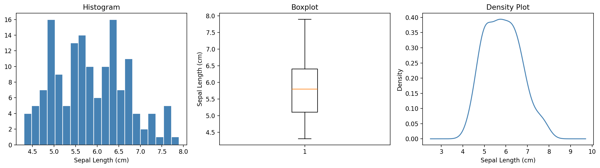

# Univariate Analysis (Numerical)

This section covers how to fully describe a **single numerical variable** (Interval or Ratio scale). A complete description requires three dimensions working together:

| Dimension            | Question It Answers                   |       Key Measures |
| -------------------- | ------------------------------------- | -----------------: |
| **Central Tendency** | Where is the center of the data?      | Mean, Median, Mode |
| **Variability**      | How spread out are the values?        | Range, SD, IQR, CV |
| **Shape**            | What does the distribution look like? | Skewness, Kurtosis |

Key point: Always describe all three. Reporting only the mean without variability or shape is incomplete and can be misleading. For example, two datasets can have the same mean but completely different distributions.

## Central Tendency

### Interview Fast Answer

如果面試官問 mean、median、mode 差在哪，最穩的回答順序通常是：

1. 先講三者各自在描述什麼中心
2. 再講 outliers 和 skewness 會怎麼影響它們
3. 最後講什麼情境該用哪一個

可以先濃縮成：

- mean: 用到全部資料，但容易被極端值拉動
- median: 對 outliers 更 robust，偏態分布常比 mean 更穩
- mode: 最常出現的值，對 categorical 或離散資料特別有用

如果只能先講一句，通常先補上這句最有訊號：

- symmetric distribution 常看 mean
- skewed distribution 或有 outliers 時，median 往往更代表 typical value

### Mean

The sum of all values divided by the number of observations.

\[ \bar{x} = \frac{\sum\_{i=1}^n x\_i}{n} ]

* Uses every data point → **sensitive to outliers**
* Best for symmetric distributions without extreme values

```python
import pandas as pd
from sklearn.datasets import load_iris

df = load_iris(as_frame=True).frame
mean_val = df['sepal length (cm)'].mean()
print(f"Mean: {mean_val:.3f}")
```

**Mean variants — when to use which:**

| Type                | Formula       | When to Use                            | Example                             |
| ------------------- | ------------- | -------------------------------------- | ----------------------------------- |
| **Arithmetic Mean** | Σxᵢ / n       | Default for most situations            | Average exam score                  |
| **Geometric Mean**  | (∏xᵢ)^(1/n)   | Growth rates, ratios, log-normal data  | Average annual return on investment |
| **Harmonic Mean**   | n / Σ(1/xᵢ)   | Averages of rates                      | Average speed over equal distances  |
| **Weighted Mean**   | Σ(wᵢxᵢ) / Σwᵢ | Observations have different importance | GPA, weighted survey results        |

```python
import numpy as np
from scipy.stats import gmean, hmean

values = [2, 4, 8]
weights = [0.2, 0.3, 0.5]

print(f"Arithmetic: {np.mean(values):.3f}")           # 4.667
print(f"Geometric:  {gmean(values):.3f}")              # 4.000
print(f"Harmonic:   {hmean(values):.3f}")              # 3.429
print(f"Weighted:   {np.average(values, weights=weights):.3f}")  # 5.600
```

### Median

The middle value when data is sorted. If n is even, it's the average of the two middle values.

* **Robust to outliers** — extreme values don't affect it
* Represents the 50th percentile (Q₂)
* Preferred when data is skewed

```python
median_val = df['sepal length (cm)'].median()
print(f"Median: {median_val:.3f}")
```

### Mode

The most frequently occurring value.

* Useful for **discrete** or **categorical** data
* A distribution can be unimodal (1 peak), bimodal (2 peaks), or multimodal (3+ peaks)

Tip: A bimodal distribution often suggests that two sub-populations have been mixed together, such as combining heights from two distinct groups.

```python
mode_val = df['sepal length (cm)'].mode()[0]
print(f"Mode: {mode_val:.3f}")
```

### When to Use Which Measure

| Situation                               | Recommended        | Reason                               |
| --------------------------------------- | ------------------ | ------------------------------------ |
| Symmetric distribution, no outliers     | **Mean**           | Uses all data, mathematically stable |
| Skewed distribution                     | **Median**         | Not distorted by extreme values      |
| Data with outliers                      | **Median**         | Resistant to distortion              |
| Categorical or discrete data            | **Mode**           | Mean/Median are not meaningful       |
| Growth rates, investment returns        | **Geometric Mean** | Correct for multiplicative processes |
| Averaging rates (speed, price-per-unit) | **Harmonic Mean**  | Correct for ratio-type averages      |
| Survey with unequal group sizes         | **Weighted Mean**  | Accounts for different group weights |

**The relationship between Mean, Median, and Mode tells you about skew:**

| Distribution Shape                | Relationship             | What It Implies                  |
| --------------------------------- | ------------------------ | -------------------------------- |
| Symmetric                         | Mean ≈ Median ≈ Mode     | Any measure is representative    |
| Right-skewed (right tail is long) | Mode < Median < **Mean** | Mean pulled up by high outliers  |
| Left-skewed (left tail is long)   | **Mean** < Median < Mode | Mean pulled down by low outliers |

Tip: Quick check: If Mean > Median, suspect right skew (common in income, house price data). Report both.

## Common Interview Traps

- 把 mode 當成只存在於 categorical data；其實數值資料也可能有 mode
- 看到平均數就直接報 mean，忽略分布偏斜與極端值
- 用「mean 比 median 更準」這種沒有前提的說法
- 忘記說明 mean、median、mode 的差異其實是在回答不同資料形狀下的代表性

## Variability / Spread

### Range

\[ \text{Range} = \max(x\_i) - \min(x\_i) ]

* Simplest measure of spread — only uses two data points
* Very sensitive to outliers
* Use as a quick sanity check, not a primary measure

```python
rng = df['sepal length (cm)'].max() - df['sepal length (cm)'].min()
print(f"Range: {rng:.2f}")
```

### Variance

The average of squared deviations from the mean.

\[ s^2 = \frac{\sum\_{i=1}^n (x\_i - \bar{x})^2}{n - 1} ]

Tip: Why divide by (n−1)? This is Bessel's correction. When estimating population variance from a sample, dividing by (n−1) instead of n corrects for the systematic underestimation that occurs with small samples.

```python
values = df['sepal length (cm)']

var_sample = np.var(values, ddof=1)   # sample: divide by n-1
var_pop    = np.var(values, ddof=0)   # population: divide by n

print(f"Sample Variance:     {var_sample:.4f}")
print(f"Population Variance: {var_pop:.4f}")
```

Warning: Variance is in squared units (e.g., cm²), making it hard to interpret directly. Use Standard Deviation for interpretation.

### Standard Deviation

\[ s = \sqrt{\frac{\sum\_{i=1}^n (x\_i - \bar{x})^2}{n - 1\}} ]

* Same unit as the data → directly interpretable
* Represents the **typical distance** from the mean
* Small SD → data tightly clustered; Large SD → data widely spread

```python
std_sample = np.std(values, ddof=1)
print(f"Standard Deviation: {std_sample:.4f}")
```

**Empirical Rule (68–95–99.7 Rule)** — for normally distributed data:

| Range from Mean | % of Data Covered |
| --------------- | ----------------- |
| ± 1 SD          | \~68%             |
| ± 2 SD          | \~95%             |
| ± 3 SD          | \~99.7%           |

Tip: Data points beyond ±3 SD are often flagged as outliers in a normal distribution.

```python
mean = values.mean()
std  = np.std(values, ddof=1)

within_1sd = ((values >= mean - std) & (values <= mean + std)).mean()
within_2sd = ((values >= mean - 2*std) & (values <= mean + 2*std)).mean()
print(f"Within ±1 SD: {within_1sd:.1%}")
print(f"Within ±2 SD: {within_2sd:.1%}")
```

### Standard Error (SE) vs Standard Deviation (SD)

Warning: These two quantities are frequently confused, so keep their roles separate.

**SE is the standard deviation of the sampling distribution** — not of the raw data. If you repeatedly drew samples of size n and computed the mean each time, those means would form a distribution. SE is _that_ distribution's standard deviation.

\[ SE = \begin{cases} \dfrac{\sigma}{\sqrt{n\}} & \text{if population SD } \sigma \text{ is known} \ \dfrac{s}{\sqrt{n\}} & \text{if } \sigma \text{ is unknown (typical)} \end{cases} ]

| Metric                      | Formula            | What It Describes                               | Use When                                     |
| --------------------------- | ------------------ | ----------------------------------------------- | -------------------------------------------- |
| **Standard Deviation (SD)** | √(Σ(xᵢ-x̄)²/(n-1)) | Spread of **individual data points**            | Describing how variable the data is          |
| **Standard Error (SE)**     | s / √n             | Precision of the **sample mean** as an estimate | Reporting how reliable your mean estimate is |

```python
se = std_sample / np.sqrt(len(values))
print(f"SD: {std_sample:.4f}  ← spread of individual data points")
print(f"SE: {se:.4f}  ← precision of the mean estimate")
```

**Why SE connects to CLT, CI, and hypothesis testing:**

* **CLT** tells us sample means are approximately normally distributed with spread = SE
* **Confidence interval**: $\text{CI} = \bar{x} \pm t \times SE$ — smaller SE → narrower (more precise) interval
* **t-test**: $t = (\bar{x} - \mu\_0) / SE$ — smaller SE → larger t → easier to detect significant differences

Tip: SE shrinks as sample size grows because the mean becomes more precise. SD does not shrink with larger n because it describes the spread of the underlying data, not the precision of the estimate.

```python
import numpy as np
import matplotlib.pyplot as plt

# Show how SE shrinks as n grows
pop = np.random.normal(100, 15, 100_000)
sample_sizes = [5, 10, 30, 100, 200]

ses = []
for n in sample_sizes:
    means = [np.mean(np.random.choice(pop, n)) for _ in range(1000)]
    ses.append(np.std(means, ddof=1))

plt.plot(sample_sizes, ses, marker='o', color='steelblue')
plt.xlabel('Sample Size (n)')
plt.ylabel('Standard Error (SE)')
plt.title('SE Decreases as Sample Size Increases')
plt.grid(True, alpha=0.3)
plt.show()
```

### Interquartile Range

\[ \text{IQR} = Q\_3 - Q\_1 ]

* Represents the spread of the **middle 50%** of the data
* **Robust to outliers** — unaffected by extreme values
* The basis of boxplot whiskers

```python
Q1  = values.quantile(0.25)
Q3  = values.quantile(0.75)
IQR = Q3 - Q1
print(f"Q1: {Q1:.3f},  Q3: {Q3:.3f},  IQR: {IQR:.3f}")
```

**Outlier Detection — the 1.5 × IQR Rule:**

\[ \text{Lower fence} = Q\_1 - 1.5 \times IQR ] \[ \text{Upper fence} = Q\_3 + 1.5 \times IQR ]

Data points outside these fences are flagged as potential outliers (this is what boxplot whiskers represent).

```python
lower_fence = Q1 - 1.5 * IQR
upper_fence = Q3 + 1.5 * IQR

outliers = values[(values < lower_fence) | (values > upper_fence)]
print(f"Potential outliers: {outliers.tolist()}")
```

### Coefficient of Variation

\[ CV = \frac{s}{\bar{x\}} \times 100% ]

* **Unit-free** (expressed as a percentage) — allows comparing variability across different variables
* Useful when variables have different units or very different magnitudes
* E.g., comparing variability of salary (NT$) vs. age (years)

```python
cv = (std_sample / values.mean()) * 100
print(f"CV: {cv:.2f}%")
```

| CV     | Interpretation       |
| ------ | -------------------- |
| < 15%  | Low variability      |
| 15–35% | Moderate variability |
| > 35%  | High variability     |

Warning: CV is only meaningful when the mean is positive and the variable has a true zero (Ratio scale). Don't use CV for temperature in °C or year.

### Variability Measures — Summary

| Measure                | Robust to Outliers? | Units        | Best Used When                              |
| ---------------------- | ------------------- | ------------ | ------------------------------------------- |
| **Range**              | ❌ No                | Same as data | Quick overview, sanity check                |
| **Variance**           | ❌ No                | Squared      | Internal calculations, basis for SD         |
| **Standard Deviation** | ❌ No                | Same as data | Normal-ish data; paired with mean           |
| **Standard Error**     | ❌ No                | Same as data | Reporting precision of the mean             |
| **IQR**                | ✅ Yes               | Same as data | Skewed data or when outliers exist          |
| **CV**                 | ❌ No                | % (unitless) | Comparing spread across different variables |

## Shape of Distribution

### Why Shape Matters

Two datasets can have the **same mean and SD** but completely different shapes. Shape tells you:

* Whether the data is symmetric or skewed
* Whether there are heavy tails with extreme values
* Whether parametric methods (which assume normality) are appropriate

### Skewness

Measures the **asymmetry** of the distribution.

\[ \text{Skewness} = \frac{\sum (x\_i - \bar{x})^3}{(n-1)s^3} ]

| Value          | Shape        | Description                        | Common Example                      |
| -------------- | ------------ | ---------------------------------- | ----------------------------------- |
| ≈ 0            | Symmetric    | Balanced distribution              | Normal distribution                 |
| > 0 (positive) | Right-skewed | Long tail extends to the **right** | Income, house prices, reaction time |
| < 0 (negative) | Left-skewed  | Long tail extends to the **left**  | Exam scores near the maximum        |

Tip: Right-skewed = Right-skewed = Long right tail = Mean > Median Practical threshold: |Skewness| > 1 is generally considered substantially skewed; consider transformation.

```python
skew_val = df['sepal length (cm)'].skew()
print(f"Skewness: {skew_val:.3f}")
```

### Kurtosis

Measures the **tailedness** — how heavy the tails are compared to a normal distribution.

| Type            | Excess Kurtosis | Shape                   | Practical Implication               |
| --------------- | --------------- | ----------------------- | ----------------------------------- |
| **Mesokurtic**  | ≈ 0             | Normal tails            | Behaves like a normal distribution  |
| **Leptokurtic** | > 0             | Heavy tails, sharp peak | More extreme outliers than expected |
| **Platykurtic** | < 0             | Light tails, flat peak  | Fewer extreme values                |

Warning: Important distinction: pandas `.kurt()` returns excess kurtosis (normal distribution = 0). The raw formula gives kurtosis = 3 for a normal distribution; excess kurtosis subtracts 3 to center it at 0. 3. The two are different, so be careful not to confuse them.

```python
kurt_val = df['sepal length (cm)'].kurt()  # excess kurtosis
print(f"Excess Kurtosis: {kurt_val:.3f}")
```

### Visual Normality Check

Warning: Formal normality tests (Shapiro-Wilk, Anderson-Darling) are hypothesis tests — they belong in Inferential Statistics. At the descriptive stage, use visual methods only.

**Histogram with KDE:**

```python
import matplotlib.pyplot as plt
import seaborn as sns

sns.histplot(df['sepal length (cm)'], kde=True, color='steelblue')
plt.title('Distribution of Sepal Length')
plt.xlabel('Sepal Length (cm)')
plt.show()
```

**Q–Q Plot (Quantile–Quantile Plot):**

Compares the data's quantiles against a theoretical normal distribution. Points should fall along the diagonal line if the data is normally distributed.

```python
import scipy.stats as stats

fig, ax = plt.subplots()
stats.probplot(df['sepal length (cm)'], dist="norm", plot=ax)
ax.set_title('Q–Q Plot of Sepal Length')
plt.show()
```

| Pattern in Q–Q Plot              | Interpretation               |
| -------------------------------- | ---------------------------- |
| Points along the diagonal        | Data is approximately normal |
| Points curve upward at both ends | Heavy tails (leptokurtic)    |
| S-shaped curve                   | Skewed distribution          |
| Points deviate at one end only   | One-sided tail issue         |

### Full Distribution Summary

Putting it all together — describe a numerical variable with all three dimensions:

```python
col = df['sepal length (cm)']

print("=== Central Tendency ===")
print(f"  Mean:     {col.mean():.3f}")
print(f"  Median:   {col.median():.3f}")
print(f"  Mode:     {col.mode()[0]:.3f}")

print("\n=== Variability ===")
print(f"  Range:    {col.max() - col.min():.3f}")
print(f"  SD:       {col.std():.3f}")
print(f"  IQR:      {col.quantile(0.75) - col.quantile(0.25):.3f}")
print(f"  CV:       {col.std()/col.mean()*100:.2f}%")

print("\n=== Shape ===")
print(f"  Skewness: {col.skew():.3f}")
print(f"  Kurtosis: {col.kurt():.3f}  (excess)")
```

### Practical Guidelines

| Condition          | Metric   | Threshold | Recommended Action                                                 |
| ------------------ | -------- | --------- | ------------------------------------------------------------------ |
|                    | Skewness | < 0.5     | Approximately symmetric — use mean + SD                            |
|                    | Skewness | 0.5–<1    | Moderately skewed — report both mean and median                    |
|                    | Skewness | ≥ 1       | Substantially skewed — prefer median + IQR; consider log transform |
| Excess Kurtosis >2 | —        | —         | Heavy tails — be cautious of outliers                              |

## Visualization

<details>

<summary>Show plotting script</summary>

```python
import matplotlib.pyplot as plt

fig, axes = plt.subplots(1, 3, figsize=(14, 4))

# Histogram
axes[0].hist(df['sepal length (cm)'], bins=20, color='steelblue', edgecolor='white')
axes[0].set_title('Histogram')
axes[0].set_xlabel('Sepal Length (cm)')

# Boxplot
axes[1].boxplot(df['sepal length (cm)'])
axes[1].set_title('Boxplot')
axes[1].set_ylabel('Sepal Length (cm)')

# KDE plot
df['sepal length (cm)'].plot(kind='kde', ax=axes[2], color='steelblue')
axes[2].set_title('Density Plot')
axes[2].set_xlabel('Sepal Length (cm)')

plt.tight_layout()
plt.show()
```

</details>



| Chart                  | Best For                                                 |
| ---------------------- | -------------------------------------------------------- |
| **Histogram**          | Seeing the overall shape and spread                      |
| **Boxplot**            | Quickly spotting outliers; comparing groups              |
| **KDE (Density Plot)** | Smooth version of histogram; cleaner shape visualization |
| **Q–Q Plot**           | Assessing normality visually                             |

## Key Takeaways

| Concept                     | Key Point                                                         |
| --------------------------- | ----------------------------------------------------------------- |
| **Always report all three** | Central tendency alone is insufficient                            |
| **Mean vs Median**          | If Mean ≠ Median, there's skew — report both                      |
| **SD vs SE**                | SD describes data spread; SE describes estimate precision         |
| **IQR over SD**             | When data is skewed or has outliers, IQR is more informative      |
| **CV for comparison**       | Use CV when comparing variability across different-unit variables |
| **Visual first**            | Always plot before interpreting numbers                           |

## Mean vs. Median Decision Rule

| Distribution pattern   | Better default summary                     |
| ---------------------- | ------------------------------------------ |
| Roughly symmetric      | Mean and SD                                |
| Skewed / outlier-prone | Median and IQR                             |
| Multi-modal            | Plot first, then report multiple summaries |

Tip: A single center measure is rarely enough. The right summary depends on shape, not preference.
