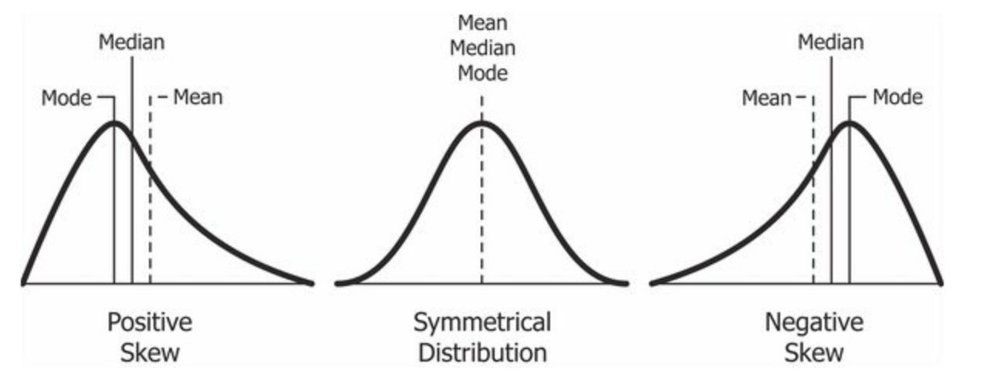
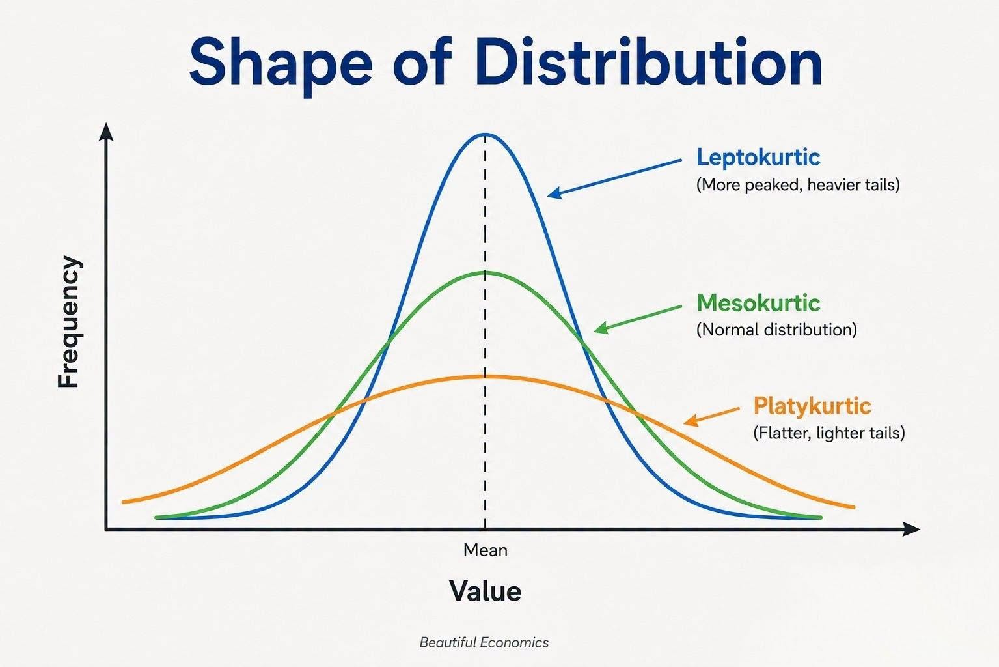
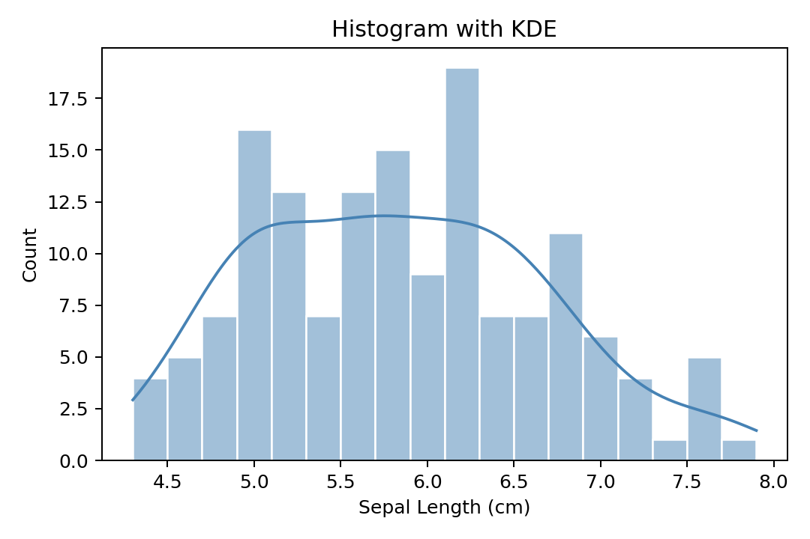
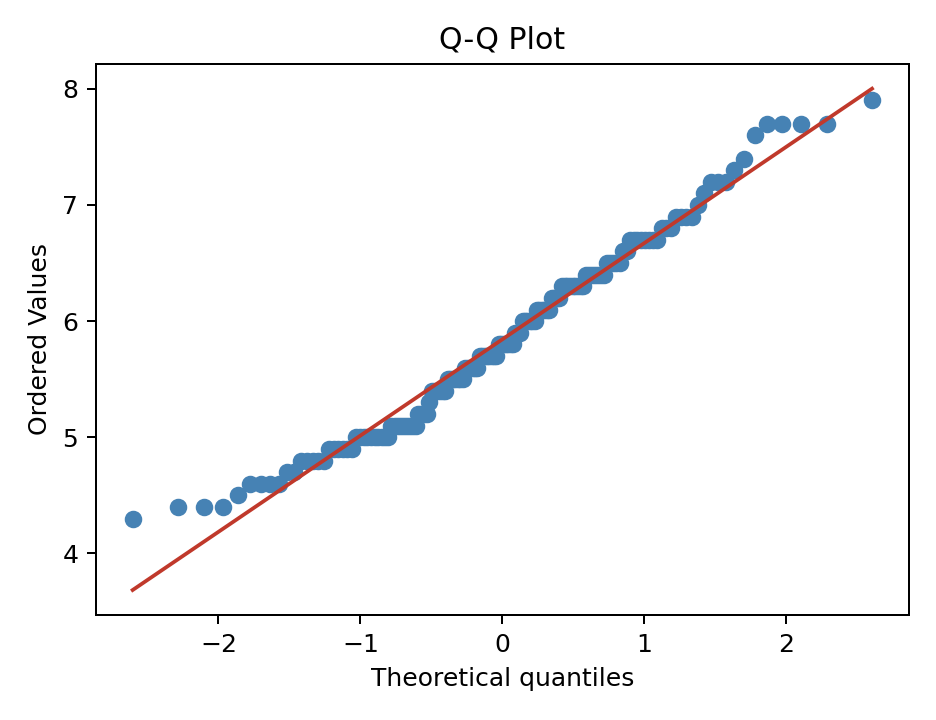
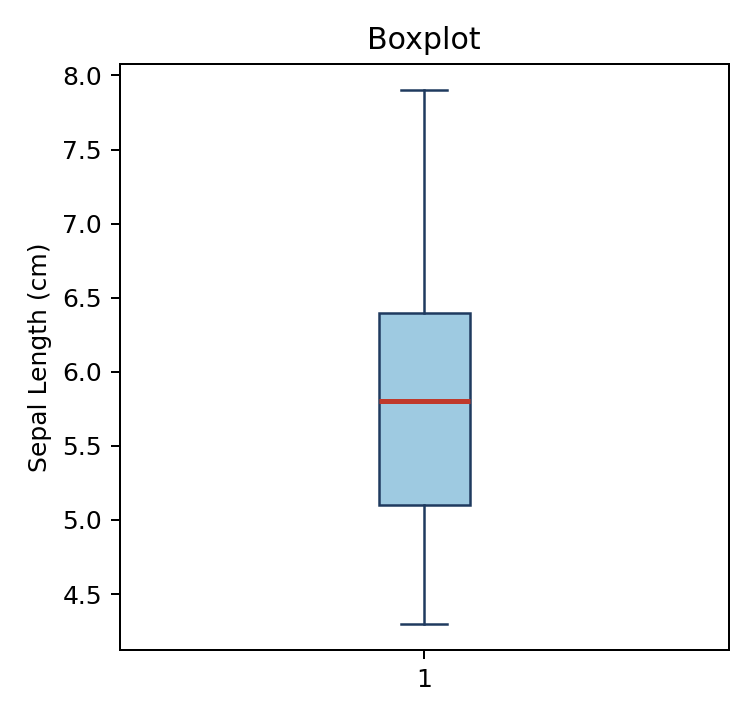

# Univariate Analysis (Numerical)

This section covers how to fully describe a **single numerical variable** (Interval or Ratio scale). A complete description requires three dimensions working together:

| Dimension            | Question It Answers                   |       Key Measures |
| -------------------- | ------------------------------------- | -----------------: |
| **Central Tendency** | Where is the center of the data?      | Mean, Median, Mode |
| **Variability**      | How spread out are the values?        | Range, SD, IQR, CV |
| **Shape**            | What does the distribution look like? | Skewness, Kurtosis |

**Key point:**

- Always describe all three.
- Reporting only the mean without variability or shape is incomplete and can be misleading. For example, two datasets can have the same mean but completely different distributions.

## Central Tendency

### Mean

The sum of all values divided by the number of observations.

$$
\bar{x} = \frac{\sum_{i=1}^{n} x_i}{n}
$$

- Uses every data point → **sensitive to outliers**
- Best for symmetric distributions without extreme values

```python
import pandas as pd
from sklearn.datasets import load_iris

df = load_iris(as_frame=True).frame
mean_val = df['sepal length (cm)'].mean()
print(f"Mean: {mean_val:.3f}")
```

**When to use which:**

| Type                             | Formula                                               | When to Use                            | Example                             |
| -------------------------------- | ----------------------------------------------------- | -------------------------------------- | ----------------------------------- |
| **Arithmetic Mean (算術平均數)** | $$\frac{\sum_{i=1}^{n} x_i}{n}$$                      | Default for most situations            | Average exam score                  |
| **Geometric Mean (幾何平均數)**  | $$\left(\prod_{i=1}^{n} x_i\right)^{1/n}$$            | Growth rates, ratios, log-normal data  | Average annual return on investment |
| **Harmonic Mean (調和平均數)**   | $$\frac{n}{\sum_{i=1}^{n} \frac{1}{x_i}}$$            | Averages of rates                      | Average speed over equal distances  |
| **Weighted Mean (加權平均數)**   | $$\frac{\sum_{i=1}^{n} w_i x_i}{\sum_{i=1}^{n} w_i}$$ | Observations have different importance | GPA, weighted survey results        |

```python
import numpy as np
from scipy.stats import gmean, hmean

values = [2, 4, 8]
weights = [0.2, 0.3, 0.5]

print(f"Arithmetic: {np.mean(values):.3f}") # 4.667
print(f"Geometric:  {gmean(values):.3f}") # 4.000
print(f"Harmonic:   {hmean(values):.3f}") # 3.429
print(f"Weighted:   {np.average(values, weights=weights):.3f}") # 5.600
```

### Median

The middle value when data is sorted.  
If n is even, it's the average of the two middle values.

- **Robust to outliers** — extreme values don't affect it
- Represents the 50th percentile (Q₂)
- Preferred when data is skewed

```python
median_val = df['sepal length (cm)'].median()
print(f"Median: {median_val:.3f}")
```

### Mode

The most frequently occurring value.

- Useful for **discrete** or **categorical** data
- A distribution can be unimodal (1 peak), bimodal (2 peaks), or multimodal (3+ peaks)
  - Bimodal or multimodal does **not** require peaks to be exactly equal in height or frequency; the key idea is <u>the presence of multiple distinct local peaks.</u>
- Numerical data can also have a mode

**Tip:**

- A bimodal distribution often suggests that two sub-populations have been mixed together, but confirm that the pattern is not caused by bin-width choice, KDE smoothing settings, rounding, or small-sample noise before making that interpretation.

```python
mode_val = df['sepal length (cm)'].mode()[0]
print(f"Mode: {mode_val:.3f}")
```

### When to Use Which Measure

| Situation                               | Recommended        | Reason                               |
| --------------------------------------- | ------------------ | ------------------------------------ |
| Symmetric distribution, no outliers     | **Mean**           | Uses all data, mathematically stable |
| Skewed distribution                     | **Median**         | Not distorted by extreme values      |
| Data with outliers                      | **Median**         | Resistant to distortion              |
| Categorical or discrete data            | **Mode**           | Mean/Median are not meaningful       |
| Growth rates, investment returns        | **Geometric Mean** | Correct for multiplicative processes |
| Averaging rates (speed, price-per-unit) | **Harmonic Mean**  | Correct for ratio-type averages      |
| Survey with unequal group sizes         | **Weighted Mean**  | Accounts for different group weights |

For more details on the relationship between the mean, median, mode, and skewness, please refer to the [Skewness](#skewness) section.

## Variability / Spread

### Range

$$
\text{Range} = \max(x_i) - \min(x_i)
$$

- Simplest measure of spread — only uses two data points
- Very sensitive to **outliers**
- Use as a quick sanity check, not a primary measure

```python
rng = df['sepal length (cm)'].max() - df['sepal length (cm)'].min()
print(f"Range: {rng:.2f}")
```

### Variance

Variance measures how far observations are spread around the mean, using squared deviations.

- Variance is in squared units (e.g., cm²), making it hard to interpret directly. Use **Standard Deviation** for interpretation.

#### Population Variance

Use when the observed data represent the entire population.

$$
\sigma^2 =
\frac{\sum_{i=1}^{N}(x_i-\mu)^2}{N}
$$

#### Sample Variance

Use when the observed data are a sample used to estimate population variability.

$$
s^2 =
\frac{\sum_{i=1}^{n}(x_i-\bar{x})^2}{n-1}
$$

**Why divide by (n−1)?**
This is Bessel's correction. When estimating population variance from a sample, dividing by (n−1) instead of n corrects for the systematic underestimation that occurs with small samples.

```python
values = df['sepal length (cm)']

var_sample = np.var(values, ddof=1)   # sample: divide by n-1
var_pop    = np.var(values, ddof=0)   # population: divide by n

print(f"Sample Variance:     {var_sample:.4f}")
print(f"Population Variance: {var_pop:.4f}")
```

### Standard Deviation (SD)

Standard deviation measures the spread of observations around the mean.

- Standard deviation has **the same unit as the original data**, making it easier to interpret than variance.
- It describes the typical spread of observations around the mean.
  - Small SD: data tightly clustered
  - Large SD: data widely spread

#### Population Standard Deviation

Use when the observed data represent the entire population.

$$
\sigma =
\sqrt{
\frac{\sum_{i=1}^{N}(x_i-\mu)^2}{N}
}
$$

#### Sample Standard Deviation

Use when the observed data are a sample used to estimate population variability.

$$
s =
\sqrt{
\frac{\sum_{i=1}^{n}(x_i-\bar{x})^2}{n-1}
}
$$

```python
std_sample = np.std(values, ddof=1)      # divide by n - 1
std_population = np.std(values, ddof=0)  # divide by n

print(f"Sample Standard Deviation:     {std_sample:.4f}")
print(f"Population Standard Deviation: {std_population:.4f}")
```

**Empirical Rule (68–95–99.7 Rule)**

- for <u>normally distributed</u> data only

| Range from Mean | % of Data Covered |
| --------------- | ----------------- |
| ± 1 SD          | \~68%             |
| ± 2 SD          | \~95%             |
| ± 3 SD          | \~99.7%           |

**Tip:**

- Data points beyond **±3 SD** are often flagged as **outliers** in a normal distribution.

```python
mean = values.mean()
std  = np.std(values, ddof=1)

within_1sd_ratio = ((values >= mean - std) & (values <= mean + std)).mean()
within_2sd_ratio = ((values >= mean - 2*std) & (values <= mean + 2*std)).mean()
print(f"Within ±1 SD: {within_1sd:.1%}")
print(f"Within ±2 SD: {within_2sd:.1%}")
```

### Standard Error (SE)

SE is the **standard deviation of the sampling distribution** — not of the raw data.

$$
SE =
\begin{cases}
\dfrac{\sigma}{\sqrt{n}},
& \text{if the population SD } \sigma \text{ is known} \\[6pt]
\dfrac{s}{\sqrt{n}},
& \text{if } \sigma \text{ is unknown}
\end{cases}
$$

- If you repeatedly drew samples of size n and computed the mean each time, those means would form a distribution. SE is _that_ distribution's standard deviation.
- SE shrinks as sample size grows because the mean becomes more precise. SD does not shrink with larger n because it describes the spread of the underlying data.

| Metric                 | What It Describes                               | Use When                                     |
| ---------------------- | ----------------------------------------------- | -------------------------------------------- |
| **Standard Deviation** | Spread of **individual data points**            | Describing how variable the data is          |
| **Standard Error**     | Precision of the **sample mean** as an estimate | Reporting how reliable your mean estimate is |

```python
se = std_sample / np.sqrt(len(values))
print(f"SD: {std_sample:.4f}  ← spread of individual data points")
print(f"SE: {se:.4f}  ← precision of the mean estimate")
```

**Why SE connects to CLT, CI, and hypothesis testing:**

- **CLT** tells us sample means are approximately normally distributed with spread = SE
- **Confidence interval (CI)**:
  - $\text{CI} = \bar{x} \pm t_{crit} \times SE$
  - smaller SE → narrower (more precise) interval
- **t-test**:
  - $t_{obs} = (\bar{x} - \mu_0) / SE$
  - smaller SE → larger t → easier to detect significant differences

```python
import numpy as np
import matplotlib.pyplot as plt

# Show how SE shrinks as n grows
pop = np.random.normal(100, 15, 100_000)
sample_sizes = [5, 10, 30, 100, 200]

ses = []
for n in sample_sizes:
    means = [np.mean(np.random.choice(pop, n)) for _ in range(1000)]
    ses.append(np.std(means, ddof=1))

plt.plot(sample_sizes, ses, marker='o', color='steelblue')
plt.xlabel('Sample Size (n)')
plt.ylabel('Standard Error (SE)')
plt.title('SE Decreases as Sample Size Increases')
plt.grid(True, alpha=0.3)
plt.show()
```

### Interquartile Range

$$
\text{IQR} = Q_3 - Q_1
$$

- Represents the spread of the **middle 50%** of the data
- **Robust to outliers** — unaffected by extreme values
- The basis of boxplot whiskers

```python
Q1  = values.quantile(0.25)
Q3  = values.quantile(0.75)
IQR = Q3 - Q1
print(f"Q1: {Q1:.3f},  Q3: {Q3:.3f},  IQR: {IQR:.3f}")
```

**Outlier Detection**

\[
\text{Lower fence} = Q_1 - 1.5 \times IQR
\]

\[
\text{Upper fence} = Q_3 + 1.5 \times IQR
\]

Data points outside these fences are flagged as potential **outliers** (this is what boxplot whiskers represent).

```python
lower_fence = Q1 - 1.5 * IQR
upper_fence = Q3 + 1.5 * IQR

outliers = values[(values < lower_fence) | (values > upper_fence)]
print(f"Potential outliers: {outliers.tolist()}")
```

### Coefficient of Variation (CV)

$$
CV = \frac{s}{\bar{x}} \times 100\%
$$

- **Unit-free** — allows comparing variability across different variables
- Useful when variables have different units or very different magnitudes
- E.g., comparing variability of salary (NT$) vs. age (years)

```python
cv = (std_sample / values.mean()) * 100
print(f"CV: {cv:.2f}%")
```

| CV     | Interpretation       |
| ------ | -------------------- |
| < 15%  | Low variability      |
| 15–35% | Moderate variability |
| > 35%  | High variability     |

**Warning:**

- CV is only meaningful when the mean is positive and the variable has a true zero (Ratio scale). Don't use CV for temperature in °C or year.

### Variability Measures — Summary

| Measure                | Robust to Outliers? | Units        | Best Used When                              |
| ---------------------- | ------------------- | ------------ | ------------------------------------------- |
| **Range**              | No                  | Same as data | Quick overview, sanity check                |
| **Variance**           | No                  | Squared      | Internal calculations, basis for SD         |
| **Standard Deviation** | No                  | Same as data | Normal-ish data; paired with mean           |
| **Standard Error**     | No                  | Same as data | Reporting precision of the mean             |
| **IQR**                | Yes                 | Same as data | Skewed data or when outliers exist          |
| **CV**                 | No                  | % (unitless) | Comparing spread across different variables |

## Shape of Distribution

### Why Shape Matters

Two datasets can have the **same mean and SD** but completely different shapes. Shape tells you:

- Whether the data is symmetric or skewed
- Whether there are heavy tails with extreme values
- Whether parametric methods (which assume normality) are appropriate

### Skewness

Measures the **asymmetry** of the distribution.

- |Skewness| > 1 is generally considered substantially skewed
  - Consider whether a transformation, a robust statistical method, or a model designed for skewed data would be more appropriate

```python
skew_val = df['sepal length (cm)'].skew()
print(f"Skewness: {skew_val:.3f}")
```

| Distribution Shape      | Relationship             | What It Implies                  |
| ----------------------- | ------------------------ | -------------------------------- |
| Right-skewed (Positive) | Mode < Median < **Mean** | Mean pulled up by high outliers  |
| Symmetric               | Mean ≈ Median ≈ Mode     | Any measure is representative    |
| Left-skewed (Negative)  | **Mean** < Median < Mode | Mean pulled down by low outliers |



<p align="right">
  <a href="https://mdsohel-mahmood.medium.com/mean-and-median-for-skewed-distribution-d5dea13674ca">
    Image from Website
  </a>
</p>

### Kurtosis

Measures the **tailedness** — how heavy the tails are compared to a normal distribution.

| Type            | Excess Kurtosis | Shape                   | Practical Implication               |
| --------------- | --------------- | ----------------------- | ----------------------------------- |
| **Mesokurtic**  | ≈ 0             | Normal tails            | Behaves like a normal distribution  |
| **Leptokurtic** | > 0             | Heavy tails, sharp peak | More extreme outliers than expected |
| **Platykurtic** | < 0             | Light tails, flat peak  | Fewer extreme values                |



<p align="right">
  <a href="https://www.facebook.com/beautifulecos/photos/-shape-of-distribution-kurtosis-by-beautiful-economics-what-is-kurtosiskurtosis-/1445152480962231/">
    Image from Website
  </a>
</p>

#### Kurtosis: Raw vs. Excess

Kurtosis has two common definitions:

- **Raw kurtosis (Pearson kurtosis)**
  - Normal distribution = **3**

- **Excess kurtosis (Fisher kurtosis)**
  - Defined as:

  $$
  \text{Excess kurtosis}= \text{Raw kurtosis}-3
  $$
  - Normal distribution = **0**

| Excess Kurtosis | Interpretation                      |
| --------------: | ----------------------------------- |
|            (>0) | Heavier tails; more extreme values  |
|            (=0) | Similar to a normal distribution    |
|            (<0) | Lighter tails; fewer extreme values |

```python
kurt_val = df['sepal length (cm)'].kurt()  # excess kurtosis
print(f"Excess Kurtosis: {kurt_val:.3f}")
```

> **Note:** `pandas.Series.kurt()` returns **excess kurtosis**, not raw kurtosis. Therefore, a normal distribution has a kurtosis value of approximately `0` in pandas.

### Visual Diagnostics

At the descriptive stage, use these plots to understand **shape, skewness, tails, spread, and outliers**.

- For formal assumption checking before parametric tests, see [Assumption Checks](../inferential-statistics/assumption-checks.md).

#### Histogram with KDE

Use this when you want to see whether the distribution looks symmetric, skewed, heavy-tailed, or multi-peaked.

KDE (Kernel Density Estimation) is a smooth density curve that helps you see the overall shape more clearly than histogram bins alone.

- The total area under the curve equals 1, and the area over a given interval represents the approximate probability of values falling in that range.

```python
import matplotlib.pyplot as plt
import seaborn as sns

sns.histplot(df['sepal length (cm)'], kde=True, bins=18, color='steelblue', edgecolor='white')
plt.title('Histogram with KDE')
plt.xlabel('Sepal Length (cm)')
plt.ylabel('Count')
plt.show()
```



#### Q–Q Plot (Quantile–Quantile Plot)

Use this to compare the sample shape against a theoretical normal shape.

- If the points stay close to the diagonal, the distribution is approximately normal-looking.

```python
import matplotlib.pyplot as plt
import scipy.stats as stats

fig, ax = plt.subplots()
stats.probplot(df['sepal length (cm)'], dist='norm', plot=ax)
ax.set_title('Q-Q Plot')
plt.show()
```



| Pattern in normal Q–Q plot                  | Interpretation                             |
| ------------------------------------------- | ------------------------------------------ |
| Points approximately follow the diagonal    | Data is approximately normally distributed |
| Left end below and right end above the line | Heavier tails than a normal distribution   |
| Left end above and right end below the line | Lighter tails than a normal distribution   |
| Systematic asymmetric curvature             | Possible skewness                          |
| Strong deviation at only one end            | One-sided tail issue or possible outliers  |

#### Boxplot

Use this when you want a compact summary of the median, IQR, overall spread, and potential outliers.

```python
import matplotlib.pyplot as plt

plt.boxplot(df['sepal length (cm)'])
plt.title('Boxplot')
plt.ylabel('Sepal Length (cm)')
plt.show()
```



## Key Takeaways

| Concept                     | Key Point                                                         |
| --------------------------- | ----------------------------------------------------------------- |
| **Always report all three** | Central tendency alone is insufficient                            |
| **Mean vs Median**          | If Mean ≠ Median, there's skew — report both                      |
| **SD vs SE**                | SD describes data spread; SE describes estimate precision         |
| **IQR over SD**             | When data is skewed or has outliers, IQR is more informative      |
| **CV for comparison**       | Use CV when comparing variability across different-unit variables |
| **Visual first**            | Always plot before interpreting numbers                           |
