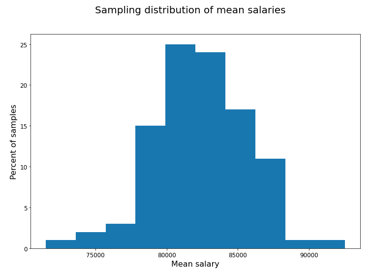

# Sampling & Estimation

Before testing any hypothesis, you need to understand **where your data comes from** and **what it can tell you about the broader population**. This section covers how samples relate to populations, and how we use sample statistics to estimate unknown population parameters.

Key point: Why this step is the most important: the whole premise of inferential statistics is that your sample can reasonably represent the target population. If the sampling method is biased, everything that follows will be distorted.

## Population vs. Sample

| Term               | Definition                                                       | Example                                         |
| ------------------ | ---------------------------------------------------------------- | ----------------------------------------------- |
| **Population**     | The entire group you want to draw conclusions about              | All adults in Taiwan                            |
| **Sample**         | A subset of the population actually observed                     | 1,000 adults surveyed in Taipei                 |
| **Parameter**      | A numerical summary of the population (usually unknown)          | True population mean income μ                   |
| **Statistic**      | A numerical summary computed from the sample                     | Sample mean income x̄                           |
| **Sampling error** | The difference between a sample statistic and the true parameter | x̄ ≠ μ simply because we didn't survey everyone |

Tip: We use Roman letters (x̄, s, p̂) for sample statistics and Greek letters (μ, σ, π) for population parameters. This distinction matters for formulas and interpretation.

## Sampling Methods

| Method                     | Description                                                        | Pros / Cons                                                           |
| -------------------------- | ------------------------------------------------------------------ | --------------------------------------------------------------------- |
| **Simple random sampling** | Every individual has an equal probability of being selected        | ✅ Unbiased; ❌ Expensive if population is large/dispersed              |
| **Stratified sampling**    | Divide into subgroups (strata), then randomly sample within each   | ✅ Ensures representation of subgroups; ❌ Requires strata info         |
| **Cluster sampling**       | Randomly select whole clusters (e.g., schools), then sample within | ✅ Cheaper for geographically spread populations; ❌ Higher variance    |
| **Systematic sampling**    | Select every k-th individual from a list                           | ✅ Easy to implement; ❌ Periodic pattern can introduce bias            |
| **Convenience sampling**   | Select whoever is easily accessible                                | ✅ Fast and cheap; ❌ High risk of selection bias — avoid for inference |

Warning: Bias vs. Variance tradeoff in sampling: Random methods minimize bias (systematic error) but may have high variance (noise). Non-random methods are fast but introduce bias that no amount of analysis can fix.

### Systematic Sampling

Systematic sampling means choosing every `k`-th observation after a starting point.

Example:

- you have 10,000 rows
- you want roughly 1,000 observations
- set `k = 10` and take every 10th row

This is operationally convenient, but it has one major caveat: if the row order contains a hidden pattern, systematic sampling can become biased.

For example:

- customer records sorted by region
- manufacturing records sorted by machine cycle
- web logs sorted by repeated periodic events

If the periodicity in the data lines up with `k`, you may over- or under-sample certain patterns.

Practical rule:

- systematic sampling is acceptable when row order is already random-like
- otherwise shuffle first, then apply systematic selection

Once you shuffle rows first, systematic sampling behaves much more like simple random sampling.

### Stratified vs. Cluster Sampling

These two are easy to confuse because both start with groups, but their goals are different.

| Method | What you do | Main goal |
| ------ | ----------- | --------- |
| **Stratified sampling** | sample from every subgroup | preserve subgroup representation |
| **Cluster sampling** | sample some subgroups, then observe within them | reduce collection cost |

Use stratified sampling when:

- subgroup representation matters
- groups differ meaningfully on the outcome
- you want more stable estimates for subgroup comparisons

Use cluster sampling when:

- the population is geographically or operationally spread out
- it is expensive to reach every subgroup
- you can tolerate higher variance in exchange for lower collection cost

Key mental model:

- stratified sampling spreads effort across all important groups
- cluster sampling concentrates effort inside a subset of groups

### Weighted Sampling

Sometimes not every row should have the same probability of being selected.

Weighted sampling changes the relative selection probability of each observation.

This is useful when:

- some subgroups are rare but analytically important
- you want to oversample a specific category for modeling or inspection
- you are simulating a sampling scheme with unequal probabilities

Important caution:

- weighted sampling changes who enters the sample
- it does **not** automatically make later estimates unbiased
- if you oversample a subgroup, you often need weighting again at analysis time to recover population-level estimates

This distinction matters because "sampling weights" and "analysis weights" are related but not interchangeable.

## Point Estimation

A **point estimate** is a single-value guess for a population parameter, calculated from the sample.

| Population Parameter  | Symbol | Point Estimate    | Symbol |
| --------------------- | ------ | ----------------- | ------ |
| Population mean       | μ      | Sample mean       | x̄     |
| Population variance   | σ²     | Sample variance   | s²     |
| Population SD         | σ      | Sample SD         | s      |
| Population proportion | π      | Sample proportion | p̂     |

**Key limitation**: A point estimate is almost certainly not exactly equal to the true parameter. To communicate this uncertainty, we use **confidence intervals**.

```python
import pandas as pd
import numpy as np
from sklearn.datasets import load_iris

df = load_iris(as_frame=True).frame

# Point estimates for sepal length
n       = df['sepal length (cm)'].count()
x_bar   = df['sepal length (cm)'].mean()
s       = df['sepal length (cm)'].std(ddof=1)   # sample SD (ddof=1)
s_sq    = df['sepal length (cm)'].var(ddof=1)   # sample variance

print(f"n     = {n}")
print(f"x̄    = {x_bar:.4f}")
print(f"s     = {s:.4f}")
print(f"s²    = {s_sq:.4f}")
```

Tip: Why `ddof=1`? The sample variance uses n−1 in the denominator (not n) to produce an unbiased estimate of σ². This correction is called Bessel's correction. Pandas' default for `.var()` and `.std()` is already `ddof=1`.

## The Central Limit Theorem (CLT)

The **Central Limit Theorem** is the theoretical backbone of inferential statistics.

CLT Statement: If you draw many random samples of size n from _any_ population with mean μ and finite variance σ², the distribution of sample means (x̄) will approach a Normal distribution as n increases, regardless of the shape of the original population.

\[ \bar{x} \sim N\left(\mu,\ \frac{\sigma^2}{n}\right) \quad \text{as } n \to \infty ]

| Condition                    | Practical Rule of Thumb       |
| ---------------------------- | ----------------------------- |
| Population is normal         | CLT holds for any n           |
| Population is mildly skewed  | n ≥ 30 is usually sufficient  |
| Population is heavily skewed | n ≥ 100 or more may be needed |

**What CLT enables:**

* We can use z-tests and t-tests even when the original population isn't normal
* The Normal distribution becomes our tool for computing probabilities about sample means

```python
import numpy as np
import matplotlib.pyplot as plt

np.random.seed(42)

# Simulate CLT: sample means from a right-skewed (exponential) population
population = np.random.exponential(scale=2, size=100_000)
sample_means = [np.mean(np.random.choice(population, size=30)) for _ in range(5000)]

fig, axes = plt.subplots(1, 2, figsize=(12, 4))

axes[0].hist(population, bins=80, color='steelblue', edgecolor='white')
axes[0].set_title('Original Population (Exponential — Skewed)')
axes[0].set_xlabel('Value')

axes[1].hist(sample_means, bins=60, color='coral', edgecolor='white')
axes[1].set_title('Distribution of Sample Means (n=30)\n→ Approximately Normal (CLT)')
axes[1].set_xlabel('Sample Mean')

plt.tight_layout()
plt.show()
```



The chart above is a helpful teaching bridge from the source materials: once you repeatedly re-sample, the "mean salary" stops being one number and becomes a distribution. That distribution is exactly what inferential statistics works with.

## Standard Error (SE)

**Standard Error** measures how much the sample statistic (e.g., x̄) varies from sample to sample. It is the **standard deviation of the sampling distribution**.

\[ SE\_{\bar{x\}} = \frac{s}{\sqrt{n\}} ]

| n (sample size) | SE behavior | Implication                                       |
| --------------- | ----------- | ------------------------------------------------- |
| Small           | Large SE    | Estimates are imprecise; wide confidence interval |
| Large           | Small SE    | Estimates are precise; narrow confidence interval |

```python
se = s / np.sqrt(n)
print(f"Standard Error (SE) = {se:.4f}")
```

Tip: SE vs. SD: Standard Deviation (s) describes how spread out individual observations are. Standard Error (SE) describes how spread out _sample means_ are. As n increases, SE decreases — SD does not change much.

| Statistic     | What it describes                          | Changes with n?            |
| ------------- | ------------------------------------------ | -------------------------- |
| **SD (s)**    | Spread of individual data points           | Not much                   |
| **SE (s/√n)** | Spread of sample means across many samples | Yes — decreases as n grows |

As sample size grows, the sampling distribution of the mean gets narrower. This is why larger samples usually produce more stable point estimates and tighter confidence intervals.

## Repeated Sampling vs. Bootstrap

These two ideas are easy to mix up:

| Idea                  | Where samples come from                             | Main purpose                                       |
| --------------------- | --------------------------------------------------- | -------------------------------------------------- |
| **Repeated sampling** | Hypothetical fresh samples from the population      | Define the true sampling distribution              |
| **Bootstrap**         | Resamples from the one dataset you already observed | Approximate that sampling distribution in practice |

Repeated sampling is usually the **theoretical object** behind formulas like `SE = s / sqrt(n)`. Bootstrap is the **practical workaround** when the theoretical formula is unavailable or inconvenient.

```python
import numpy as np
import seaborn as sns

rng = np.random.default_rng(42)
tips = sns.load_dataset("tips")
sample = tips["tip"].dropna().to_numpy()

boot_medians = np.array([
    np.median(rng.choice(sample, size=len(sample), replace=True))
    for _ in range(4000)
])

print(f"Observed median:     {np.median(sample):.2f}")
print(f"Bootstrap SE median: {boot_medians.std(ddof=1):.3f}")
print(f"Bootstrap 95% CI:    {np.percentile(boot_medians, [2.5, 97.5])}")
```

Tip: The median is a good example because its standard error is less convenient to derive analytically than the mean, but bootstrap handles it naturally.

## Bootstrap

**Bootstrapping** estimates uncertainty by repeatedly resampling from the observed sample with replacement.

Key point: Bootstrap treats the observed sample as a stand-in for the population, then repeatedly resamples it to see how the statistic changes. It is especially useful when the analytic formula for uncertainty is difficult to derive.

| Use                 | What It Estimates                           |
| ------------------- | ------------------------------------------- |
| Standard error      | Variability of a statistic                  |
| Confidence interval | Plausible range without analytic formula    |
| Model stability     | How sensitive results are to sample changes |

```python
import numpy as np

np.random.seed(42)
sample = df['sepal length (cm)'].to_numpy()

boot_means = [
    np.random.choice(sample, size=len(sample), replace=True).mean()
    for _ in range(5000)
]

ci_low, ci_high = np.percentile(boot_means, [2.5, 97.5])
print(f"Bootstrap 95% CI: ({ci_low:.3f}, {ci_high:.3f})")
```

| Action                                        |
| --------------------------------------------- |
| Resample the original sample with replacement |
| Compute the statistic for that resample       |
| Repeat many times                             |
| Use the bootstrap distribution for SE or CI   |

### What Bootstrap Can and Cannot Fix

Bootstrap is powerful, but it is not magic.

It can help approximate:

- standard errors
- confidence intervals
- stability of a statistic

It cannot fix:

- selection bias
- measurement bias
- badly unrepresentative original samples

If the original sample is biased, bootstrap usually just reproduces that bias many times.

### Quantile vs. Standard-Error Confidence Intervals

Two common bootstrap CI patterns are:

1. quantile / percentile method
2. standard-error method

Percentile method:

```python
ci_low, ci_high = np.percentile(boot_means, [2.5, 97.5])
```

Standard-error method, normal approximation:

```python
boot_se = np.std(boot_means, ddof=1)
ci_low = sample.mean() - 1.96 * boot_se
ci_high = sample.mean() + 1.96 * boot_se
```

Rule of thumb:

- percentile intervals are convenient and widely used
- normal-approximation intervals are simpler, but rely more on the bootstrap distribution being reasonably symmetric

## Key Takeaways

| Principle                        | Details                                                                  |
| -------------------------------- | ------------------------------------------------------------------------ |
| **Sample ≠ Population**          | Statistics from samples always contain sampling error                    |
| **Sampling method matters**      | Non-random samples introduce bias that invalidates inference             |
| **CLT is foundational**          | Enables use of Normal-based tests even when the population is non-normal |
| **SE quantifies precision**      | Larger n → smaller SE → more precise estimates                           |
| **Bootstrap is practical**       | Resampling can estimate uncertainty when formulas are hard               |
| **Point estimates need context** | Always accompany point estimates with confidence intervals               |
