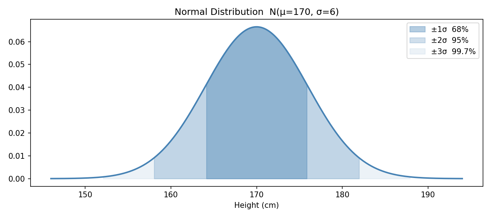
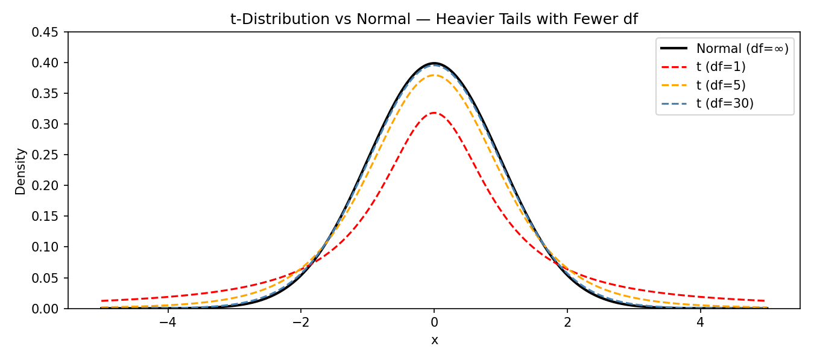

# Continuous Distributions

A **continuous distribution** models a random variable that can take any value within a range. Unlike discrete distributions, probabilities are described as **areas under a curve** (PDF), not as point probabilities.

**Why is continuous distribution so important?**

- Normal distribution is the core of statistics. The t, Chi-square, and F distributions are all derived from it, and these distributions are the basis for hypothesis tests such as t-test, chi-square test, and ANOVA.

## Distribution Selection Guide

| Distribution        | When to Use                                                        | Key Parameter(s)        |
| ------------------- | ------------------------------------------------------------------ | ----------------------- |
| **Normal**          | Continuous data that's roughly symmetric; foundation of most tests | μ (mean), σ (SD)        |
| **t**               | Small sample mean estimation; when population SD is unknown        | df (degrees of freedom) |
| **Chi-square (χ²)** | Variance testing; goodness-of-fit; independence tests              | df                      |
| **F**               | Comparing two variances; ANOVA                                     | df₁, df₂                |
| **Exponential**     | Time between independent events                                    | λ (rate)                |
| **Uniform**         | Equal probability over a range                                     | a (min), b (max)        |

## Normal Distribution

**Key properties:**

- **Symmetric**: Mean = Median = Mode
- **Bell-shaped**: Single peak at μ
- **Empirical Rule**: 68% within ±1σ, 95% within ±2σ, 99.7% within ±3σ
- **Defined by 2 parameters**: Fully described by μ and σ
- **Tails never touch zero**: Extends to ±∞

### Parameters

$$
X \sim N(\mu, \sigma^2)
$$

- Mean (μ): Center of the distribution
- Standard Deviation (σ): Spread / width of the bell curve

### PDF

$$
f(x) = \frac{1}{\sigma\sqrt{2\pi}} e^{-\frac{(x-\mu)^2}{2\sigma^2}}
$$

### Standard Normal Distribution

The **Standard Normal** is a special case where μ = 0 and σ = 1, written Z ~ N(0, 1).

Any Normal distribution can be converted to Standard Normal using the **Z-score**:

$$
Z = \frac{X - \mu}{\sigma}
$$

**Note:**

- Z-score tells you how many standard deviations a value is from the mean.
- Z = 2 means 2 standard deviations above the mean.
- This allows data at different scales to be compared with each other.

```python
from scipy.stats import norm
import numpy as np
import matplotlib.pyplot as plt

mu, sigma = 170, 6   # height example: mean 170cm, SD 6cm

# Probability calculations
print(f"P(X < 175)          = {norm.cdf(175, mu, sigma):.4f}")
print(f"P(160 < X < 180)    = {norm.cdf(180, mu, sigma) - norm.cdf(160, mu, sigma):.4f}")
print(f"P(X > 180)          = {1 - norm.cdf(180, mu, sigma):.4f}")

# Z-score conversion
x = 180
z = (x - mu) / sigma
print(f"\nZ-score for X=180: {z:.2f}")
print(f"P(Z < {z:.2f})      = {norm.cdf(z):.4f}")  # Same result via standard normal

# Inverse: what value has 95% below it?
x_95 = norm.ppf(0.95, mu, sigma)
print(f"\n95th percentile: {x_95:.2f} cm")
```

### Visualization

```python
x = np.linspace(mu - 4*sigma, mu + 4*sigma, 300)
pdf = norm.pdf(x, mu, sigma)

fig, ax = plt.subplots(figsize=(9, 4))
ax.plot(x, pdf, color='steelblue', linewidth=2)

# Shade ±1σ, ±2σ regions
for n_sd, alpha, label in [(1, 0.4, '±1σ  68%'), (2, 0.25, '±2σ  95%'), (3, 0.1, '±3σ  99.7%')]:
    ax.fill_between(x, pdf,
                    where=(x >= mu - n_sd*sigma) & (x <= mu + n_sd*sigma),
                    alpha=alpha, color='steelblue', label=label)

ax.set_title(f'Normal Distribution  N(μ={mu}, σ={sigma})')
ax.set_xlabel('Height (cm)')
ax.legend()
plt.show()
```



## t-Distribution

The t-distribution looks like a Normal distribution but with **heavier tails**.

### When to Use

- Estimating a population mean from a **small sample** (n < 30 is a rough guideline)
- Population standard deviation **σ is unknown** (must be estimated from sample)
- Data is approximately normally distributed

**Note:**

- When estimating the parent population with a small sample, the uncertainty is higher, so the tail should be thicker to reflect this uncertainty.
- As the number of samples increases (df increases), the t distribution will get closer and closer to the Normal distribution.

### Parameter: Degrees of Freedom (df)

$$
df = n - 1
$$

As df increases, the t-distribution approaches the Standard Normal.

```python
from scipy.stats import t, norm
import matplotlib.pyplot as plt
import numpy as np

x = np.linspace(-5, 5, 300)

plt.figure(figsize=(9, 4))
plt.plot(x, norm.pdf(x), label='Normal (df=∞)', color='black', linewidth=2)

for df, color in [(1, 'red'), (5, 'orange'), (30, 'steelblue')]:
    plt.plot(x, t.pdf(x, df), label=f't (df={df})', color=color, linestyle='--')

plt.title('t-Distribution vs Normal — Heavier Tails with Fewer df')
plt.xlabel('x')
plt.ylabel('Density')
plt.legend()
plt.ylim(0, 0.45)
plt.show()
```



### Critical Values

```python
from scipy.stats import norm, t

# Critical value for 95% confidence interval (two-tailed, α=0.05)
for df in [5, 10, 30, 100]:
    cv = t.ppf(0.975, df)  # upper tail 2.5%
    print(f"df={df:3d}:  t_critical = {cv:.4f}")

# As df → ∞, t approaches z = 1.96
print(f"Normal z = {norm.ppf(0.975):.4f}")

# df=  5:  t_critical = 2.5706
# df= 10:  t_critical = 2.2281
# df= 30:  t_critical = 2.0423
# df=100:  t_critical = 1.9840
# Normal z = 1.9600
```

## Chi-square Distribution

The Chi-square distribution is the distribution of the **sum of squared standard normal variables**.

$$
\chi^2 = Z_1^2 + Z_2^2 + \cdots + Z_k^2 \quad \text{where each } Z_i \sim N(0,1)
$$

### Key Properties

| Property      | Detail                                          |
| ------------- | ----------------------------------------------- |
| **Shape**     | Right-skewed; approaches Normal as df increases |
| **Range**     | Always ≥ 0 (it's a sum of squares)              |
| **Parameter** | df (degrees of freedom)                         |
| **Mean**      | df                                              |
| **Variance**  | 2 × df                                          |

### When to Use

| Application              | Details                                                                      |
| ------------------------ | ---------------------------------------------------------------------------- |
| **Variance testing**     | Is a population variance equal to a specific value?                          |
| **Goodness-of-fit test** | Does observed data fit an expected distribution?                             |
| **Independence test**    | Are two categorical variables independent? (Chi-square test of independence) |

```python
from scipy.stats import chi2
import matplotlib.pyplot as plt
import numpy as np

x = np.linspace(0, 40, 300)

plt.figure(figsize=(9, 4))
for df, color in [(2, 'red'), (5, 'orange'), (10, 'steelblue'), (20, 'green')]:
    plt.plot(x, chi2.pdf(x, df), label=f'df={df}', color=color)

plt.title('Chi-square Distribution — Shape by Degrees of Freedom')
plt.xlabel('x')
plt.ylabel('Density')
plt.legend()
plt.xlim(0, 40)
plt.show()

# Critical value example (α = 0.05, right-tail)
df = 10
cv = chi2.ppf(0.95, df)
print(f"χ² critical value (df={df}, α=0.05) = {cv:.4f}")
```

## F-Distribution

The F-distribution is the ratio of two independent Chi-square variables divided by their respective degrees of freedom.

$$
F = \frac{\chi^2_{df_1}/df_1}{\chi^2_{df_2}/df_2}
$$

### Key Properties

| Property       | Detail                             |
| -------------- | ---------------------------------- |
| **Shape**      | Right-skewed; always ≥ 0           |
| **Parameters** | df₁ (numerator), df₂ (denominator) |
| **Mean**       | ≈ 1 when df₂ is large              |

### When to Use

| Application                 | Details                                                                                      |
| --------------------------- | -------------------------------------------------------------------------------------------- |
| **Comparing two variances** | Is σ₁² = σ₂²? (F-test for equality of variances)                                             |
| **ANOVA**                   | Are the means of multiple groups equal? F = variance between groups / variance within groups |
| **Regression F-test**       | Is the overall regression model significant?                                                 |

```python
from scipy.stats import f
import matplotlib.pyplot as plt
import numpy as np

x = np.linspace(0, 5, 300)

plt.figure(figsize=(9, 4))
for df1, df2, color in [(1, 10, 'red'), (5, 10, 'orange'), (10, 30, 'steelblue')]:
    plt.plot(x, f.pdf(x, df1, df2), label=f'df=({df1},{df2})', color=color)

plt.title('F-Distribution')
plt.xlabel('x')
plt.ylabel('Density')
plt.legend()
plt.xlim(0, 5)
plt.show()

# Critical value (α = 0.05)
cv = f.ppf(0.95, dfn=5, dfd=20)
print(f"F critical value (df=5,20, α=0.05) = {cv:.4f}")
```

## Exponential Distribution

The Exponential distribution models the **time between independent events** — the continuous counterpart of the Poisson distribution.

Tip: If Poisson counts events per unit time, Exponential models the waiting time until the next event. Poisson counts events per unit time, and Exponential models the waiting time between two events.

### Parameter: Rate (λ)

$$
f(x) = \lambda e^{-\lambda x}, \quad x \geq 0
$$

$$
E(X) = \frac{1}{\lambda} \qquad \text{Var}(X) = \frac{1}{\lambda^2}
$$

**Examples:**

- Time between customer arrivals (if arrivals follow Poisson)
- Lifetime of electronic components
- Time until next server request

```python
from scipy.stats import expon
import matplotlib.pyplot as plt
import numpy as np

# λ = 2 means 2 events per unit time → average wait = 1/2 = 0.5
lam = 2
scale = 1 / lam   # scipy uses scale = 1/λ

x = np.linspace(0, 4, 300)
pdf = expon.pdf(x, scale=scale)

plt.plot(x, pdf, color='steelblue', linewidth=2)
plt.fill_between(x, pdf, where=(x <= 1), alpha=0.3, color='steelblue',
                 label=f'P(X ≤ 1) = {expon.cdf(1, scale=scale):.3f}')
plt.title(f'Exponential Distribution (λ={lam}, mean={1/lam})')
plt.xlabel('Time')
plt.ylabel('Density')
plt.legend()
plt.show()

print(f"Mean wait time:      {expon.mean(scale=scale):.2f}")
print(f"P(wait ≤ 0.5)       = {expon.cdf(0.5, scale=scale):.4f}")
print(f"P(wait > 1.0)       = {1 - expon.cdf(1.0, scale=scale):.4f}")
```

### Memoryless Property

Like the Geometric distribution, the Exponential distribution is **memoryless**:

$$
P(X > s + t \mid X > s) = P(X > t)
$$

Tip: If a lightbulb has been working for 1,000 hours, the probability of it lasting another 500 hours is the same as a brand-new bulb lasting 500 hours. Past survival time gives no information about future lifetime.

## Uniform Distribution

Every value in the range [a, b] is **equally likely**.

$$
f(x) = \frac{1}{b-a}, \quad a \leq x \leq b
$$

$$
E(X) = \frac{a+b}{2} \qquad \text{Var}(X) = \frac{(b-a)^2}{12}
$$

```python
from scipy.stats import uniform

a, b = 0, 10
scale = b - a

print(f"Mean:          {uniform.mean(loc=a, scale=scale):.1f}")   # 5.0
print(f"P(3 ≤ X ≤ 7)  = {uniform.cdf(7, a, scale) - uniform.cdf(3, a, scale):.2f}")  # 0.4
```

**Use cases:**

- Random number generation
- Modeling complete uncertainty over a bounded range
- Simulations and Monte Carlo methods
- Prior distribution in Bayesian analysis (when you have no prior knowledge)

## Comparing All Continuous Distributions

| Distribution    | Shape                     | Range    | Key Use                                      | Parameters |
| --------------- | ------------------------- | -------- | -------------------------------------------- | ---------- |
| **Normal**      | Symmetric bell            | (−∞, +∞) | General continuous data; foundation of tests | μ, σ       |
| **t**           | Symmetric, heavy tails    | (−∞, +∞) | Small sample mean inference                  | df         |
| **Chi-square**  | Right-skewed              | [0, +∞)  | Variance tests, categorical tests            | df         |
| **F**           | Right-skewed              | [0, +∞)  | Variance comparison, ANOVA                   | df₁, df₂   |
| **Exponential** | Right-skewed (decreasing) | [0, +∞)  | Waiting times, lifetimes                     | λ          |
| **Uniform**     | Flat                      | [a, b]   | Complete uncertainty over bounded range      | a, b       |

### Family Relationships

```
Normal(0,1) ──squared──▶  Chi-square(1)
                              │
                         sum k of them
                              │
                              ▼
                         Chi-square(k)
                              │
                    ratio of two chi-squares
                              │
                              ▼
                         F(df₁, df₂)

Normal(μ,σ²) ─ small n, unknown σ ─▶  t-distribution

Poisson(λ) ─ time between events ─▶  Exponential(λ)
```

Tip: These relationships matter in practice: when you run a t-test, it uses the t-distribution. When you run ANOVA, it uses the F-distribution. When you run a Chi-square test, it uses the χ² distribution. Understanding where these distributions come from makes the tests much more intuitive.

## Key Takeaways

| Distribution    | Key Point                                                                          |
| --------------- | ---------------------------------------------------------------------------------- |
| **Normal**      | Foundation of statistics; defined by mean and SD; use Z-scores to standardize      |
| **t**           | Like Normal but heavier tails; used for small samples; approaches Normal as df → ∞ |
| **Chi-square**  | Always ≥ 0; used for variance and categorical tests; sum of squared normals        |
| **F**           | Always ≥ 0; ratio of variances; used in ANOVA and regression                       |
| **Exponential** | Waiting time between Poisson events; memoryless; mean = 1/λ                        |
| **Uniform**     | Every value equally likely; simplest distribution                                  |
