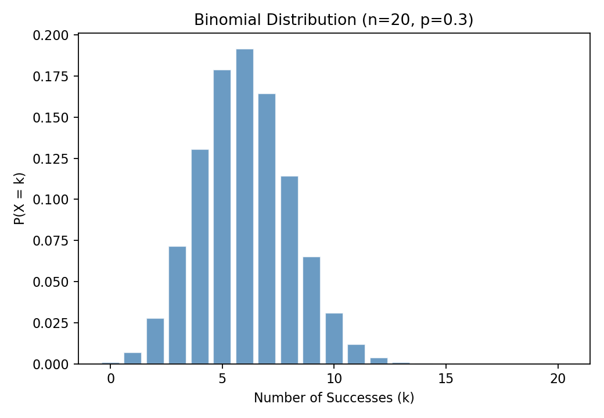
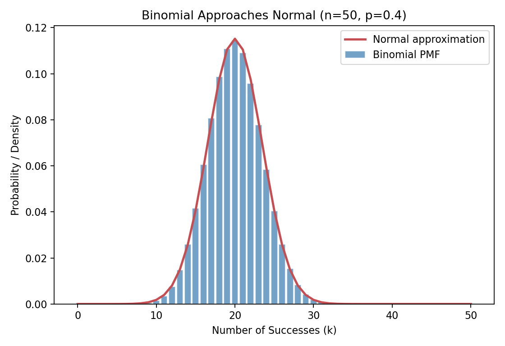
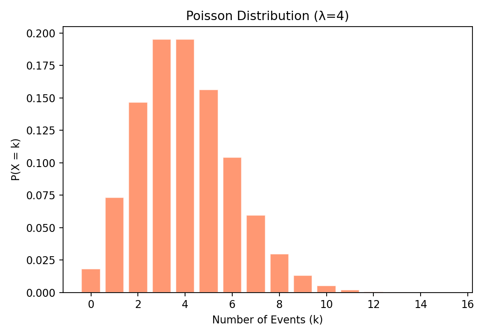
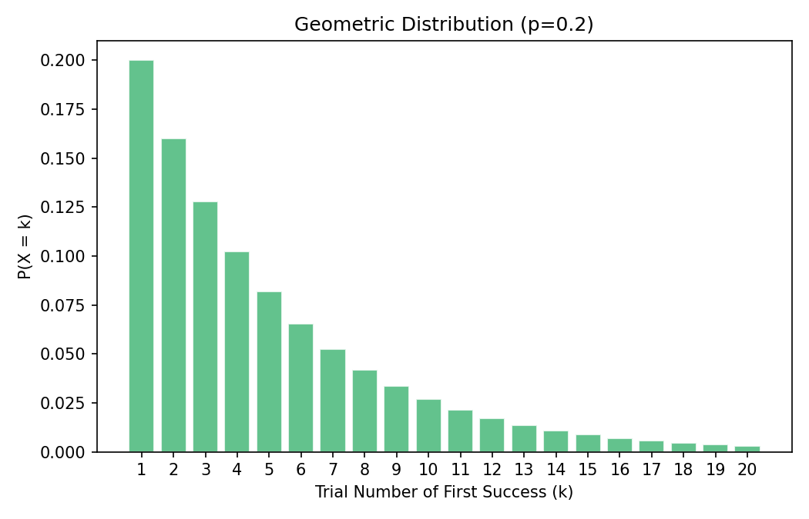

# Discrete Distributions

A **discrete distribution** is a probability model for a discrete random variable — one that takes countable values (usually non-negative integers).

Each distribution has a specific shape and assumptions. Choosing the right one depends on the nature of your data and the process generating it.

## Distribution Selection Guide

| Distribution       | Key Question                                          | Typical Scenario                        |
| ------------------ | ----------------------------------------------------- | --------------------------------------- |
| **Binomial**       | How many successes in n trials?                       | Defect count, survey responses (yes/no) |
| **Poisson**        | How many events in a fixed interval?                  | Website visits per hour, typos per page |
| **Geometric**      | How many trials until first success?                  | Waiting for first sale, first failure   |
| **Hypergeometric** | How many successes when sampling without replacement? | Quality control, card drawing           |

## Binomial Distribution

### When to Use

- Fixed number of trials **n**
- Each trial has exactly **two outcomes** (success / failure)
- Probability of success **p** is constant across trials
- Trials are **independent** of each other

**Examples:**

- Number of defective items in a batch of 20
- Number of customers who click an ad out of 100 shown
- Number of heads in 10 coin flips.

### Formula

$$
P(X = k) = \binom{n}{k} p^k (1-p)^{n-k}
$$

- `n`: Number of trials
- `k`: Number of successes
- `p`: Probability of success on each trial

**Mean and Variance:**

$$
E(X) = np \qquad \text{Var}(X) = np(1-p)
$$

For the full derivation, see [Binomial mean and variance derivation](./src/discrete-distributions-binomial-derivation.md).

```python
from scipy.stats import binom
import matplotlib.pyplot as plt
import numpy as np

n, p = 20, 0.3   # 20 trials, 30% success rate
x = np.arange(0, n+1)

# PMF and CDF
pmf = binom.pmf(x, n, p)
cdf = binom.cdf(x, n, p)

print(f"Mean:     {binom.mean(n, p):.2f}")   # E(X) = np = 6.0
print(f"Variance: {binom.var(n, p):.2f}")    # Var(X) = np(1-p) = 4.2
print(f"P(X = 6)      = {binom.pmf(6, n, p):.4f}")
print(f"P(X ≤ 6)      = {binom.cdf(6, n, p):.4f}")
print(f"P(X > 8)      = {1 - binom.cdf(8, n, p):.4f}")

# Plot
plt.bar(x, pmf, color='steelblue', edgecolor='white', alpha=0.8)
plt.xlabel('Number of Successes (k)')
plt.ylabel('P(X = k)')
plt.title(f'Binomial Distribution (n={n}, p={p})')
plt.show()
```



### When Binomial Approaches Normal

When n is large and p is not extreme (roughly: $np ≥ 5$ and $n(1−p) ≥ 5$), the Binomial distribution looks approximately Normal. This is an early preview of the [Central Limit Theorem](./sampling-distributions.md#central-limit-theorem).

### Python Example

```python
from scipy.stats import binom, norm
import matplotlib.pyplot as plt
import numpy as np

n, p = 50, 0.4
x = np.arange(0, n + 1)

pmf = binom.pmf(x, n, p)
mu = n * p
sigma = np.sqrt(n * p * (1 - p))
pdf = norm.pdf(x, loc=mu, scale=sigma)

plt.bar(x, pmf, width=0.85, color='steelblue', edgecolor='white', alpha=0.75, label='Binomial PMF')
plt.plot(x, pdf, color='#c44e52', linewidth=2.2, label='Normal approximation')
plt.xlabel('Number of Successes (k)')
plt.ylabel('Probability / Density')
plt.title('Binomial Approaches Normal (n=50, p=0.4)')
plt.legend()
plt.show()
```



A Binomial count is obtained by summing multiple **Bernoulli** outcomes: each trial produces a 0 or 1, and their sum gives the total number of successes in $n$ trials.

## Poisson Distribution

### When to Use

- Counting events that occur **randomly over a fixed time or space interval**
- Events occur **independently** of each other
- The **average rate (λ)** is constant
- Two events cannot occur at exactly the same instant

**Examples:**

- Number of emails per hour
- Number of accidents at an intersection per month
- Number of typos per page
- Number of customer arrivals per minute

### Formula

$$
P(X = k) = \frac{e^{-\lambda} \lambda^k}{k!}, \quad k = 0, 1, 2, \ldots
$$

- `λ (lambda)`: Average number of events per interval
- `k`: Actual number of events observed

**Mean and Variance — both equal λ:**

$$
E(X) = \lambda \qquad \text{Var}(X) = \lambda
$$

For the full derivation, see [Poisson mean and variance derivation](./src/discrete-distributions-poisson-derivation.md).

**Tip:**

- The fact that mean = variance is a useful diagnostic.
- If your count data has variance much larger than the mean, it may be overdispersed and Poisson may not be appropriate (consider Negative Binomial instead).

### A Practical Diagnostic: Mean vs Variance

When you suspect a Poisson model, check whether the empirical variance is roughly close to the empirical mean.

```python
import numpy as np

# Example synthetic count data
counts = np.array([2, 4, 3, 5, 7, 4, 2, 6, 5, 3, 4, 4])

print(f"Mean     = {counts.mean():.3f}")
print(f"Variance = {counts.var(ddof=1):.3f}")
```

If variance is much larger than the mean, that is called **overdispersion**. In real applications, this often signals hidden heterogeneity, clustering, or dependence between events.

### Python Example

```python
from scipy.stats import poisson
import matplotlib.pyplot as plt
import numpy as np

lam = 4   # average 4 events per interval
x = np.arange(0, 16)

pmf = poisson.pmf(x, lam)

print(f"Mean:     {poisson.mean(lam):.2f}")    # 4.0
print(f"Variance: {poisson.var(lam):.2f}")     # 4.0
print(f"P(X = 4)  = {poisson.pmf(4, lam):.4f}")
print(f"P(X ≤ 6)  = {poisson.cdf(6, lam):.4f}")
print(f"P(X > 6)  = {1 - poisson.cdf(6, lam):.4f}")

plt.bar(x, pmf, color='coral', edgecolor='white', alpha=0.8)
plt.xlabel('Number of Events (k)')
plt.ylabel('P(X = k)')
plt.title(f'Poisson Distribution (λ={lam})')
plt.show()
```



### Poisson as Limit of Binomial

When $n$ is large and $p$ is small (rare events), $Binomial(n, p) ≈ Poisson(λ = np)$.

| Condition                                                  | Use      |
| ---------------------------------------------------------- | -------- |
| $n$ is moderate, $p$ is known                              | Binomial |
| $n$ is very large, $p$ is very small, $λ = np$ is moderate | Poisson  |

## Geometric Distribution

### When to Use

- Counting the **number of trials until the first success**
- Each trial is independent with success probability **p**

**Examples:**

- Number of product tests until first failure
- Number of attempts until a machine produces a good item.

### Formula

$$
P(X = k) = (1-p)^{k-1} \cdot p, \quad k = 1, 2, 3, \ldots
$$

$$
E(X) = \frac{1}{p} \qquad \text{Var}(X) = \frac{1-p}{p^2}
$$

For the full derivation, see [Geometric mean and variance derivation](./src/discrete-distributions-geometric-derivation.md).

### Python Example

```python
from scipy.stats import geom
import matplotlib.pyplot as plt
import numpy as np

p = 0.2   # 20% success probability
x = np.arange(1, 21)

pmf = geom.pmf(x, p)

print(f"Mean (expected trials): {geom.mean(p):.1f}")  # 5.0
print(f"P(X = 1) = {geom.pmf(1, p):.4f}")   # First trial succeeds
print(f"P(X ≤ 5) = {geom.cdf(5, p):.4f}")   # Success within 5 trials

plt.bar(x, pmf, color='mediumseagreen', edgecolor='white', alpha=0.8)
plt.xlabel('Trial Number of First Success (k)')
plt.ylabel('P(X = k)')
plt.title(f'Geometric Distribution (p={p})')
plt.show()
```



### Memoryless Property

The Geometric distribution has a unique property: **past failures don't change the probability of future success**.

$$
P(X > m + n \mid X > m) = P(X > n)
$$

### Geometric vs. Negative Binomial

- wait until the **first** success: Geometric distribution
- wait until the **r-th** success: Negative Binomial

## Hypergeometric Distribution

### When to Use

- Sampling **without replacement** from a finite population
  - Binomial assumes sampling with replacement (or infinite population)
- Population contains two types: "successes" (K) and "failures" (N−K)
- You draw n items and count how many are successes

**Examples:**

- Drawing 5 cards from a deck and counting aces

### Formula

$$
P(X = k) = \frac{\binom{K}{k}\binom{N-K}{n-k}}{\binom{N}{n}}
$$

- `N`: Total population size
- `K`: Total successes in population
- `n`: Sample size drawn
- `k`: Observed successes in sample

$$
E(X) = \frac{nK}{N} \qquad \text{Var}(X) = n \cdot \frac{K}{N} \cdot \frac{N-K}{N} \cdot \frac{N-n}{N-1}
$$

Note:

- The extra term $\frac{N-n}{N-1}$ is the finite population correction factor
- As the sample approaches the full population, variance approaches 0

### Binomial vs. Hypergeometric

| Feature             | Binomial                                               | Hypergeometric                                 |
| ------------------- | ------------------------------------------------------ | ---------------------------------------------- |
| Sampling scheme     | **With** replacement / effectively infinite population | **Without** replacement from finite population |
| Trial independence  | Yes                                                    | No                                             |
| Success probability | Constant across draws                                  | Changes after each draw                        |

## Simulation as a Sanity Check

```python
import numpy as np

rng = np.random.default_rng(42)
n_sim = 100_000

# Hypergeometric example:
# 15 defectives in a batch of 100, draw 10 without replacement
successes = rng.hypergeometric(ngood=15, nbad=85, nsample=10, size=n_sim)

print(f"Estimated P(X >= 3) = {(successes >= 3).mean():.4f}")
print(f"Estimated mean      = {successes.mean():.4f}")
```

Simulation is especially useful for catching mistaken independence assumptions.

```python
from scipy.stats import hypergeom

N = 100   # total population
K = 15    # defective items in population
n = 10    # sample size

print(f"Mean:      {hypergeom.mean(N, K, n):.2f}")   # 1.5
print(f"P(X = 0) = {hypergeom.pmf(0, N, K, n):.4f}")  # No defectives in sample
print(f"P(X ≤ 2) = {hypergeom.cdf(2, N, K, n):.4f}")  # At most 2 defectives
print(f"P(X ≥ 3) = {1 - hypergeom.cdf(2, N, K, n):.4f}")
```

## Comparing All Four Distributions

|                    | **Binomial**          | **Poisson**              | **Geometric**            | **Hypergeometric**  |
| ------------------ | --------------------- | ------------------------ | ------------------------ | ------------------- |
| **What X counts**  | Successes in n trials | Events in fixed interval | Trials until 1st success | Successes in sample |
| **Population**     | Infinite              | Events over time/space   | Infinite                 | Finite              |
| **Replacement**    | With replacement      | N/A                      | With replacement         | Without replacement |
| **Parameters**     | n, p                  | λ                        | p                        | N, K, n             |
| **Mean**           | np                    | λ                        | 1/p                      | nK/N                |
| **Variance**       | np(1−p)               | λ                        | (1−p)/p²                 | (complex)           |
| **Key Assumption** | Fixed n, constant p   | Constant rate λ          | Independent trials       | Finite population   |

## Key Takeaways

| Concept                | Key Point                                                                                |
| ---------------------- | ---------------------------------------------------------------------------------------- |
| **Binomial**           | Fixed trials, binary outcome, with replacement — the workhorse of discrete distributions |
| **Poisson**            | Count of rare events per interval; mean = variance is a diagnostic check                 |
| **Geometric**          | Waiting time until first success; memoryless property                                    |
| **Hypergeometric**     | Sampling without replacement from finite population                                      |
| **Binomial → Poisson** | When n is large and p is small, Poisson is a good approximation                          |
| **Binomial → Normal**  | When n is large and p is moderate, Normal approximation works                            |
