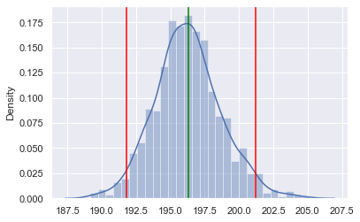

# Monte Carlo Simulation

Monte Carlo simulation uses **repeated random sampling** to approximate quantities that are hard to solve exactly. In statistics, it is one of the most practical ways to turn probability models into numerical answers.

## When It Helps

| Situation                          | Why Monte Carlo is useful                             |
| ---------------------------------- | ----------------------------------------------------- |
| Exact formula is messy             | Simulation is often easier to write than derive       |
| You want to understand variability | It produces a whole distribution, not just one number |
| You need a risk estimate           | Tail probabilities can be approximated directly       |
| You want to validate a result      | Simulated answers can sanity-check analytic work      |

## Core Workflow

1. Define a random process or probability model.
2. Simulate it many times.
3. Compute the statistic of interest for each run.
4. Summarize the simulated distribution.

```python
import numpy as np

rng = np.random.default_rng(42)
n_sim = 100_000

# Example: probability of at least one 6 in four die rolls
rolls = rng.integers(1, 7, size=(n_sim, 4))
success = (rolls == 6).any(axis=1)

print(f"Monte Carlo estimate: {success.mean():.4f}")
print(f"Exact answer:         {1 - (5/6)**4:.4f}")
```

**Note:**

- Monte Carlo error shrinks roughly at the rate of `1 / sqrt(n_sim)`.
- To cut simulation noise in half, you usually need about `4x` as many runs.

## Monte Carlo vs. Bootstrap

| Method                     | What gets resampled?                         | Typical goal                              |
| -------------------------- | -------------------------------------------- | ----------------------------------------- |
| **Monte Carlo simulation** | Data generated from a probability model      | Estimate probabilities, outcomes, or risk |
| **Bootstrap**              | The observed sample itself, with replacement | Estimate uncertainty of a statistic       |

## Bootstrap Example

```python
import numpy as np
import seaborn as sns

rng = np.random.default_rng(42)
tips = sns.load_dataset("tips")
sample = tips["total_bill"].dropna().to_numpy()

boot_means = np.array([
    rng.choice(sample, size=len(sample), replace=True).mean()
    for _ in range(5000)
])

ci_low, ci_high = np.percentile(boot_means, [2.5, 97.5])

print(f"Observed mean:     {sample.mean():.2f}")
print(f"Bootstrap 95% CI: ({ci_low:.2f}, {ci_high:.2f})")
```



The histogram above highlights a useful mental model: once you simulate many resamples, the single sample mean turns into a **distribution of plausible means**.

- Blue bars: bootstrap distribution
- Blue curve: density estimate
- Green line: observed mean from the original sample.
- Red lines: lower and upper bounds of the bootstrap 95% confidence interval

## A Risk-Oriented Example

Monte Carlo becomes especially valuable when you care about tail events rather than averages.

```python
import numpy as np

rng = np.random.default_rng(42)
n_sim = 200_000

# Daily returns: mean 0.04%, SD 1.2%
daily_returns = rng.normal(loc=0.0004, scale=0.012, size=(n_sim, 20))
twenty_day_return = (1 + daily_returns).prod(axis=1) - 1

prob_loss_gt_10 = (twenty_day_return < -0.10).mean()

print(f"P(20-day return < -10%) ≈ {prob_loss_gt_10:.4f}")
print(f"Median 20-day return     = {np.median(twenty_day_return):.4f}")
```

This is the style of question where closed-form formulas are often less convenient than simulation: "How often do bad outcomes happen if the process repeats many times?"

## Limitations

| Limitation                   | Why it matters                                                   |
| ---------------------------- | ---------------------------------------------------------------- |
| Garbage-in, garbage-out      | A bad probability model produces misleading results              |
| Rare events need many runs   | Tail probabilities are noisy unless `n_sim` is large             |
| Simulation is approximate    | Results should be reported with tolerance, not fake precision    |
| Dependence can be overlooked | Assuming independence when it is false can badly understate risk |

## Key Takeaways

| Concept               | Key point                                                              |
| --------------------- | ---------------------------------------------------------------------- |
| **Monte Carlo**       | Repeated random sampling used to approximate probabilities or outcomes |
| **Bootstrap**         | Resampling the observed data to quantify uncertainty of a statistic    |
| **Simulation output** | Usually a full empirical distribution, not just one estimate           |
| **More runs**         | Reduces Monte Carlo noise, but does not fix a wrong model              |
