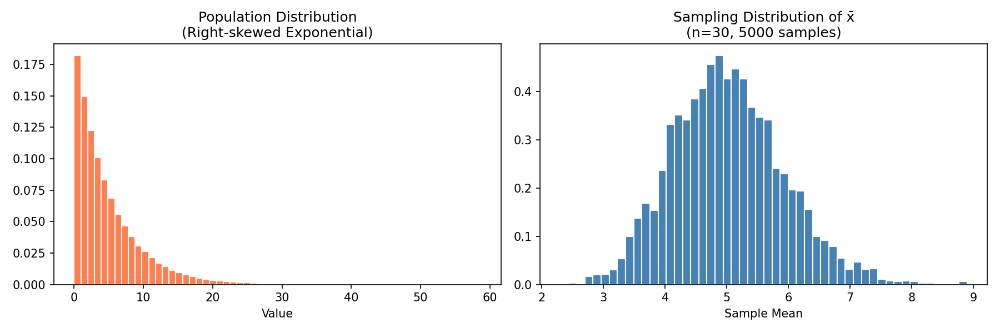
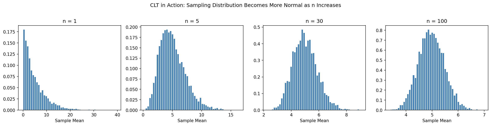

# Sampling Distributions & Central Limit Theorem

This section is the bridge between descriptive statistics and inferential statistics. It explains why we can use sample data to make claims about populations — and why the Normal distribution appears so frequently in statistical tests even when the underlying data is not normal.

## The Core Problem: Sample vs Population

In practice, you almost never have access to the entire population — you work with a **sample**.

The fundamental challenge is:

- My sample gives me a statistic (e.g., sample mean x̄).<br>How well does it represent the true population parameter (e.g., population mean μ)?

| Term                     | Symbol  | Definition                                                        |
| ------------------------ | ------- | ----------------------------------------------------------------- |
| **Population parameter** | μ, σ, p | True value for the entire population — usually unknown            |
| **Sample statistic**     | x̄, s, p̂ | Calculated from your sample — observed, but subject to randomness |
| **Sampling error**       | x̄ − μ   | Difference between sample statistic and population parameter      |

**Note:**

- Sampling error is not a mistake — it's the natural variability that occurs because you're working with a subset of the population. Different samples give different x̄ values.
- The key question is: how are these x̄ values distributed?

## Sampling Distribution of the Mean

If you drew **many repeated samples** of size n from the same population and calculated x̄ for each:

- Each sample would give a slightly different x̄
- The distribution of all these x̄ values is called the **sampling distribution of the mean**

```python
import numpy as np
import matplotlib.pyplot as plt

# Simulate: population is right-skewed (not normal)
np.random.seed(42)
population = np.random.exponential(scale=5, size=100_000)

print(f"Population mean: {population.mean():.3f}")
print(f"Population SD:   {population.std():.3f}")

# Draw 5000 samples of size n=30, compute each sample mean
n = 30
sample_means = [np.random.choice(population, size=n).mean() for _ in range(5000)]

fig, axes = plt.subplots(1, 2, figsize=(12, 4))

# Population distribution (skewed)
axes[0].hist(population, bins=60, color='coral', edgecolor='white', density=True)
axes[0].set_title('Population Distribution\n(Right-skewed Exponential)')
axes[0].set_xlabel('Value')

# Sampling distribution of x̄ (approximately Normal!)
axes[1].hist(sample_means, bins=50, color='steelblue', edgecolor='white', density=True)
axes[1].set_title(f'Sampling Distribution of x̄\n(n={n}, 5000 samples)')
axes[1].set_xlabel('Sample Mean')

plt.tight_layout()
plt.show()
```



**Note:**

- Even though the population is skewed, the distribution of sample means looks approximately Normal. This is the **Central Limit Theorem**.

## Central Limit Theorem (CLT)

### Statement

Regardless of the shape of the population distribution, the sampling distribution of the sample mean approaches a Normal distribution as the sample size n increases.

Formally, if X₁, X₂, ..., Xₙ are independent and identically distributed with mean μ and standard deviation σ:

$$
\bar{X} \sim N\left(\mu,\ \frac{\sigma^2}{n}\right) \quad \text{as } n \to \infty
$$

### What This Tells Us

| Property                     | Formula                        | Meaning                                                               |
| ---------------------------- | ------------------------------ | --------------------------------------------------------------------- |
| **Mean of x̄**                | $E(x̄) = μ$                     | Sample means are centered at the population mean — no systematic bias |
| **SD of x̄** (Standard Error) | $SE = \frac{\sigma}{\sqrt{n}}$ | Spread of sample means shrinks as n increases                         |
| **Shape**                    | Approximately Normal           | Holds for large enough n, regardless of population shape              |

For the full derivation of $E(\bar{X}) = \mu$, see [Mean of sample mean derivation](./src/sampling-distributions-mean-of-xbar-derivation.md).

### How Large Does n Need to Be?

| Population Shape                 | Minimum n for CLT to Kick In     |
| -------------------------------- | -------------------------------- |
| Approximately Normal             | n ≥ 10 (sometimes even less)     |
| Mildly skewed                    | n ≥ 30 (the common "rule of 30") |
| Heavily skewed                   | n ≥ 50–100                       |
| Extremely skewed or heavy-tailed | n ≥ 100+                         |

**Note:**

- n ≥ 30 rule is a common rule of thumb, but not an absolute law.

```python
import numpy as np
import matplotlib.pyplot as plt

# Demonstrate CLT: same skewed population, different sample sizes
np.random.seed(42)
population = np.random.exponential(scale=5, size=100_000)

fig, axes = plt.subplots(1, 4, figsize=(16, 4))
sample_sizes = [1, 5, 30, 100]

for ax, n in zip(axes, sample_sizes):
    means = [np.random.choice(population, size=n).mean() for _ in range(5000)]
    ax.hist(means, bins=50, color='steelblue', edgecolor='white', density=True)
    ax.set_title(f'n = {n}')
    ax.set_xlabel('Sample Mean')

plt.suptitle('CLT in Action: Sampling Distribution Becomes More Normal as n Increases',
             y=1.02, fontsize=12)
plt.tight_layout()
plt.show()
```



## Standard Error (SE)

The **Standard Error** is the standard deviation of the sampling distribution of x̄:

$$
SE = \frac{\sigma}{\sqrt{n}}
$$

For details of SE, see [Standard Error](../descriptive-statistics/univariate-numerical.md#standard-error-se)

## Using t-Distribution when σ is Unknown

In practice, the population SD $σ$ is almost never known. We estimate it with the sample SD $s$, and the sampling distribution becomes:

$$
T
=
\frac{\bar X-\mu}{\widehat{SE}(\bar X)}
=
\frac{\bar X-\mu}{s/\sqrt{n}}
\sim t_{n-1}
$$

This is exactly the test statistic used in a **one-sample t-test**.

| Condition                 |    Distribution to Use | Formula                      |
| ------------------------- | ---------------------: | ---------------------------- |
| σ known, any n            |             Normal (Z) | $Z = (x̄ − μ) / (σ/\sqrt{n})$ |
| σ unknown, n large (> 30) | Normal (approximately) | $Z ≈ (x̄ − μ) / (s/\sqrt{n})$ |
| σ unknown, n small (≤ 30) |        t with df = n−1 | $t = (x̄ − μ) / (s/\sqrt{n})$ |

## Sampling Distribution for Proportions

The CLT also applies to proportions.

Let $\hat{p}$ denote the sample proportion of successes and $p$ the population proportion of successes. When the normal approximation conditions are satisfied,

$$
\hat{p} \sim N\left(p,\ \frac{p(1-p)}{n}\right)
$$

where

$$
SE(\hat{p})
=
\sqrt{\frac{p(1-p)}{n}}
$$

Therefore, the standardized sample proportion is

$$
Z
=
\frac{\hat{p}-p}
{\sqrt{p(1-p)/n}}
\approx N(0,1).
$$

**Condition for the normal approximation:**

$$
np \ge 5
\quad\text{and}\quad
n(1-p)\ge 5
$$

```python
from scipy.stats import norm
import numpy as np

# Example: True proportion = 0.4, sample size = 100
p_true = 0.4
n = 100
se_prop = np.sqrt(p_true * (1 - p_true) / n)

print(f"SE of proportion: {se_prop:.4f}")

# P(sample proportion < 0.35)?
p_hat = 0.35
z = (p_hat - p_true) / se_prop
print(f"Z-score: {z:.3f}")
print(f"P(p̂ < 0.35) = {norm.cdf(z):.4f}") # norm.cdf(z) uses the standard normal distribution N(0, 1)
```

## Why This Matters: The Bridge to Inference

The CLT is the reason why most parametric tests work. Here's how it connects:

| Statistical Method        | What It Uses                             | Why CLT Enables It                                   |
| ------------------------- | ---------------------------------------- | ---------------------------------------------------- |
| **One-sample t-test**     | $t = (x̄ − μ₀) / (s/\sqrt{n}) $           | x̄ is approximately normal → test statistic follows t |
| **Two-sample t-test**     | $t = (x̄₁ − x̄₂) / SE$                     | Difference of means is approximately normal          |
| **Z-test for proportion** | $z = (p̂ − p₀) / SE$                      | Sample proportion is approximately normal            |
| **ANOVA**                 | $F$ = variance between / variance within | Group means follow normal distributions              |
| **Confidence Intervals**  | $x̄ ± z·(σ/\sqrt{n})$                     | x̄ is normally distributed around μ                   |

**Note:**:

- Even if raw data is not normally distributed, the means of large enough samples are approximately normal.
- This is what allows us to use normal-based tests on real-world data that is never perfectly normal. This is the basis of justification for almost all parametric methods.

## Key Takeaways

| Concept                   | Key Point                                                                            |
| ------------------------- | ------------------------------------------------------------------------------------ |
| **Sampling distribution** | Distribution of a statistic (e.g., x̄) across many repeated samples                   |
| **Sampling error**        | Natural variability of statistics — not a mistake                                    |
| **CLT**                   | Sample means approach Normal distribution as n grows, regardless of population shape |
| **Mean of x̄**             | Always equals population mean μ (unbiased estimator)                                 |
| **Standard Error**        | Precision of the mean estimate; shrinks with larger n                                |
| **SE halving**            | Requires 4× the sample size — important for study design                             |
| **σ unknown**             | Use t-distribution instead of Z; as n grows, t approaches Normal                     |
| **Why it matters**        | CLT is the foundation of virtually all parametric inferential methods                |
