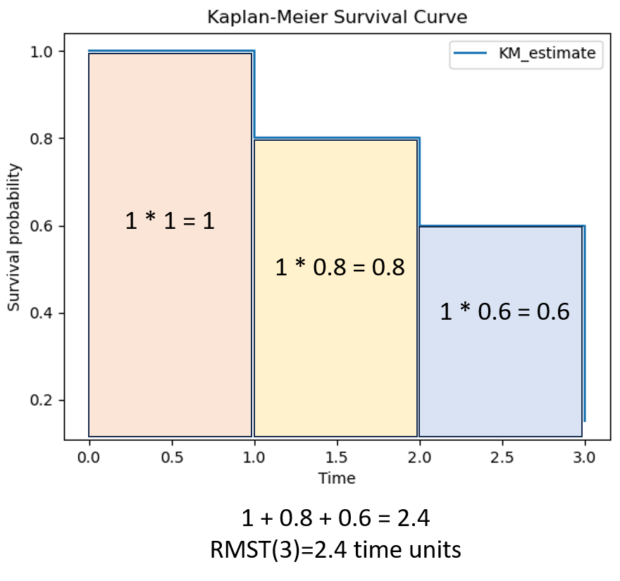

# Introduction to Kaplan–Meier Survival Analysis

## What is Kaplan–Meier?

The **Kaplan–Meier (KM) method** is a non-parametric statistic used to estimate the **survival function** from time-to-event data.  
It is widely applied in biomedical research, clinical trials, and reliability engineering to measure the probability of surviving past a given time point.

Key features:

- Handles **censored data** (when the exact time of event is unknown, e.g., patient lost to follow-up).
- Produces a **step function** survival curve.
- Allows comparison of survival probabilities between groups.

## The Survival Function

The KM estimator of the survival probability at time _t_ is:

\[
\hat{S}(t) = \prod\_{t_i \leq t} \left( 1 - \frac{d_i}{n_i} \right)
\]

Where:

- \(t_i\): time of the i-th event
- \(d_i\): number of events (deaths, failures) at \(t_i\)
- \(n_i\): number of individuals at risk just before \(t_i\)

## Conditional vs. Cumulative Survival

### Conditional Survival

- The probability of surviving a particular interval, **given that the subject has survived up to the start of that interval**.
- Formula at time \(t_i\):  
  \[
  p_i = 1 - \frac{d_i}{n_i}
  \]
- Example interpretation: “If a patient has survived until 3 months, what is the chance they survive past 3 months?”

### Cumulative Survival

- The overall probability of surviving **from time 0 up to a certain time**.
- Computed by multiplying all conditional survival probabilities up to that point:  
  \[
  \hat{S}(t) = p_1 \times p_2 \times \cdots \times p_i
  \]
- Example interpretation: “What is the probability a patient survives from the beginning of the study up to 3 months?”

## Censoring

- Censoring occurs when the exact time of the event (e.g., death, disease recurrence, machine failure) is **not observed**, but partial information is available.
- We don’t know the subject’s exact event time, but we know they survived at least up to a certain time.
- Causes:
  - Patient lost to follow-up.
  - Study ends before the patient has an event.
  - Patient withdraws from the study.
- A censored subject contributes to the risk set up until the time of censoring. After that, they are removed from the risk set, but they do not count as an event.
- On a KM plot, censored observations are typically shown as **tick marks (short vertical or horizontal bars)** on the survival curve.
- The curve does **not drop** at censoring times (since no event occurred), but the **risk set decreases**.

## Worked Example (5 Patients)

Suppose we follow 5 patients:

| Patient | Survival time (months) | Event (1=death, 0=censored) |
| ------- | ---------------------- | --------------------------- |
| A       | 2                      | 1                           |
| B       | 3                      | 1                           |
| C       | 6                      | 0 (censored)                |
| D       | 7                      | 1                           |
| E       | 10                     | 0 (censored)                |

### Step-by-step KM calculation:

- **At 2 months**:  
  \(n=5, d=1\).  
  Conditional survival = \(1 - 1/5 = 0.8\).
  Cumulative survival = 0.8.

  - 在 2 個月前還活著的病人，有 80% 能活過 2 個月 (此時 individuals at risk 為 5 人，其中 1 個死亡)
  - 從研究一開始到 2 個月，總體的存活機率是 80% (此時 individuals at risk 為 5 人，其中 1 個死亡)

- **At 3 months**:  
  \(n=4, d=1\) (A already dead, 4 remain at risk).  
  Conditional survival = \(1 - 1/4 = 0.75\).  
  Cumulative survival = \(0.8 \times 0.75 = 0.6\).

  - 條件生存率（3 個月）：在已經存活超過 2 個月的病人當中，仍有 75% 能活過 3 個月（此時 individuals at risk 為 4 人，其中 1 人死亡）。
  - 累積生存率（3 個月）：從研究一開始到 3 個月為止，整體存活機率為 60%（因為 5 個人中有 2 人死亡）。這個結果也可以由前兩段條件生存率相乘得到：80% (4/5) × 75% (3/4) = 60% (3/5)。

- **At 6 months**:  
  \(n=3, d=0\) (A,B already dead, 3 remain at risk).  
  Conditional survival = \(1 - 3/3 = 1\).  
  Cumulative survival = \(0.6 \times 1 = 0.6\).

  - 條件生存率（6 個月）：在已經存活超過 3 個月的病人當中，有 100% 能活過 6 個月（此時 individuals at risk 為 3 人，其中 0 人死亡，其中 1 人 censored）。
  - 累積生存率（6 個月）：從研究一開始到 6 個月為止，整體存活機率為 60%（因為 5 個人中有 2 人死亡）。這個結果也可以由前兩段條件生存率相乘得到：80% (4/5) × 75% (3/4) x 100% (3/3) = 60% (3/5)。
  - 超過這個時間點，C 不再列處 risk candidate。

### Interpretation

- At 2 months: survival probability = 80%.
- At 3 months: survival probability = 60%.
- At 6 months: survival probability = 30%.

> Notice that “conditional survival” is the **stepwise probability** at each event, while “cumulative survival” is the **overall probability of surviving from the start until that point**.

## Steps in Kaplan–Meier Analysis

1. **Organize Data**

   - Collect survival times and event indicators (1 = event, 0 = censored).
   - Sort data by survival time.

2. **Calculate Survival Probabilities**

   - At each observed event time, compute the proportion surviving:
     \[
     p_i = 1 - \frac{d_i}{n_i}
     \]
   - Multiply sequentially to obtain cumulative survival:
     \[
     \hat{S}(t) = p_1 \times p_2 \times \cdots \times p_i
     \]

3. **Plot Kaplan–Meier Curve**
   - X-axis: time
   - Y-axis: estimated survival probability \(\hat{S}(t)\)
   - Curve steps downward at each event time.
   - Censored observations are indicated by tick marks.

## Basic Methods of Analysis

### 1. Median Survival Time

- The time point when the survival probability drops to 50%.
- Provides a simple summary of central tendency in survival distribution.


### 2. Mean Survival Time

- The **average expected survival time** for individuals in the study population.
- Defined mathematically as the **area under the survival curve**:  
  \[
  E[T] = \int_0^\infty S(t) \, dt
  \]
- Provides an overall summary of survival experience across the entire follow-up period.
- Unlike the median survival time (which focuses on the 50% point), the mean incorporates **all observed survival times** and is more sensitive to long-term follow-up and censoring.

#### Mean Survival vs. Restricted Mean Survival Time (RMST)

- In theory, the mean survival time requires the curve to be observed **until it reaches 0** (all individuals have had the event).
- In practice, survival data are censored, and follow-up is finite → the full mean survival time is usually **not estimable**.
- **Restricted Mean Survival Time (RMST)** is therefore used:  
  \[
  RMST(\tau) = \int_0^\tau S(t) \, dt
  \]
  where \(\tau\) is a chosen time horizon (e.g., the maximum follow-up or a clinically meaningful cutoff such as 5 years).
- RMST is always well-defined and interpretable as the **average survival up to time \(\tau\)**.
- If follow-up were infinitely long and censoring absent, RMST would converge to the true mean survival time.



### 3. Comparison Between Groups

- **Log-Rank Test**: statistical test to compare survival curves between two or more groups.
- Null hypothesis: no difference in survival distributions.
- Sensitive to differences that occur later in follow-up.

### 4. Hazard Ratios (extension)

- While not directly from KM, hazard ratios are often estimated using **Cox proportional hazards model**, building on the survival curves.
- Provide a measure of relative risk between groups.

## Interpretation Notes

- The KM curve does not assume any particular distribution of survival times.
- Wider confidence intervals occur later in the curve due to fewer individuals at risk.
- Interpretation should consider censoring, group size, and clinical context.
- Example: “In a cancer study, the 5-year cumulative survival rate was 60%” → meaning 60% of patients were alive 5 years after diagnosis.

## Example (R code)

```r
# Load packages
library(survival)
library(survminer)

# Example dataset
data(lung)
fit <- survfit(Surv(time, status) ~ sex, data = lung)

# Plot KM curve
ggsurvplot(fit, data = lung, pval = TRUE, conf.int = TRUE,
           risk.table = TRUE, surv.median.line = "hv")
```

## Example (Python code)

```python
from lifelines import KaplanMeierFitter
import matplotlib.pyplot as plt

# Example data
durations = [5,6,6,2,4,4,3,2,1,3]
event_observed = [1,0,1,1,1,0,1,0,1,1]  # 1=event, 0=censored

kmf = KaplanMeierFitter()
kmf.fit(durations, event_observed)

# Plot KM curve
kmf.plot_survival_function()
plt.title("Kaplan-Meier Survival Curve")
plt.xlabel("Time")
plt.ylabel("Survival probability")
plt.show()

# Calculate median survival time
median_survival = kmf.median_survival_time_

# Restricted Mean Survival Time, RMST
tau = max(durations) # Specify an upper limit tau
mean_survival = kmf.mean_survival_time_
```

$$
\hat{S}(t) = \prod_{t_i \leq t} \left( 1 - \frac{d_i}{n_i} \right)
$$
