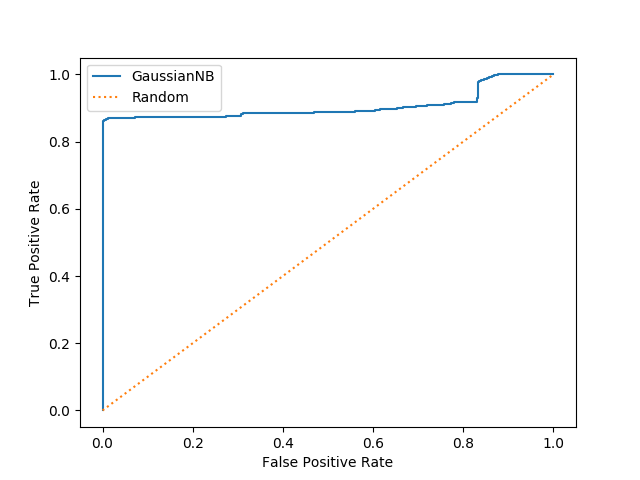

# ROC curve, AUC

- **ROC curve**: Receiver Operating Characteristic Curve
- **AUC**: Area Under the Curve, ranges between `0` and `1`

ROC curve 用來看二元 [classification](../supervised-learning/classification/README.md) 模型在不同 threshold 下，真陽性率與假陽性率如何一起變化。它適合回答「模型有沒有把正例排得比負例前面」這類辨識能力問題。

## Axes

- **x-axis**: FPR (False Positive Rate)
  \( FPR = \frac{FP}{TN + FP} = 1 - \text{Specificity} \)
- **y-axis**: TPR (True Positive Rate, Sensitivity)
  \( TPR = \frac{TP}{TP + FN} \)

## How to Read the Curve

- 曲線越靠左上角越好，代表在維持較低 FPR 的同時能拿到較高 TPR。
- 對角線代表隨機猜測基準。
- 若兩模型 ROC 曲線交叉，只看 AUC 可能還不夠，還要考慮實際可接受的 FPR 區間。



## Construction

把模型機率輸出從高到低掃過不同 cutoff，每個 threshold 都會對應一組 `(FPR, TPR)`，連起來就是 ROC curve。

## AUC Interpretation

- **AUC = 0.5**: classifier performs no better than random guessing
- **AUC > 0.5**: model has predictive power
- **AUC = 1.0**: perfect ranking between positive and negative classes

## When ROC/AUC Is Useful

- 你關心模型的整體排序能力，而不是單一 cutoff。
- 你還沒決定 threshold，但想先比較不同模型。
- 正負樣本不完全平衡，但你仍希望看 across-threshold 的辨識能力。

## Important Cautions

- ROC/AUC 不會直接告訴你哪個 threshold 最符合業務目標。
- 在極度不平衡資料中，PR curve 有時比 ROC 更敏感。
- AUC 高不代表 calibration 好，也不代表實際 precision 一定高。

## Example

```python
from sklearn.datasets import make_classification
from sklearn.model_selection import train_test_split
from sklearn.linear_model import LogisticRegression
from sklearn.metrics import roc_curve, auc, roc_auc_score
import numpy as np

# Generate dataset
X, y = make_classification(n_samples=1000, n_features=20, n_informative=2, n_classes=2, random_state=42)

X_train, X_test, y_train, y_test = train_test_split(X, y, test_size=0.3, random_state=42)

# Train model
model = LogisticRegression()
model.fit(X_train, y_train)

# Predict probabilities
y_prob = model.predict_proba(X_test)[:, 1]

# ROC curve
fpr, tpr, thresholds = roc_curve(y_test, y_prob)
roc_auc = auc(fpr, tpr)
roc_auc_score_val = roc_auc_score(y_test, y_prob)

# Find best threshold using Youden index
j_scores = tpr - fpr
best_threshold = thresholds[np.argmax(j_scores)]

print("AUC (via auc):", roc_auc)
print("AUC (via roc_auc_score):", roc_auc_score_val)
print("Best threshold (Youden):", best_threshold)
```

## Key Takeaways

- ROC curve evaluates a model across thresholds instead of at one cutoff.
- AUC summarizes overall discrimination ability.
- **Youden index** can be a useful heuristic cutoff, but it should not replace cost-based decision design.
- Useful when class distribution is [imbalanced](class-imbalance.md).

## Related Concepts

- [Classification Thresholds and Calibration](classification-thresholds-and-calibration.md)
- [Confusion Matrix](confusion-metrics.md)
- [Class Imbalance](class-imbalance.md)
- [Logistic Regression](../supervised-learning/classification/logistic-regression.md)

[Back to Evaluation](README.md)
