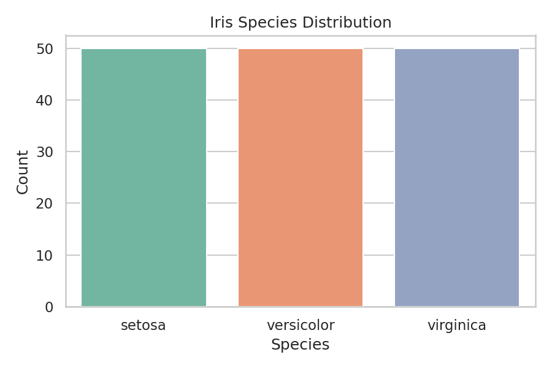
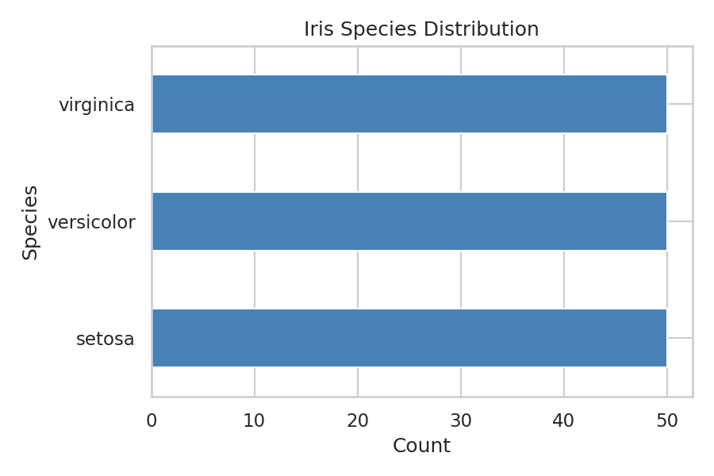
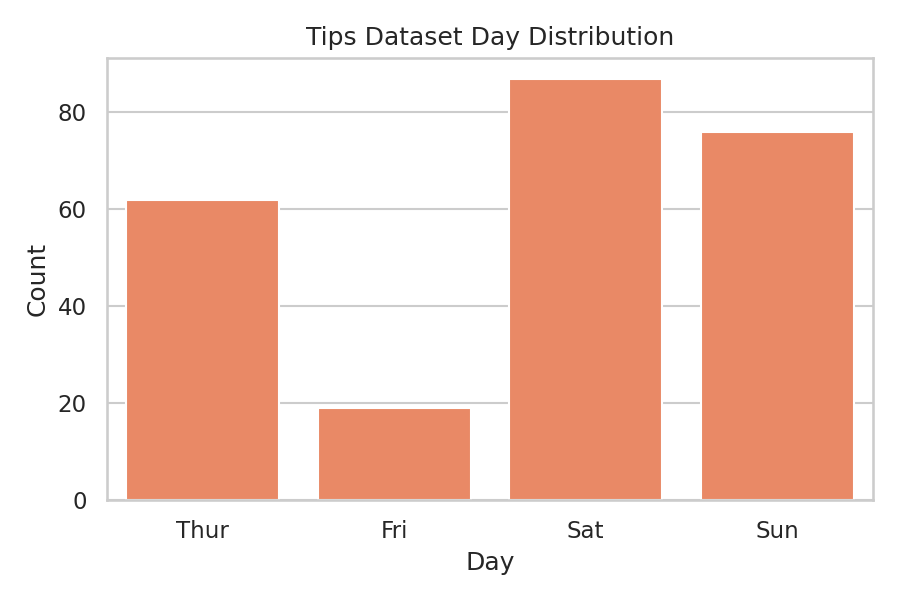

# Univariate Analysis (Categorical)

This section covers how to describe a **single categorical variable** (Nominal or Ordinal scale). Since you cannot compute a meaningful mean or standard deviation for categories, the focus is on **counts, proportions, and visual distributions**.

## Frequency Table

A frequency table is the foundation of categorical description. It shows how often each category appears.

| Metric                 | Description                                      |
| ---------------------- | ------------------------------------------------ |
| **Frequency (n)**      | Raw count of each category                       |
| **Relative Frequency** | Proportion = count ÷ total                       |
| **Percentage (%)**     | Relative frequency × 100                         |
| **Cumulative %**       | Running total — most useful for **ordinal** data |

```python
import pandas as pd
import seaborn as sns

df = sns.load_dataset("iris").copy()

# Build frequency table
freq = df['species'].value_counts()
rel_freq = df['species'].value_counts(normalize=True)

summary = pd.DataFrame({
    'Count': freq,
    'Proportion': rel_freq.round(3),
    'Percentage (%)': (rel_freq * 100).round(1)
})

print(summary)
#             Count  Proportion  Percentage (%)
# species
# setosa         50       0.333            33.3
# versicolor     50       0.333            33.3
# virginica      50       0.333            33.3
```

Tip: When to use relative frequency instead of raw count? When comparing two groups of different sizes, raw counts are misleading. For example, 30 complaints out of 100 customers is very different from 30 out of 1,000.

## Ordinal Data: Preserving Order Matters

For ordinal variables (e.g., satisfaction ratings), the category order is meaningful and must be preserved in both tables and charts.

```python
# Define ordered categories explicitly
ratings = pd.Categorical(
    ['Good', 'Bad', 'Excellent', 'Good', 'Bad', 'Excellent', 'Good'],
    categories=['Bad', 'Good', 'Excellent'],  # logical order
    ordered=True
)

freq_ordered = pd.Series(ratings).value_counts().sort_index()
print(freq_ordered)
# Bad          2
# Good         3
# Excellent    2
```

Warning: Without setting ordered=True and specifying categories, pandas will sort alphabetically (Bad → Excellent → Good), which breaks the logical order.

## Visualization

### Vertical Bar Chart

- Use when the main goal is to compare category counts.
- Avoid it only when labels are too long or too numerous to fit comfortably.

??? example "Script"

    ```python
    import matplotlib.pyplot as plt
    import seaborn as sns

    iris = sns.load_dataset("iris").copy()

    sns.countplot(x="species", data=iris, hue="species", palette="Set2", legend=False)
    plt.title('Species Distribution')
    plt.xlabel('Species')
    plt.ylabel('Count')
    plt.show()
    ```

{ .img-center }

### Horizontal Bar Chart

- Use when category labels are long or when you have many categories.
- Prefer this over a vertical bar chart when readability becomes the main concern.

??? example "Script"

    ```python
    species_counts = iris["species"].value_counts().sort_values()

    species_counts.plot(kind="barh", color="steelblue")
    plt.title("Species Distribution")
    plt.xlabel("Count")
    plt.ylabel("Species")
    plt.show()
    ```

{ .img-center }

### Pie Chart

- Use when the message is part-of-whole and the number of categories is small.
- Avoid it when you need precise comparison across many categories.

??? example "Script"

    ```python
    species_counts = iris["species"].value_counts()

    species_counts.plot(
        kind="pie", autopct="%1.1f%%", startangle=90
    )
    plt.title("Species Proportion")
    plt.ylabel("")
    plt.show()
    ```

{ .img-center }

### Ordered Bar Chart

- Use for ordinal data, where category order carries meaning.
- Define the order explicitly before plotting, otherwise the chart may be misleading.

??? example "Script"

    ```python
    tips = sns.load_dataset("tips").copy()
    day_order = ["Thur", "Fri", "Sat", "Sun"]
    tips["day"] = pd.Categorical(tips["day"], categories=day_order, ordered=True)

    sns.countplot(x="day", data=tips, order=day_order, color="coral")
    plt.title("Tips Dataset Day Distribution")
    plt.xlabel("Day")
    plt.ylabel("Count")
    plt.show()
    ```

{ .img-center }

Tip: Rule of thumb: Default to bar charts. Use a pie chart only when the part-of-whole message is the main point and the number of categories is small.

## Cross-Tabulation

A cross-tabulation (contingency table) shows the joint frequency of **two categorical variables**. While technically bivariate, it's introduced here as a natural extension of frequency tables.

??? example "Script"

    ```python
    import pandas as pd

    data = pd.DataFrame({
        'Gender':   ['Male', 'Female', 'Male', 'Female', 'Male', 'Female'],
        'Survived': ['No',   'Yes',    'Yes',  'Yes',    'No',   'No']
    })

    # Raw counts with row/column totals
    ct = pd.crosstab(data['Gender'], data['Survived'], margins=True)
    print(ct)

    # Proportions within each row (e.g., survival rate by gender)
    ct_norm = pd.crosstab(data['Gender'], data['Survived'], normalize='index').round(3)
    print(ct_norm)

    # normalize='index' → row proportions (most common: "what % of each group did X?")
    # normalize='columns' → column proportions
    # normalize='all' → proportions of grand total
    ```

**Raw count output:**

| Gender | No  | Yes | Total |
| ------ | --- | --- | ----- |
| Female | 1   | 2   | 3     |
| Male   | 2   | 1   | 3     |
| Total  | 3   | 3   | 6     |

**Row-normalized (survival rate per gender):**

| Gender | No    | Yes   |
| ------ | ----- | ----- |
| Female | 0.333 | 0.667 |
| Male   | 0.667 | 0.333 |

## Key Takeaways

| Concept                | Key Point                                                               |
| ---------------------- | ----------------------------------------------------------------------- |
| **Frequency table**    | Always the starting point for categorical description                   |
| **Relative frequency** | Prefer over raw counts when comparing groups of different sizes         |
| **Ordinal data**       | Explicitly define category order — don't let pandas sort alphabetically |
| **Bar chart**          | Default visualization for categorical data                              |
| **Pie chart**          | Only when ≤ 5 categories and part-of-whole is the message               |
| **Cross-tabulation**   | Describes relationship between two categorical variables                |

## Rare Categories and Grouping

Real-world categorical variables often contain many low-frequency levels. Before plotting or modeling, consider whether to keep them separate or group them into `Other`.

Tip: This is not just a visualization choice. Rare-level handling affects chi-square tests, encoding quality, and model stability.
