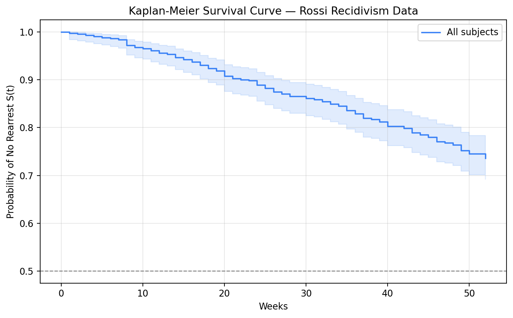

# Kaplan-Meier Estimator

The **Kaplan-Meier (KM) estimator** is the standard non-parametric method for estimating the survival function from observed data. It handles censored observations correctly without assuming any particular parametric distribution.

Key point: KM is the starting point of survival analysis: almost every survival analysis report starts with the KM curve. It is a standard visualization tool for describing survival data, just like a histogram for continuous data. Before running any model, draw the KM curve.

## What KM Actually Estimates

KM estimates the survival function:

\[ S(t) = P(T > t) ]

This means:

* the probability the event has **not** happened by time `t`
* not the average survival time
* not the hazard

Tip: Many learners first read a KM curve like a declining probability line, which is good. The next step is remembering that every downward step is triggered by an observed event, while censoring changes the risk set without causing a step down.

## The KM Formula

At each time point where an event occurs, KM updates the survival estimate:

\[ \hat{S}(t) = \prod\_{t\_i \leq t} \left(1 - \frac{d\_i}{n\_i}\right) ]

Where:

* $t\_i$ = the distinct event times (only times when events actually occur)
* $d\_i$ = number of events at time $t\_i$
* $n\_i$ = number of subjects at risk just before time $t\_i$ (the **risk set**)

Tip: Conditional survival describes the chance of surviving a specific interval given that the subject made it to the start of that interval, $p\_i = 1 - d\_i/n\_i$. Cumulative survival, $\hat{S}(t)$, multiplies those interval-specific probabilities together to describe survival from time 0 all the way to time $t$.

Tip: The risk set $n\_i$ includes only subjects still under observation just before time $t\_i$. Subjects censored before $t\_i$ are removed from the risk set, which is exactly how KM handles censoring correctly.

## Why KM Is a Step Function

The KM curve changes only when an event is observed:

* **event occurs** → the curve steps downward
* **censoring occurs** → no vertical drop, but the risk set shrinks afterward

This is why censor marks matter visually. They show where information about future follow-up ends for specific subjects.

## Step-by-Step Manual Calculation

```python
import pandas as pd
import numpy as np

# Small example dataset (8 subjects)
data = pd.DataFrame({
    'time':  [3, 5, 5, 8, 10, 12, 12, 15],
    'event': [1, 0, 1, 1,  0,  1,  1,  0 ]
})

# Build KM table manually
event_times = sorted(data[data['event'] == 1]['time'].unique())
n_total = len(data)

rows = []
n_at_risk = n_total
S = 1.0

for t in event_times:
    d = ((data['time'] == t) & (data['event'] == 1)).sum()  # events at t
    # subtract those censored before this time point
    censored_before = ((data['time'] < t) & (data['event'] == 0)).sum()

    # Recalculate n_at_risk properly
    n_at_risk = (data['time'] >= t).sum()

    prob_survive = 1 - d / n_at_risk
    S = S * prob_survive

    rows.append({
        'time':        t,
        'n_at_risk':   n_at_risk,
        'events (d)':  d,
        '1 - d/n':     round(prob_survive, 4),
        'S(t)':        round(S, 4)
    })

km_table = pd.DataFrame(rows)
print(km_table)
```

**Output:**

| n\_at\_risk | events (d) | 1 - d/n | S(t)   |
| ----------- | ---------- | ------- | ------ |
| 8           | 1          | 0.8750  | 0.8750 |
| 6           | 1          | 0.8333  | 0.7292 |
| 4           | 1          | 0.7500  | 0.5469 |
| 2           | 2          | 0.0000  | 0.0000 |

At t=5: one subject was censored at t=5 (not an event), so n\_at\_risk drops by both the event at t=3 and the censored subject, giving n=6.

## KM Estimator with lifelines

### Example

```r
library(survival)
library(survminer)

data(lung)
fit <- survfit(Surv(time, status) ~ sex, data = lung)

ggsurvplot(fit,
           data = lung,
           pval = TRUE,
           conf.int = TRUE,
           risk.table = TRUE,
           surv.median.line = "hv",
           xlab = "Time (days)",
           ylab = "Survival probability")
```

### Python Example

```python
from lifelines import KaplanMeierFitter
from lifelines.datasets import load_rossi
import matplotlib.pyplot as plt

# Load Rossi recidivism dataset
# Outcome: rearrest (1) or study end (0); time: weeks until event
rossi = load_rossi()
T = rossi['week']
E = rossi['arrest']

kmf = KaplanMeierFitter()
kmf.fit(T, E, label='All subjects')

# Key summary statistics
print(f"Median survival time: {kmf.median_survival_time_:.1f} weeks")
print(f"\nSurvival table (first 10 event times):")
print(kmf.survival_function_.head(10))
```

### Plotting the KM Curve

<details>

<summary>Show plotting script</summary>

```python
from lifelines import KaplanMeierFitter
from lifelines.datasets import load_rossi
import matplotlib.pyplot as plt

rossi = load_rossi()
T = rossi['week']
E = rossi['arrest']

kmf = KaplanMeierFitter()
kmf.fit(T, E, label='All subjects')

fig, ax = plt.subplots(figsize=(8, 5))

kmf.plot_survival_function(
    ax=ax,
    ci_show=True,          # show 95% confidence interval
    ci_alpha=0.15,
    color='#3B82F6'
)

# Mark median survival time
median = kmf.median_survival_time_
ax.axhline(0.5, color='gray', linestyle='--', linewidth=1)
ax.axvline(median, color='gray', linestyle='--', linewidth=1)
ax.annotate(f'Median = {median:.0f} wks',
            xy=(median, 0.5), xytext=(median + 5, 0.55),
            arrowprops=dict(arrowstyle='->', color='gray'),
            fontsize=10)

ax.set_xlabel('Weeks')
ax.set_ylabel('Probability of No Rearrest S(t)')
ax.set_title('Kaplan-Meier Survival Curve — Rossi Recidivism Data')
ax.grid(alpha=0.3)
plt.tight_layout()
plt.show()
```

</details>

{ .img-center }

### Adding a Risk Table

A **risk table** shows how many subjects remain at risk at each time point — essential context for interpreting the width of confidence intervals.

```python
from lifelines.plotting import add_at_risk_counts

fig, ax = plt.subplots(figsize=(9, 5))
kmf.plot_survival_function(ax=ax, ci_show=True)

add_at_risk_counts(kmf, ax=ax, fontsize=9)

ax.set_title('KM Curve with At-Risk Table')
ax.set_xlabel('Weeks')
ax.set_ylabel('S(t)')
plt.tight_layout()
plt.show()
```

Tip: Confidence intervals widen late in follow-up because fewer subjects remain at risk, so each event has a larger influence on the estimate. Always inspect the risk table before interpreting the tail of a KM curve.

## Reading a KM Curve Well

When you look at a KM curve, ask:

1. How steep is the early drop?
2. Where is the median survival, if it exists?
3. How many subjects remain at risk in the tail?
4. Are apparent group differences stable over time or only early / late?

Tip: The far-right tail of a KM plot is often visually dramatic but statistically fragile because the risk set may be very small.

## Comparing KM Curves by Group

The most common use of KM curves is comparing survival between two or more groups.

```python
from lifelines import KaplanMeierFitter
import matplotlib.pyplot as plt

# Split by financial aid status (fin: 1 = received aid, 0 = no aid)
groups = rossi['fin'].unique()
colors = ['#3B82F6', '#EF4444']

fig, ax = plt.subplots(figsize=(9, 5))
kmf_list = []

for group, color in zip([1, 0], colors):
    mask = rossi['fin'] == group
    label = 'Received Aid' if group == 1 else 'No Aid'

    kmf_group = KaplanMeierFitter()
    kmf_group.fit(T[mask], E[mask], label=label)
    kmf_group.plot_survival_function(ax=ax, ci_show=True, color=color)
    kmf_list.append(kmf_group)

    print(f"{label}: Median = {kmf_group.median_survival_time_:.1f} weeks")

ax.set_xlabel('Weeks')
ax.set_ylabel('Probability of No Rearrest S(t)')
ax.set_title('KM Curves by Financial Aid Status')
ax.grid(alpha=0.3)
plt.tight_layout()
plt.show()
```

Warning: Visual comparison is not a formal test. Two curves can look different without being statistically significant, and the reverse can also happen. Use the log-rank test to compare groups formally.

## When the Median Is Undefined

Sometimes the survival curve never drops below 0.5 during observed follow-up. In that case:

* median survival is undefined
* this does **not** mean survival is infinite
* it means fewer than half the subjects experienced the event in the observed window

That is a common reason to report **RMST** or a fixed-time survival estimate instead.

## Confidence Intervals for KM

The `lifelines` default confidence interval uses **Greenwood's formula** with log transformation — this ensures the CI stays within \[0, 1] and performs better in the tails.

\[ \text{Var}\[\hat{S}(t)] = \hat{S}(t)^2 \sum\_{t\_i \leq t} \frac{d\_i}{n\_i(n\_i - d\_i)} ]

```python
# Print KM estimate with confidence intervals at specific time points
timeline = [10, 20, 30, 40, 52]
kmf.fit(T, E, timeline=timeline)

summary = pd.DataFrame({
    'S(t)':     kmf.survival_function_['KM_estimate'],
    'CI Lower': kmf.confidence_interval_['KM_estimate_lower_0.95'],
    'CI Upper': kmf.confidence_interval_['KM_estimate_upper_0.95']
}).round(4)

print("KM estimates at selected time points:")
print(summary)
```

## Restricted Mean Survival Time (RMST)

The **RMST** is the area under the KM curve up to a specified time horizon τ — the average event-free time up to τ. It is an alternative summary to the median that:

* Is always defined (unlike median, which requires S(t) to cross 0.5)
* Has a clear interpretation: expected time event-free up to τ
* Is directly comparable between groups

\[ \text{RMST}(\tau) = \int\_0^\tau \hat{S}(t), dt ]

```python
from lifelines.utils import restricted_mean_survival_time

tau = 52  # restrict to 52 weeks

rmst_aid    = restricted_mean_survival_time(kmf_list[0], t=tau)
rmst_no_aid = restricted_mean_survival_time(kmf_list[1], t=tau)

print(f"RMST (Received Aid, up to {tau} wks): {rmst_aid:.2f} weeks")
print(f"RMST (No Aid,       up to {tau} wks): {rmst_no_aid:.2f} weeks")
print(f"Difference: {rmst_aid - rmst_no_aid:.2f} weeks event-free")
```

Tip: Use RMST when the median is undefined (S(t) never crosses 0.5) or when comparing groups with crossing survival curves where the hazard ratio is not constant. When survival curves cross, the hazard ratio is meaningless and RMST is a better comparison metric.

## Common Interpretation Mistakes

| Mistake                              | Why it is wrong                                              |
| ------------------------------------ | ------------------------------------------------------------ |
| Reading censoring as an event        | censoring means follow-up ended, not that the event happened |
| Overinterpreting the tail            | late estimates may be unstable because few subjects remain   |
| Treating visible separation as proof | formal comparison still needs a statistical test             |
| Reporting median only                | misses uncertainty and alternative summaries like RMST       |

## Key Takeaways

| Concept                             | Key Point                                                          |
| ----------------------------------- | ------------------------------------------------------------------ |
| **KM is non-parametric**            | Makes no assumption about the distribution of T; lets data speak   |
| **Risk set shrinks over time**      | Both events and censorings remove subjects from the risk set       |
| **Median survival time**            | Where the KM curve crosses 0.5; undefined if curve stays above 0.5 |
| **CI widens at tails**              | Fewer at-risk subjects → unreliable estimates → check risk table   |
| **Group comparison ≠ significance** | Use the log-rank test for formal statistical comparison            |
| **RMST as alternative summary**     | More robust than median when curves cross or median is undefined   |
