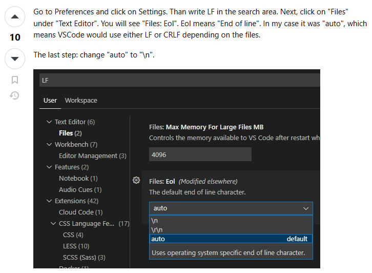

# VS Code

## Close Parameter Hint

- Go to `Preferences → Settings → Parameter → Editor → Parameter Hints`
- Close `Editor > Parameter Hints`

---

## Modify newline format（Windows `\r\n` → `\\n`）

- `^M` = `\r\\n`
- Go to `Preferences → Settings → type "LF" in search area → Click "File" under "Text Editor" → Modify "Files Eol" option`
- More information can be referred to : [Stack Overflow](https://stackoverflow.com/questions/66038334/how-to-disable-m-line-endings-in-vs-code)
- 
